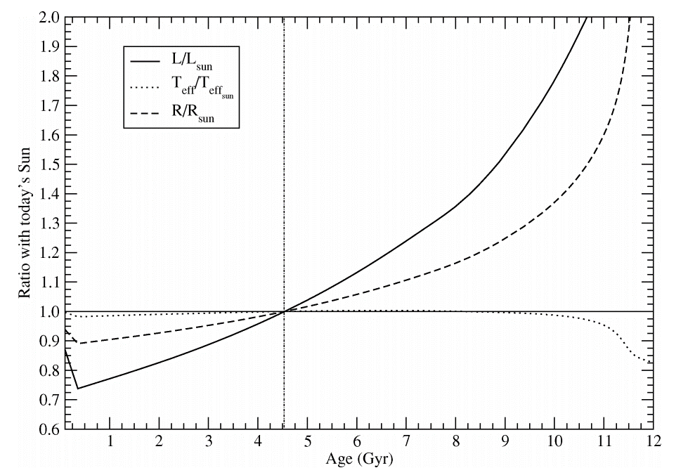

# Variation of luminosity and radius during main-sequence phase

## Raise of the question

When considering the evolution of habitable zone in solar system, wikipedia says:
> Even while stars are on the main sequence, though, their energy output steadily increases, pushing their habitable zones farther out; our Sun, for example, was 75% as bright in the Archaean as it is now [(Kasting & Ackerman 1986)](https://ui.adsabs.harvard.edu/abs/1986Sci...234.1383K), and in the future, continued increases in energy output will put Earth outside the Sun's habitable zone, even before it reaches the red giant phase [(Franck+2002)](https://ui.adsabs.harvard.edu/abs/2002ASPC..269..261F).

This can be visualized by the output of stellar evolution code:

*Figure 1 of Ribas 2009. Based on the Yonsei-Yale evolutionary sequences.*

The change of these values follow the difination of luminosity:

$$ L = 4 \pi r^2 \sigma T_\mathrm{eff}^4 $$

*The change of effective temperature should be derived from the change in L and r.*

Here we explain the reason of this change.
The derivation follows the contents in *Stellar Structure and Evolution* ([Kippenhahn+2012](http://link.springer.com/10.1007/978-3-642-30304-3)), so the numbering of euqations corresponding to the numbering in the book. 

We have the basic differential equations for a spherically symmetric star in hydrostatic equilibrium:

$$ \frac{\parial r}{\parial m} = \frac{1}{4\pi r^2 \rho} \tag{10.1}$$

$$ \frac{\parial P}{\parial m} = -\frac{Gm}{4\pi r^4} \tag{10.2}$$

$$ \frac{\parial l}{\parial m} = \epsilon \tag{10.3}$$

$$ \frac{\parial T}{\parial m} = -\frac{GmT}{4\pi r^4 P} \nabla = -frac{3}{64\pi^2 ac} \frac{\kappa l}{r^4 T^3} \tag{10.4, 10.6}$$

The last equation assume the energy transport is due to radiation (which is the case for sun).

Since the hydrogen fusion only lost 0.7% of the mass, we assume the structure of the sun during main-sequence is not changed, only the molecular weight is varied.
Thus we are discussing homologour stars, with their mass $m$ and radius $r$ in a particular point following the equation $m/M=m'/M', r/R=r'/R'$, with $M$ representing the total mass of a star and $R$ representing the radius.

Define relative mass value $\ksi$ as:

$$ \ksi \coloneqq m/M=m'/M', \tag{20.1}$$

then the homology condiction is:

$$ \frac{r(\ksi)}{r'(\ksi)} = \frac{R}{R'} \tag{20.2} $$

For convenience, define several ratios:

$$ x = M / M'; y = \nu / \nu' \tag{20.3}$$

$$ x = r / r' = R / R'; p = P / P' = P_\mathrm{c} / P'_\mathrm{c}; t= T / T' = T_\mathrm{c} / T'_\mathrm{c}; s = l / l' = L / L' \tag{20.4}$$

$$ d = \rho / \rho'; d = \epsilon / \epsilon'; k = \kappa / \kappa' \tag{20.7}$$

> In general $\epsilon$ depends on temperature and density and on the abundance of the different nuclear species that react, described in detail in Chap. 18. -- SSE p32.

