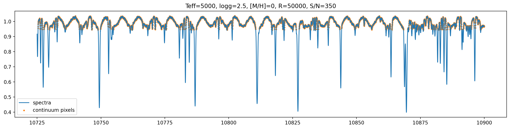
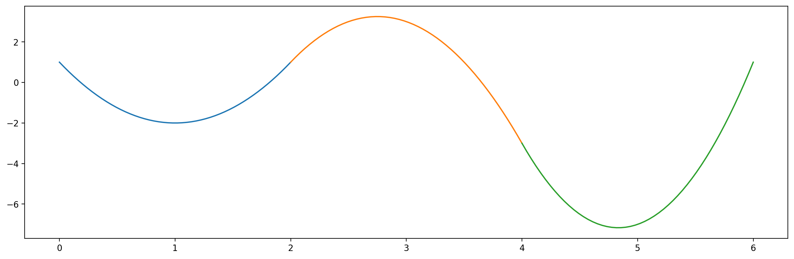

# Spline function and spline fitting

## English abstract and conclusion

Spline function is a connection of many low-order polynominal functions with the requirement that the connection point is continuous.
It is a flexible function for interpolation, such as during the fitting of spectral continuum.

- Spline function is better than single high-order polynomial funciton becuase the error of the latter is usually larger and it requires a better spacing of points.
- We can use `scipy.interpolate.UnivariateSpline` and `scipy.interpolate.LSQUnivariateSpline` to create and calculate spline function.
- The order of the spline function, `k`, and smoothing factor, `s`, are two important variables for spline fitting.

## 起因

在高分辨率的光谱数据处理中，我们经常需要进行连续谱改正。
这是因为虽然天体的连续谱也包含着一些信息，但是高分辨率光谱一般只能覆盖很小的一段波长，同时光谱仪和CCD本身的一些因素（比如说fringe）也会让光谱的连续谱形状被扭曲。
所以实际操作的时候我们干脆就不看连续谱了，就将连续谱和其他的一些扭曲都改正掉。


图1 人造观测光谱

那么在得到一条光谱之后，我们怎么去改正连续谱呢？这就涉及到拟合连续谱的问题了。
这个问题我打算在另一个笔记里面讲，也就是先鸽着的意思。
这里只讨论在找到连续谱的像素时候的拟合问题。
找连续谱像素可以用$$ \sigma $$ clipping的办法来做，我已经有现成的code了也就一起鸽着了。

好了，我们应该用什么函数去拟合这些点呢？
一个比较直接的反应是用高次多项式，因为它可以做出波浪的形状，又比较方便调整；但实际上是不现实的，因为当fringe出现在在一条几百个像素的光谱中时，大概会有大于10个的完整fringe波动出现，而用十几甚至是二十次多项式去做拟合是很不稳定了，`numpy`也做不出来。
另一个原因是高次多项式拟合可能会出现龙格现象，这里也不赘述了。
所以这里就需要用到一维样条函数了。

## 样条函数简介

$$n$$阶样条函数实际上是一堆多项式连接起来的函数。
既然高次多项式不好使，那么我们就用很多个低次多项式连接在一起，不就好了么？


图2 2阶样条函数实例

当然我们对这些多项式有一些额外的要求：
- 它们在各自的边缘点上需要连续
- 它们在各自的边缘点上的1至$$n-1$$阶导数需要相等
- 边界条件（如果需要的话）

其实函数连接点处看起来“光滑”（注意这不是数学上的光滑）只需要1阶导数相等即可，再高阶的导数相等时看不出来的，不过我们需要这些条件去确定样条的系数。

## Python中的样条函数

这里的样条函数实际上是通过拟合来的---函数并不一定穿过输入的数据点。
我们可以用`scipy.interpolate.UnivariateSpline`和`scipy.interpolate.LSQUnivariateSpline`来进行样条函数的拟合。

```py
from scipy.interpolate import UnivariateSpline, LSQUnivariateSpline

# 样条函数拟合
spline = UnivariateSpline(x, y, s = 5) 

# 计算样条函数的值
x_spline = np.linspace(0, 10, 1000)
y_spline = spline(x_spline)
```

### 有用的方法

上面的几行代码其实已经足够拿来做连续谱的拟合了，不过还是有必要介绍一下其他的一些方法：
- `spline.set_smoothing_factor()`：在确定knot位置后改变smoothing factor并再次拟合
- `get_residual()`：obtaining the weighted sum of squared residuals of the spline approximation。这个和输入的s值一致
- `integral(a, b)`：在a到b中积分
- `roots`：获取函数0点
- `get_coeffs()`：获取函数的参数
- `get_knots()`：获取函数的节点

`scipy.interpolate.LSQUnivariateSpline`和`UnivariateSpline`的区别在于前者需要手动指定knots的位置，但是后者不用。
我觉得在连续谱改正的时候用前者就可以了，毕竟我们自己也不确定knots应该在哪。

## 实际练习：连续谱改正

暂略。

## 有趣的延展

- [虚幻4引擎中的样条](https://www.bilibili.com/video/BV1r64y1t7sv?from=search&seid=3320840079321507615)
- PPT中的样条

## Refs
- [Fitting Data With Scipy’s UnivariateSpline() and LSQUnivariateSpline()](https://blog.finxter.com/fitting-data-with-scipys-univariatespline-and-lsqunivariatespline/)
- [Spline (Wiki)](https://en.wikipedia.org/wiki/Spline_(mathematics))
- [Runge's phenomenon (Wiki)](https://en.wikipedia.org/wiki/Runge%27s_phenomenon)