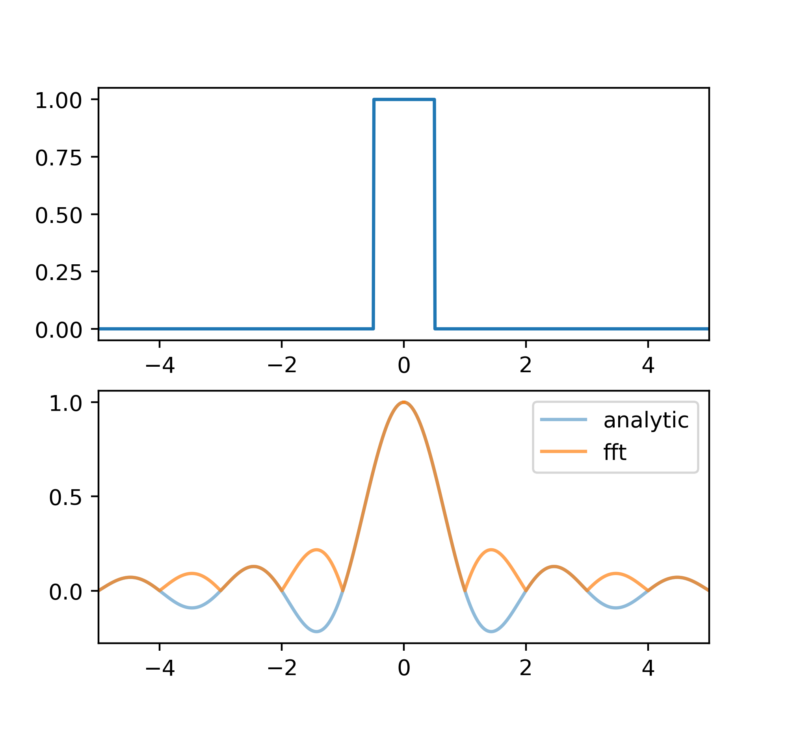
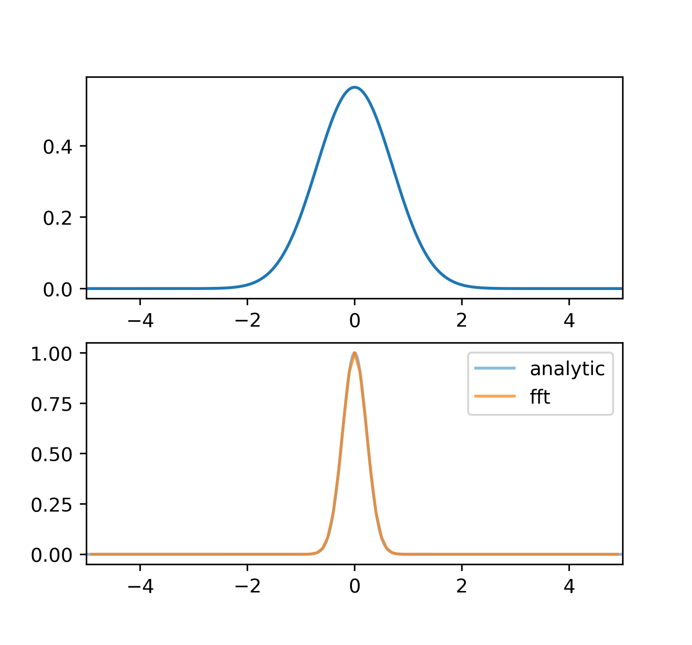
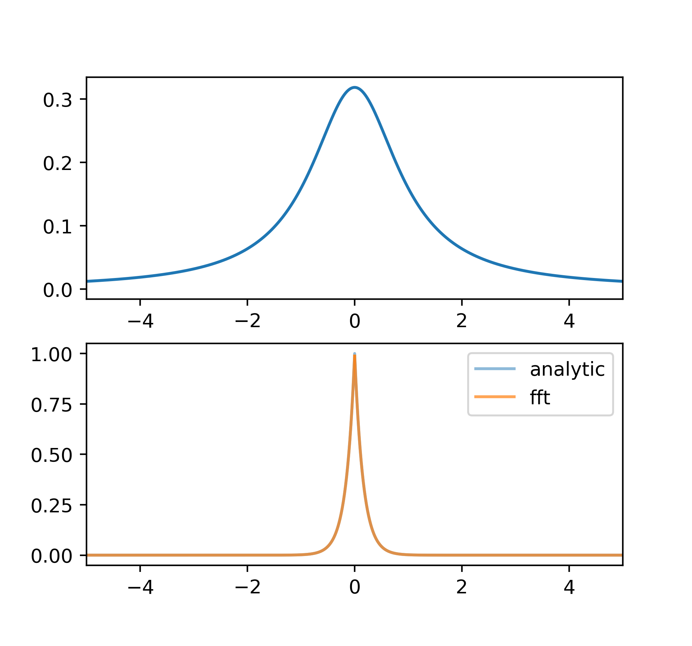
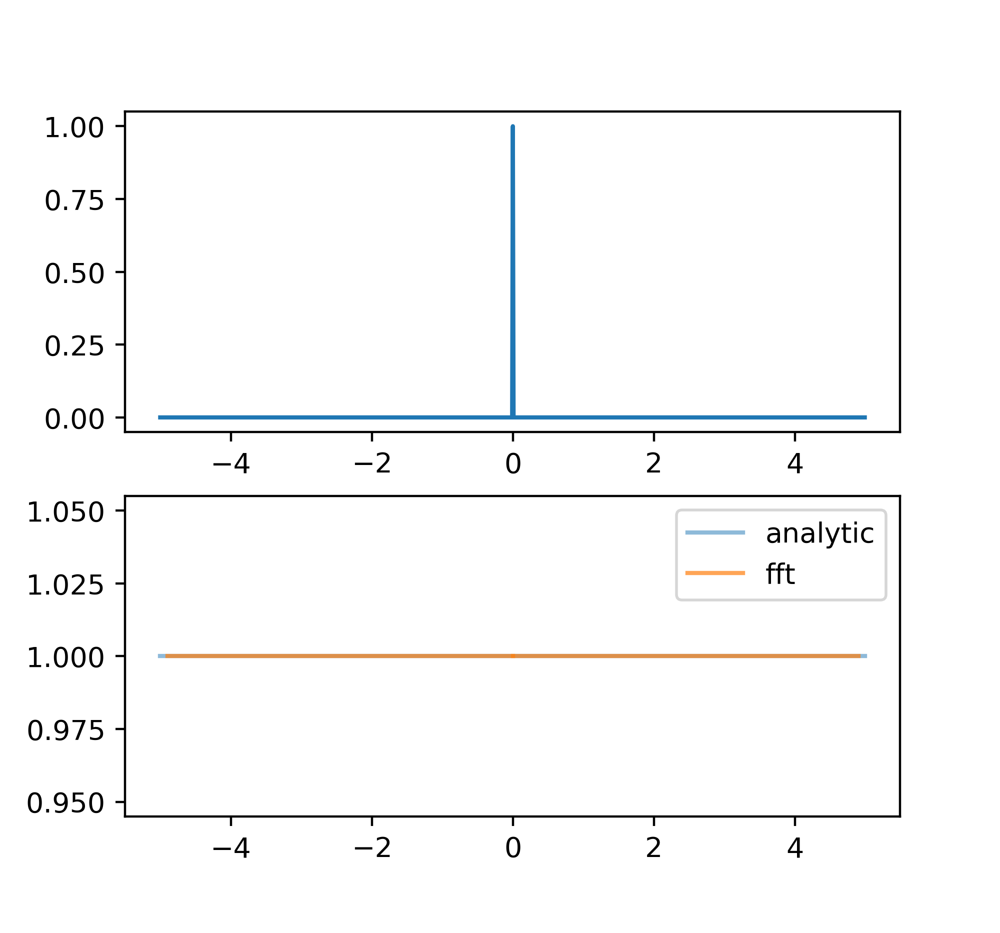
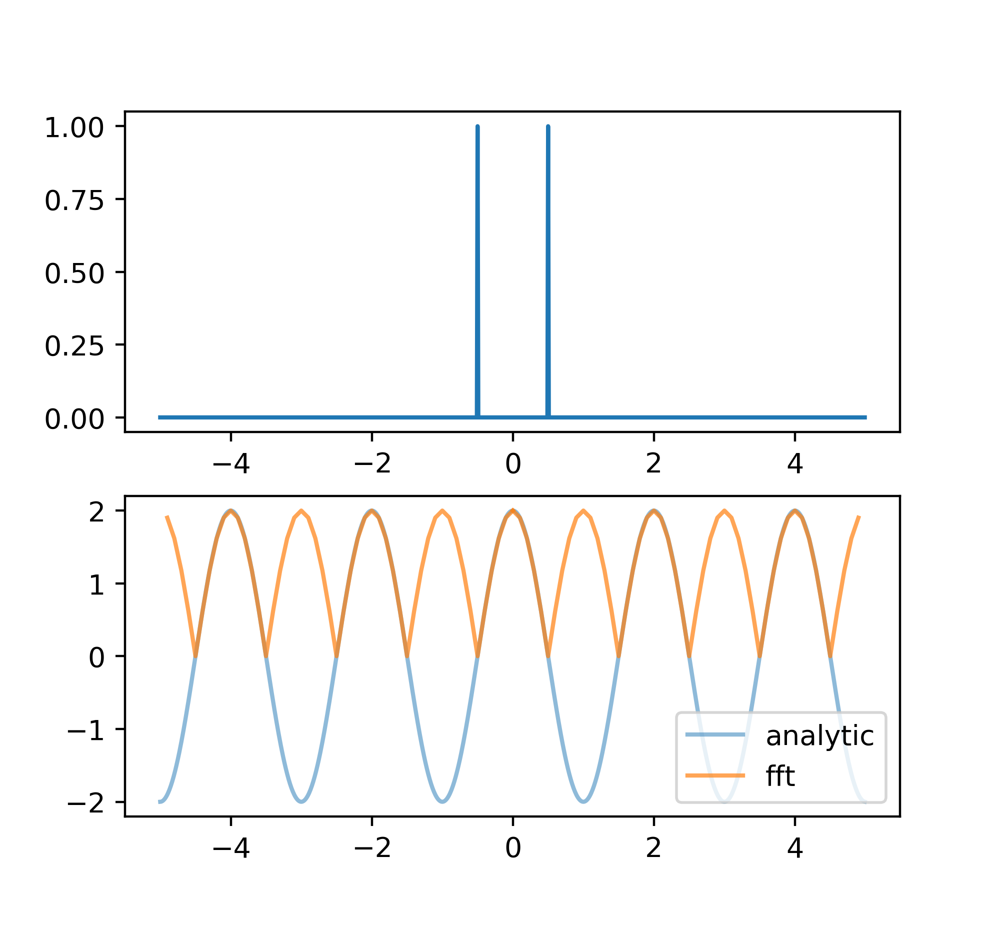
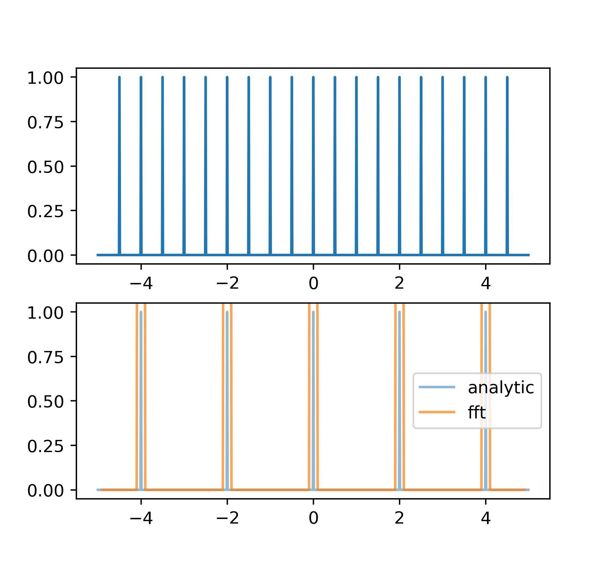

# 第二章：傅里叶变换

傅里叶变换是非常有用的工具；不仅在时序上可以确定周期/频率，之后还会看到一个光谱仪也相当于一个傅里叶变换器。在这里有一点需要明确的是我们以后会经常讨论光谱，所以傅里叶变换的$x$域一般是光谱的频率域，而$\sigma$域并没有很好的名字；所以下文统一称傅里叶变换前后的域为$x$域与$\sigma$域。

## 定义

一个函数$F(x)$和它的傅里叶变换$f(\sigma)$的关系为：

$$ f(\sigma) = \int_{-\infty}^\infty F(x) e^{2\pi i x\sigma} \mathrm{d}x $$

$$ F(x) = \int_{-\infty}^\infty f(\sigma) e^{-2\pi i x\sigma} \mathrm{d}\sigma $$

对于傅里叶变换的直观理解[知乎上](https://www.zhihu.com/topic/19600515/top-answers)已经有了很多不错的答案，我觉得只要了解可以将任何函数拆成各种各样的三角函数相加就可以了。$F,f$一般都是复函数，只有当$F(x)$为实偶函数的时候对应的$f(\sigma)$才是实函数。

当$\sigma$或$x = 0$的时候，傅里叶和逆傅里叶变换变为

$$ f(0) = \int_{-\infty}^\infty F(x)  \mathrm{d}x $$

$$ F(0) = \int_{-\infty}^\infty f(\sigma)  \mathrm{d}\sigma $$

如果讨论谱线，此时傅里叶变换的意义就是谱线和$x$轴围成的面积，也就是总吸收量。

## 常见的傅里叶变换

这里给出了常见的傅里叶变换以及图像。fft的结果因为是取模后画的图所以相当于解析的结果取了绝对值。

### 方波

$$ B(x) = \begin{cases} 0 & x \notin [-\frac{W}{2}, \frac{W}{2}] \\ 1 & x \in [-\frac{W}{2}, \frac{W}{2}] \end{cases}$$

$$ b(\sigma) = W \frac{\sin{(\pi W\sigma)}}{\pi W\sigma} $$

### 高斯函数

$$ G(x) = \frac{1}{\beta\pi^\frac{1}{2}} e^{-\frac{x^2}{\beta^2}} $$

$$ g(\sigma) = e^{-(\pi\beta\sigma)^2} $$

高斯的傅里叶变换是另一个高斯。

### 洛仑兹函数

$$ L(x) = \frac{1}{\pi} \frac{\beta}{x^2+\beta^2} $$

$$ l(x) = e^{-2\pi\beta|\sigma|} $$

### $\delta$函数

$$ F(x) = \delta(x-x_1) $$

$$ f(\sigma) = e^{2\pi i x_1\sigma} $$

单个$\delta$函数的傅里叶变换的振幅是常数，相位随着$\sigma$线性增加；两个正而且对称的$\delta$函数的傅里叶变换是余弦函数，一正一负（对称）的傅里叶变换的振幅是正弦函数。

### Shah函数

Shah函数实际上是一堆等间距分布的$\delta$函数：

$$ \mathrm{III}(x) = \sum\limits_{n=-\infty}^{\infty} \delta(x - n\Delta x) $$

它的傅里叶变换还是一个Shah函数，只不过间距变了：

$$ \mathrm{III}(\sigma) = \sum\limits_{n=-\infty}^{\infty} \delta(\sigma - n\frac{1}{\Delta x}) $$

以上的函数以及它们的傅里叶变换在接下来的一节以及第三章都会经常用到。

## 数据采样

实际上观测到的数据都是离散的点，所以我们要考虑这样的离散化会带来什么样的结果。

仍然从连续函数出发，离散化意味着将连续函数与Shah函数相乘（以波长为横坐标）：

$$ D(\lambda) = \mathrm{III}(\lambda)F(\lambda) $$

实际测量的函数等于Shah函数与理想的连续函数相乘。同时一般来说，无论是时变数据还是光谱数据，我们都不可能无限地测量下去（望远镜时间不是无限的，光谱仪有截止波长），所以我们还需要加上一个响应度函数$B(\lambda)$，来限制波长范围以及修改每个波长上的响应度（时间域上的数据应该不需要有响应度）：

$$ D(\lambda) = B(\lambda)\mathrm{III}(\lambda)F(\lambda) $$

这个时候如果想求$D(\lambda)$的傅里叶变换的话就需要知道几个函数相乘的傅里叶变换是什么，这就涉及到卷积了。

## 卷积

两个函数$f(\sigma), g(\sigma)$的卷积定义为：

$$ k(\sigma) = f(\sigma) * g(\sigma) = \int_{-\infty}^{\infty} f(\sigma_1) g(\sigma-\sigma_1) \mathrm{d}\sigma_1 $$

[维基百科](https://zh.wikipedia.org/wiki/%E5%8D%B7%E7%A7%AF)上的一张图可以比较直观地帮助理解卷积：

将其中一个函数以0为中心翻转、从左往右平移，两函数每点相乘在求和的结果就是这两个函数在第一个函数对称中心处的值。

从定义以及理解可以容易得到$f(\sigma) * g(\sigma) = g(\sigma) * f(\sigma) $$。

### 卷积和傅里叶变换的关系

实际上两函数相乘的傅里叶变换就是这两函数各自傅里叶变换的卷积(倒过来也对)，即

$$ F(x)G(x) \Longrightarrow f(\sigma) * g(\sigma) $$

$$ F(x) * G(x) \Longrightarrow f(\sigma)g(\sigma) $$

[维基百科](https://zh.wikipedia.org/wiki/%E5%8D%B7%E7%A7%AF%E5%AE%9A%E7%90%86)上有证明；这里为了理解方便将证明过程倒过来写一遍。简单起见我们证明两函数各自傅里叶变换的卷积的逆傅里叶变换为两函数的乘积，可用富比尼定理，则：

$$ \begin{align}  \int f(\sigma) * g(\sigma) e^{-2\pi ix\sigma} \mathrm{d}\sigma & = F(x)G(x) \\ \int \left(\int f(\sigma_1) g(\sigma-\sigma_1) \mathrm{d}\sigma_1\right) e^{-2\pi ix\sigma} d\sigma & = \int f(\sigma_1) \left( \int g(\sigma-\sigma_1) e^{-2\pi ix\sigma} \mathrm{d}\sigma\right) \mathrm{d}\sigma_1 \\ & = \int f(\sigma_1) \left( \int g(\alpha) e^{-2\pi ix(\alpha + \sigma_1)} \mathrm{d}\alpha\right) \mathrm{d}\sigma_1 \\ & = \int f(\sigma_1) e^{-2\pi ix\sigma_1} \mathrm{d}\sigma_1 \int g(\alpha) e^{-2\pi ix\alpha} \mathrm{d}\alpha \\ & = F(x)G(x) \end{align}$$

### 与$\delta$函数的卷积

$$ F(x) * \delta(x-x_1) = F(x-x_1) \Longrightarrow f(\sigma) e^{2\pi ix_1\sigma} $$

这个结果会在接下来的性质2中用到。

### 高斯、洛仑兹函数之间的卷积

高斯函数的傅里叶变换还是高斯函数$g(\sigma) = e^{-(\pi\beta\sigma)^2}$，所以两个高斯函数卷积的傅里叶变换为

$$ g_a(\sigma)g_b(\sigma) = e^{-(\pi\beta_a\sigma)^2}e^{-(\pi\beta_b\sigma)^2} = e^{-(\pi\beta_c\sigma)^2} $$

还是一个高斯函数；此时的$G(x)$更窄，但是$g(\sigma)$更宽$(\beta_c^2 = \beta_a^2+\beta_b^2)$。

同理，洛仑兹与洛仑兹函数的卷积也还是个洛仑兹函数，只不过现在$\beta_c = \beta_a + \beta_b $$。

高斯函数和洛仑兹函数的卷积叫做福格特(Voigt)函数，它的傅里叶变换为

$$ v(\sigma) = e^{-\pi^2\beta_g^2\sigma^2} e^{-2\pi\beta_l|\sigma|} $$

在第11章会用到。

## 被模糊的数据

我们现在可以回到$D(\lambda)$中。除了截断和采样之外，观测仪器当然也会在最终的结果中留下一些特征，叫做仪器轮廓(instrumental profile)。一般来说这些特征是一个$\delta$函数；也就是说一个很窄的$\delta$函数在经过观测仪器之后会变成另一个宽一点的$\delta$函数，或者说两个$\delta$函数卷积了。仪器轮廓可以被测出来（通过观测很细的谱线；第12章），我们在这里记作$I(\lambda)$。所以现在的$D(\lambda)$变成了

$$ D(\lambda) = [B(\lambda)\mathrm{III}(\lambda)F(\lambda)] * I(\lambda)$$

在$\sigma$域，上式变为

$$ d(\sigma) = [b(\sigma) * \mathrm{III}(\sigma) * f(\sigma)] \times i(\sigma) $$

可以看到最终傅里叶域的函数被乘上了一个$i(\sigma)$。一般仪器轮廓是一个比较窄的高斯或者洛仑兹轮廓，所以它的傅里叶变换是一个相对宽的轮廓，对$\sigma$域中的“低频”部分没有很大影响；但是轮廓会在高$\sigma$部分下降，所以会抹掉高$\sigma$部分的信息。在$\lambda$域上这意味着每个数据点不再是一个孤立的点，而因为与仪器轮廓的卷积会和旁边的数据点耦合，将高$\lambda$的信息“平均”掉。

## 采样 $\mathrm{III}(\sigma)$的影响

采样对高$\sigma$信号的也会产生影响（可能比仪器轮廓更大）。信号与Shah函数的卷积$\mathrm{III}(\sigma) * f(\sigma)$会使得信号在Shah函数每个不为0处附近重复，使得一样的图样发生重叠，同样抹掉了高$x$的信息。因为Shah函数傅里叶变换后成为间隔为$\frac{1}{\Delta x}$的Shah函数，所以我们认为在这个间隔的一半区间内，信号是没有重叠的，叫做奈奎斯特频率：

$$ \sigma_N = \frac{1}{2\Delta x} $$

在这里因为我们对信号进行了采样，所以得到的实际上是离散的信号点；我们并不知道点和点之间究竟是怎么样的（虽然经常认为是平滑过渡的），而点和点之间丢失的信息就对应着频域中大于奈奎斯特频率的部分，它们重叠了。与仪器轮廓的不同在于采样是离散化，而仪器轮廓是模糊。

我们想做的是通过测量$D(\lambda)$求得$d(\sigma)$，再转换成$f(\sigma)$最后求得$F(\lambda)$。从$d(\sigma)$到$f(\sigma)$这一步有$\mathrm{III}(\sigma)$的作用，它们都抹掉了高$\sigma$的信息。如果$f(\sigma)$在高$\sigma$处趋于0，那么转换这一步基本上是正确的。但是如果重叠的部分很宽，这部分就不会有唯一的解，解决办法是减少采样的间隔。实际上$f(\sigma)$一般的确在高$\sigma$处趋于0，而且$i(\sigma)$的存在也会强制使得$f(\sigma)$高$\sigma$的值减小，所以转换是成立的。

最后一个需要提及的是$b(\sigma)$。只要$B(x)$够宽，问题就不大；但是不够宽的时候$b(\sigma)$本身的宽度和在$\sigma > \frac{1}{W}$处的起伏都会导致数据的模糊，所以有必要修改$B(x)$的边缘以消除起伏。$b(\sigma)$本身的宽度会使和$f(\sigma)$的卷积很大，所以有必要稍微减小$f(\sigma)$。12章会有更多介绍。

## 一些定理

1. $$ F(x_1) + F(x_2) \Leftrightarrow f(\sigma_1) + f(\sigma_2) $$
2. $$ F(x - x_1) \Leftrightarrow e^{2\pi ix_1\sigma}f(\sigma) $$
3. $$ F(ax) \Leftrightarrow |\frac{1}{a}|f(\frac{1}{a}) $$
4. $$ \frac{\mathrm{d}F(x)}{\mathrm{d}x} \Leftrightarrow 2\pi i \sigma f(\sigma) $$
5. $$ K(x) = F(x) * G(x) \Rightarrow \frac{\mathrm{d}K(x)}{\mathrm{d}x} = \frac{\mathrm{d}F(x)}{\mathrm{d}x} * G(x) + F(x) * \frac{\mathrm{d}G(x)}{\mathrm{d}x} $$
6. $$ \int G(x) \mathrm{d}x = 1 \Rightarrow \int F(x) * G(x) \mathrm{d}x = \int F(x) \mathrm{d}x $$
7. 定义$z = \frac{\int xF(x) \mathrm{d}x}{\int F(x) \mathrm{d}x}$，则若$K(x) = F(x) * G(x)$，有$z_K = z_F + z_G$
8. $$\int F(x) G^+(x) \mathrm{d}x = \int f(\sigma) g^+(\sigma) \mathrm{d}\sigma $$

## 离散计算

用定义计算有的时候会带来很大的计算量；而我们经常遇到的数据是均匀采样的，这个时候用快速傅里叶变换(FFT)可以很方便地计算。

FFT中的输入和结果都是离散的，也就是说$D(x)$变成了$D(j\Delta x)$，$j$是整数，从$0$到$N$。同理，将结果也离散化成$\sigma = k \Delta \sigma$，从傅里叶变换的定义出发我们可以得到

$$ d(\sigma) = d(k) = \sum_{j=1}^N D(j)e^{2\pi ijk\Delta x \Delta\sigma} \Delta x $$

从上一节我们知道，采样后数据的傅里叶变换只在奈奎斯特频率以下包含有用数据，所以结果的计算也只到$\sigma_N  = \frac{1}{2\Delta x}$为止。同时我们要求结果的长度和输入的数组长度一致，而且中间为0，所以频域的步长

$$ \Delta \sigma = \frac{\sigma_N}{N/2} = \frac{1}{\Delta x N} $$

或者

$$ \Delta \sigma \Delta x = \frac{1}{N} $$

所以最后我们得到

$$  d(k) = \sum_{j=1}^N D(j)e^{2\pi ijk/N} \Delta x $$

其实现在就是一个FFT命令的事情。

### 有关numpy中的fft

因为采样的缘故，fft只计算到奈奎斯特频率的位置。而如果原函数不是实数函数，那么傅里叶变换关于0点对称的复数值将不会共轭，所以numpy中的fft先计算0到$\sigma_N$的值，再计算0到$-\sigma_N$的值，并使傅里叶变换的长度与源函数长度一致（一半分给正频率，一半给负频率）。这给我们画图带来了一些麻烦，所以numpy提供了`numpy.fft.fftfreq(n[, d])`来给出傅里叶变换的x值，只需输入原函数长度和步长即可。上面的画图中因为结果已知而且基本上特征都在0附近，所以人为地截断到了和原函数同样的x值上；也能看出fft的结果分辨率比解析的差一点，是采样带来的后果。

有关模，fft结果乘上步长之后取模才是正确的大小，这是因为fft只计算了前两项，没有乘上最后的$\Delta x$；当然这是因为程序不知道步长的缘故了。

*（暂未解决shah函数的fft结果和预计不符的问题）*

参见[这里](https://docs.scipy.org/doc/numpy-1.13.0/reference/routines.fft.html#module-numpy.fft)。

## 误差

测量是有误差的，那么测量的傅里叶变换误差是多少呢？假设$E(x)$为函数$F_0(x)$的测量误差，即$F(x) = F_0(x) + E(x)$，那么根据定理1，$F(x)$的傅里叶变换为$f(\sigma) = f_0(\sigma) + e(\sigma)$。同时定理8告诉我们$$\int \vert E(x)\vert^2  \mathrm{d}x = \int \vert e(\sigma)\vert^2 \mathrm{d}\sigma$。

*（实际上我们并不一定能知道$E(x)$，更多时候是知道$E(x)$的一些性质比如说平均值，这个时候怎么办？）*

离散傅里叶变换里面上式会变为

$$ \sum_1^N E^2(x_j)\Delta x = \sum_1^N e^2(\sigma_j) \Delta \sigma $$

定义误差的标准差为

$$ S_x = [\sum_1^N \frac{E^2(x_j)}{N-1}]^{1/2} $$

$$ S_\sigma = [\sum_1^N \frac{E^2(\sigma_j)}{N-1}]^{1/2} $$

代进定理8导出来的式子里面，再加上$\Delta x$$和$\Delta \sigma$的关系，我们有

$$ S_\sigma = S_x \Delta x N^{1/2} $$

也就是说想减少傅里叶变换的误差，可以减少测量误差或者缩短采样间隔，或者增大采样范围。实际测量的时候只把关心的数据点纳入（比如说某条谱线），将其他的点改成平均值或者1这种误差为0的数值可以减少测量误差。

*（书里提到了FFT的数组长度必须为2的指数，但是实际上似乎不是？）*

当误差与$x,\sigma$无关，并且采样间隔小到除了$\sigma$域的主体之外，还有一部分高$\sigma$的变换也在$\sigma_N$之内时，我们通过可以高$\sigma$部分直接测量$S_\sigma$从而算出$S_x$。

## 时间序列（略）

对于有周期的信号来说，长时间观测之后可以求出周期；但是观测时间不长或者周期性不明显的时候，可以考虑使用傅里叶变换。但是要注意由于采样引起的假信号（Shah函数），不一定每个峰都是真的。
