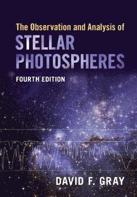

# 恒星光球层的观测与分析(OASP) - 0

 
*书的封面*

## 前言 - 2017

这是恒星光球层的观测与分析（[The Observation and Analysis of Stellar Photosphere](https://ui.adsabs.harvard.edu/abs/2005oasp.book.....G/abstract)；后文简称OASP）的读书笔记。当时是找生长曲线相关资料的时候偶尔看到的，觉得不错，就打算慢慢看下去，把笔记记在这里。这本书说是对光球层的观测与分析，实际上是教你如何分析恒星光谱。写笔记中肯定会有理解错误的地方，请不吝指正，どうか。 
为了避免版权问题，图片尽量从其他地方找、或者自己画。

## 前言 - 2025.05

上一节的这个“当时”也已经是2017年了。这么七八年来这个笔记似乎有了一些读者（感谢大家），正好也趁着这个机会把它重新整理一下。

同时也借这个机会向这本书的作者，David F. Gray教授表达我的敬意。我硕士刚入学的时候被导师推荐读的书其实是另一本：[Theory of Stellar Atmospheres.](https://ui.adsabs.harvard.edu/abs/2015tsaa.book.....H/abstract) An Introduction to Astrophysical Non-equilibrium Quantitative Spectroscopic Analysis（后文称为TSA）。我们当时准备一个星期看一章，但是事实证明至少对我来说这个目标太不现实了。而且这本书非常侧重理论；在实际科研和观测里面用到的知识散落在这本书的各个地方，作为一个observer，从头开始读这本书会需要非常多的学习时间。所以最后我说服了导师转向了读OASP这本书。归功于OASP优秀的写作水平、连贯的逻辑以及每一章解决一个问题的模块化内容安排（也有一些读TSA的时候打下的基础），读OASP的过程是非常愉快的。

大概在18还是19年我曾经给格雷教授发过一封邮件，询问他不同波长下的光深的转换公式的一个问题。他很快回复了我，并给了我很详细的回答。很可惜我跟他的联系就仅限于这么一封邮件。后来看[他的主页](https://physics.uwo.ca/~dfgray/)（现在已经打不开了）写着他在招博士生，还想过要不要去试试。2023年再次登上他的主页的时候发现他已经在2022年去世了。RIP. 在他去世的前一年，格雷教授完成了OASP这本书的第四版。在线版本的图变成了彩色，也添加了一些更新的内容。

值得一提的是这本书的曾经在1981年由黄磷、李宗伟、蒋世仰、何香涛、蔡贤德几位老师翻译成中文并出版。出于好奇以及集邮的想法去年我也买了一本。主要的内容基本上是一样的，不过有趣的是当时对一些专有名词的翻译和现在是听不一样的，比如元素丰度叫做丰富度。

既然这是前言，我就在这里多唠叨几句我对恒星大气和恒星光谱学习上书籍的选择经验。我认为这个领域学习的程度可以分为三档，由浅至深各有一本书作为代表：
- 初级：OASP（本书）
- 中级：Robert J. Rutten的[RADIATIVE TRANSFER IN STELLAR ATMOSPHERES](https://webspace.science.uu.nl/~rutte101/Radiative_Transfer.html)
- 高级：Dimitri Mihalas and Ivan Hubeny的TSA

OASP这本书仅需要基础的大学物理知识即可，并不要求有辐射转移的知识/经验以及太多的天文学背景。同时它以观测的内容为主，基本上在读完一章之后就可以完成一个新的任务（比如测量有效温度、知道为什么连续谱吸收在不同波长上是什么样子的）。所以它是非常适合本科高年级以及硕士生去了解恒星大气这个领域，并迅速上手进行光谱分析的。

Robert J. Rutten的书是介于OASP与TSA之间的一本书。与其说是书不如说它是一个讲义。它对于辐射转移的基础知识（大概就是OASP中提到的那些）有一个稍微概略一点的描述，同时以比较具象的形式涉及到了NLTE计算的内容。在发现TSA这本书读起来比较难的时候，先从这本书开始会让整个学习过程顺畅一些。略微可惜的是这个讲义某些章节并没有完成。
这里同时也推荐一下[Robert J. Rutten的主页](https://robrutten.nl/)，里面有很多很有价值的讲义、代码以及课程（比如说一个跟OASP内容类似的讲义）。

最后就是TSA这本书了。理论上来说，读这本书也不需要辐射转移的背景知识，因为它基本上是从量子力学开始讲辐射转移的，并且涵盖了从理论计算到数值模拟的几乎方方面面。但是这本书的劣势也正是在这里：它不涉及观测内容，所以对于初学者来说，会比较难以将书中的内容和具体的观测数据联系起来。我认为将它当作一本字典去使用应该是比较好的办法。

最后，作为这本书的笔记，我并不力求覆盖每个章节的全部内容 - 这样就不是笔记而是翻译了。我会侧重于里面的关键概念、以及对它的理解。这个笔记当然不能代替书籍本身的内容，但是如果它能在阅读遇到有疑问或者比较难理解的时候为读者提供一种理解的方式，那么它就达到了我预想中的效果。