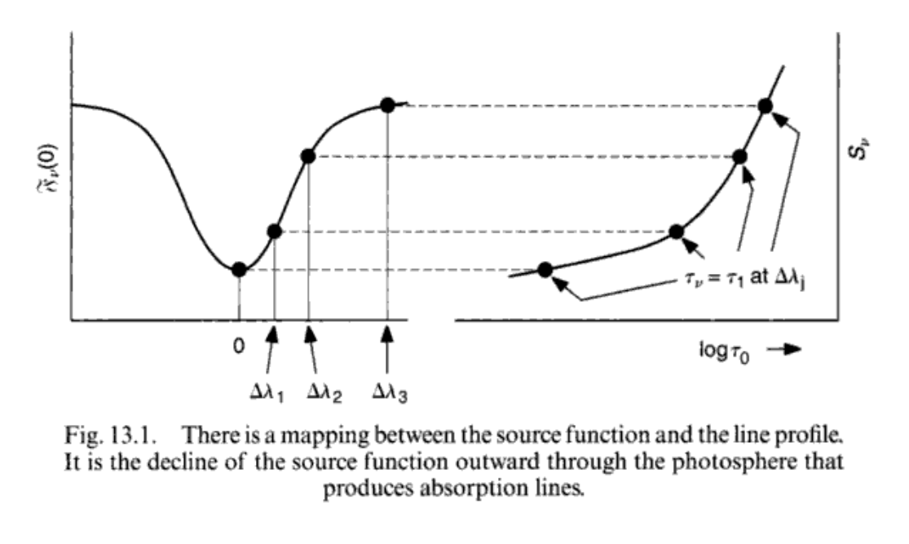
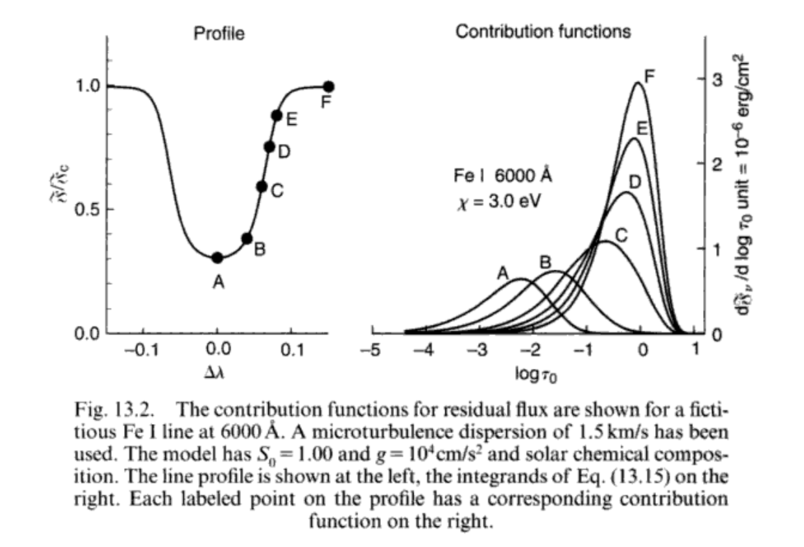
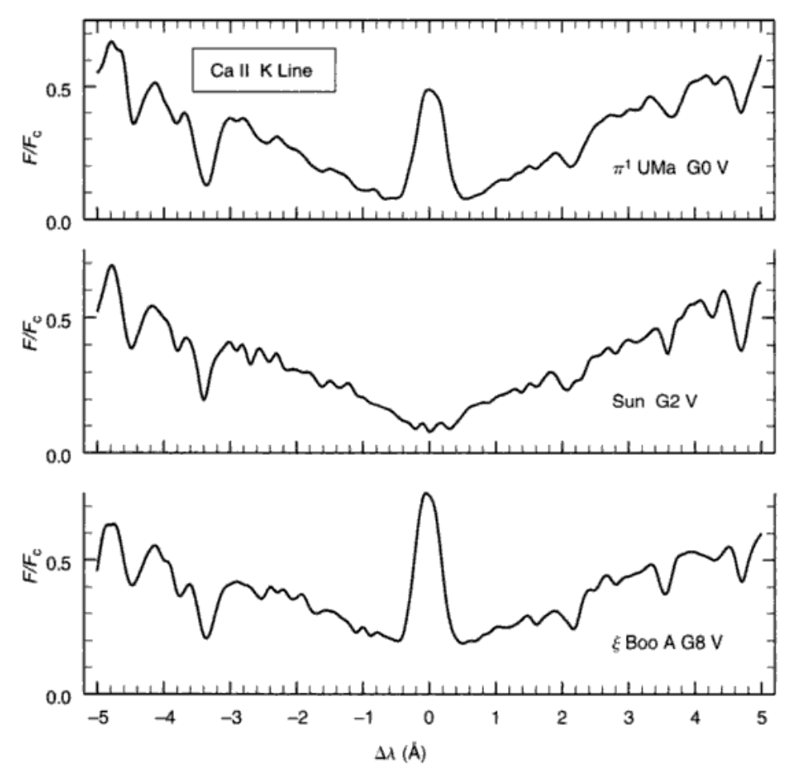
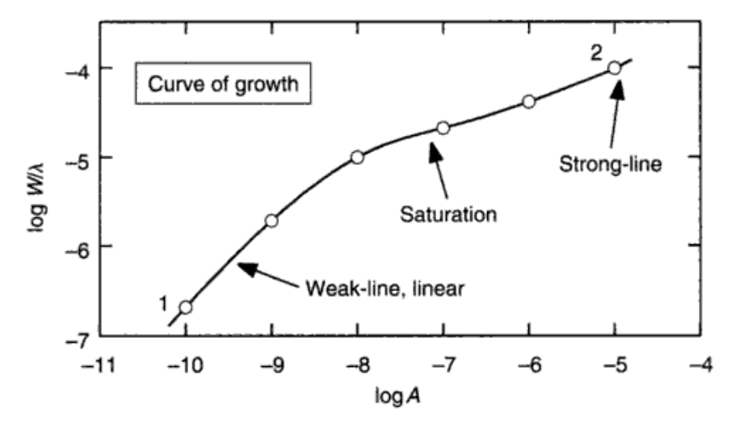

# 第十三章：谱线的行为

Image credit: [Jonathan Walker](http://www.jonathanwalker.net.au/spectral-painting.php).

我们在归一化光谱下面讨论。

## 谱线的转移方程

主要参考第七章的东西。大气连续谱上有吸收和发射，那么谱线也有。

令$$ l_\nu $$为谱线吸收系数，$$ j^l_\nu $$为谱线发射系数；对于连续谱这两个量是$$ \kappa_\nu, j^c_\nu $$。那么对于式子$$ (7.1) $$，我们还有同样的形式：

$$ \begin{align} \frac{dI_\nu}{d\tau_\nu} &= -I_\nu + \frac{j^l_\nu + j^c_\nu}{l_\nu + \kappa_\nu} \\  &= -I_\nu + S_\nu \end{align} \tag{13.3} $$

只是这时候光深$$ S_\nu $$包含了谱线和连续谱的部分，变成了$$ \frac{j^l_\nu + j^c_\nu}{l_\nu + \kappa_\nu} $$。同样光深也要包含谱线的贡献：$$ d\tau_\nu = (l_\nu + \kappa_\nu) \rho dx $$。

因为光深还是$$ S_\nu $$，所以大气辐射转移的基本式子$$ (7.4), (7.9) $$以及它们有关恒星表面的推论$$(7.10), (7.15) $$仍然成立，就不抄过来了。

如此这般，这般如此，我们的主要任务还是回到了如何求新的源函数上。

## 谱线的源函数

我们先定性的看谱线形成的深度。利用灰大气假设，我们有

$$ S(\tau_\nu) = \frac{3F_\nu(0)}{4\pi}(\tau_\nu+\frac{2}{3}) \tag{13.7} $$

形式和$$ (7.34) $$是完全一样的，只不过虽然连续谱和波长无关，谱线却和波长有关，所以$$ \nu $$的下标回来了。这个式子告诉我们光深越大的时候源函数越大（大气底层发射更多嘛），同时$$ F_\nu(0) $$也与光深成正比。这就说明了谱线中心所对应的光深比较小，形成场所在大气较上层；而谱线的边缘所对应的光深比较大，形成场所在大气较下层。

当然这个只是定性的分析，实际定量的要这么做：

我们引入谱线的发射和吸收轮廓$$ \psi(\nu), \phi(\nu) $$，并且加在$$ (5.16), (5.17) $$上面：

$$ j^l_\nu \rho = N_u A_{ul} \psi(\nu) h\nu $$

$$ l^l_\nu \rho = N_l B_{lu} \phi(\nu) h\nu - N_u B_{ul} \phi(\nu) h\nu $$

所以源函数就是

$$ S_l = \frac{j^l_\nu}{l^l_\nu} = \frac{N_u A_{ul} \psi(\nu) h\nu}{N_l B_{lu} \phi(\nu) h\nu - N_u B_{ul} \phi(\nu) h\nu} $$

把$$ (6.8) $$拿过来消掉所有的AABB：

$$ S_l = \frac{2h\nu^3}{c^2} \frac{1}{(N_l/N_u)(g_u/g_l)-1}\frac{\psi(\nu)}{\phi(\nu)} \tag{13.9} $$

这就是non-LTE下的源函数。

如果在LTE下并且有细致平衡原理的话，吸收发射轮廓相等并且有$$ (1.17) $$，则

$$ S_l = \frac{2h\nu^3}{c^2} \frac{1}{e^{h\nu/kT}-1} = B_\nu(T) \tag{13.10} $$

就比较简单了。

[2018.9] LTE的东西当然比较好用，不过最近在华沙的一个Gaia Workshop里面Maria Bergermann把LTE批判了一番，说nLTE对于元素丰度确定来说很重要。 
[2019.6] 天可怜见我现在也开始搞nLTE啦....

### nLTE下的源函数

假设我们已知发射/吸收轮廓（或者它们比较好确定？），$$ (3.19) $$剩下的东西就是$$ (N_l/N_u) $$了。在稳态下处于某个能级的原子数量是不变的，所以有

$$ \frac{dN_j}{dt} = \sum^M_{i=1}(N_iP_{ij} - N_jP_{ji}) = 0 \tag{13.11} $$

也是守恒嘛。那这俩概率$$ P $$怎么求呢？它们包含了辐射跃迁的概率以及碰撞跃迁的概率：

$$ P_{ij} = 4\pi A_{ij} + 4\pi B_{ij} \int_0^\infty J_\nu\phi(\nu)d\nu + C_{ij} \tag{13.12} $$

就是概率=自发的+受激的+碰撞的呗。当然$$ i \ne j $$，$$ i \lt j $$时$$ A_{ij} $$就没了。

类似的对于$$ P_{ji} $$也有相似的形式，只不过$$ i \lt j $$变成了$$ i \gt j $$。有了这一堆$$ P $$之后我们就可以解方程$$ (3.11) $$了。

所以我们可以从这里看出来想求$$ S_\nu $$我们需要$$ (N_l/N_u) $$，从而需要一堆$$ P $$，从而需要$$ J_\nu $$，从而需要$$ S_\nu $$。循环了怎么办？迭代呗。

### 还有一些东西

实际上什么时候是LTE，什么时候是nLTE呢？大致来说，恒星大气内部是LTE，外部是nLTE。这其实很好理解，因为内部密度大，基本上能把里面来的光全部吸收掉再发射，就LTE了；而大气外部密度下降，就会有光子逃逸，所以就会逐渐偏离LTE。同时光子逃逸说明外层原子发射的光子变少了，源函数减小，并且原子逐渐变为吸收源，为谱线中心的吸收作出了贡献。

这个结论同时也可以有一个有趣的推论：谱线中心是nLTE的，而线翼是LTE的。一个例子是太阳的Na D线。

## LTE下的谱线轮廓计算

No more nLTE things. 究竟什么时候LTE是好的得通过实际比较才能知道，或者问Maria去。

实际计算用的是$$ (9.13) $$：

$$ F_\nu = 2\pi \int_{-\infty}^{\infty} B_\nu(\tau_0) E_2(\tau_\nu) \frac{\kappa_\nu(\tau_0)\tau_0 d\log{\tau_0}}{\kappa_0(\tau_0)\log{e}} \tag{13.15}$$

如果你想算$$ \tau_\nu $$的话，把上式$$ E_2(\tau_\nu) $$那堆积分就行了，就是$$ (13.16) $$。

有一个有用的推论就是：当谱线比较弱的时候，谱线的轮廓和吸收系数的轮廓是一样的。

令$$ (13.7) $$中的$$ \tau_\nu = (4\pi-2)/3 = \tau_1$$，有

$$ S_\nu(\tau_1) = F_\nu(0) \tag{13.8} $$

那么

$$ \frac{F_c - F_\nu}{F_c} \approx \frac{S_\nu(\tau_c=\tau_1) - S_\nu(\tau_\nu=\tau_1)}{S_\nu(\tau_c=\tau_1)} \tag{13.17} $$

$$ \tau_c,\tau_\nu $$指的是没有/有谱线下的光深，并且LTE下谱线以及连续谱的源函数都是黑体辐射函数。

现在的光深变为：

$$ \tau_\nu = \int_0^{\tau_0} \frac{l_\nu}{\kappa_0}dt_0 + \int_0^{\tau_0} \frac{\kappa_\nu}{\kappa_0}dt_0 = \tau_l + \tau_c $$

（不熟悉的话参见第九章$$ (9.13) $$后面的式子）

简化，假设$$ \frac{l_\nu}{\kappa_0}, \frac{\kappa_\nu}{\kappa_0} $$与光深无关，有$$ \tau_l = \frac{l_\nu}{\kappa_0}\tau_0, \tau_c = \frac{\kappa_\nu}{\kappa_0}\tau_0 $$。

$$ S_\nu(\tau_\nu=\tau_1) = S_\nu(\tau_l+\tau_c=\tau_1) = S_\nu(\tau_c=\tau_1-\tau_l) $$以及$$ \tau_l \ll \tau_c $$，泰勒展开有：

$$ S_\nu(\tau_\nu=\tau_1) = S_\nu(\tau_c=\tau_1) + \frac{dS_\nu}{d\tau_c}(-\tau_l) + ... $$

所以$$ (13.17) $$变为

$$ \frac{F_c - F_\nu}{F_c} \approx \frac{\tau_l}{S_\nu(\tau_c=\tau_1)} \frac{dS_\nu}{d\tau_c}|_{\tau1} = \tau_l  \frac{d\ln{S_\nu}}{d\tau_c}|_{\tau1}$$

将$$ \tau_l = \frac{l_\nu}{\kappa_0}\tau_0 $$代入，有

$$\begin{align} \frac{F_c - F_\nu}{F_c} &\approx \frac{l_\nu}{\kappa_0}\tau_0 \frac{d\ln{S_\nu}}{d\tau_c}|_{\tau1} \\
&= \frac{l_\nu}{\kappa_\nu}\tau_c \frac{d\ln{S_\nu}}{d\tau_c}|_{\tau1}\\
&= \text{constant} \frac{l_\nu}{\kappa_\nu} \tag{13.19}
\end{align}$$

就是这样。

## 谱线的贡献函数

“王老五就是未结婚的王老五”，贡献函数就是第九章的贡献函数。不多说了，放两张图自己体会。

## 谱线强度的行为

这里只讨论几个对谱线强度有比较大影响的参数：温度、$$ \log{g} $$以及金属丰度。

### 温度

对于弱线来说，温度变化影响了原子的占据数以及跃迁、连续谱的吸收，从而改变了谱线强度。强线以及氢线的话，还要考虑$$ \gamma $$随温度的变化。

这里姑且只讨论弱线，则有下图：

首先由$$ (8.12) $$有：

$$ \kappa_\nu = \text{constant} T^{-5/2} P_\mathrm{e} e^{0.75/kT} $$

Case 1时，是原子谱线+中性原子：

$$ N_l = \text{constant} N_0 e^{-\chi/kT} \approx e^{-\chi/kT} $$

$$ \Rightarrow R = \frac{l_\nu}{\kappa_\nu} = \text{constant} \frac{T^{5/2}}{P_\mathrm{e}} e^{-(\chi+0.75)/kT} \tag{13.20} $$

又因为$$ (9.27) $$，有：

$$ \ln{R} = \text{constant} +2.5 \ln{T} - \frac{chi+0.75}{kT} -\Omega T $$

其他Case类似，具体公式请看书。要留意Case 1和4的表达式是完全一样的，但是因为温度范围不同趋势不同。

### 压力

有三种：1. 电离平衡改变导致谱线/连续谱吸收原子数改变； 2. damping常数与与压力有关； 3. 线性斯塔克效应。

这里的讨论都基于$$ (13.19) $$；低温时$$ \kappa_\nu \propto P_\mathrm{e} $$，高温时$$ \kappa_\nu \propto \text{constant} $$。

第一种：

$$ l_\nu \propto N_i $$

$$ \frac{N_{r+1}}{N_r} = \frac{\Phi(T)}{P_\mathrm{e}} $$

实际上是原子电离的Saha方程$$ (1.20) $$。

当跃迁是发生在$$ r $$电离态而多数原子在$$ r+1 $$电离态的时候，$$ l_\nu \propto P_\mathrm{e} $$；当跃迁是发生在$$ r+1 $$电离态而多数原子在$$ r+1 $$电离态的时候，$$ l_\nu \propto \text{constant} $$。当跃迁是发生在$$ r+1 $$电离态而多数原子在$$ r $$电离态的时候，$$ l_\nu \propto P_\mathrm{e}^{-1} $$。

第二种主要作用于线翼处，$$ l_\nu \propto \gamma = \gamma_6 + \gamma_4 + \gamma_\mathrm{nat} $$

第三种主要影响氢线，$$ l_\nu \propto P_\mathrm{e} $$。

再往高温走，电子散射会比较重要，所以由$$ (8.17) $$有

$$ \kappa_\nu \approx \kappa_\mathrm{e} = \frac{\alpha(e)P_\mathrm{e}\sum A_j}{P_\mathrm{g}-P_\mathrm{e}} $$

此时$$ P_\mathrm{g} \approx 2P_\mathrm{e} $$，所以$$ \kappa_\nu $$独立于$$ P_\mathrm{e} $$；同时$$ l_\nu \propto P_\mathrm{e}^2 $$（哪来的？）

### 金属丰度

生长曲线。

简单地来说，我们考虑这么一个图像：连续谱光源在后面，前面是一团冷的气体，厚度为$$ L $$。

$$ F_\nu = F_c e^{-\tau_\nu} \tag{13.28} $$

$$ \tau_\nu = \int_0^L l_\nu \rho dx = \int_0^L N \alpha dx = A \int_0^L (N/N_E) N_\mathrm{H} \alpha dx \tag{13.29} $$

$$ N $$为吸收原子个数，$$ N_E $$为这种原子的总个数。

当$$ \tau_\nu \ll 1 $$，即谱线很弱的时候，我们有

$$ F_\nu \approx F_c(1-\tau_\nu) $$

所以这个时候线深和谱线强都都正比于$$ A $$。

对于强线来说，我们需要考虑线翼；结论是

$$ W = (\langle\gamma\rangle Afh)^{1/2} \int_0^\infty (1-e^{-1/u^2})du \tag{13.31}$$

这里的生长曲线指的是仅仅改变某个元素的丰度；而如果我们改变整个恒星的金属丰度的话，生长曲线会不一样；这是因为改变整体的丰度会改变电离平衡、连续谱吸收以及碰撞的damping。一个例子如下图：

对于实际的谱线来说，例子如下：

*图三张*

## 最后的碎碎念

LTE和nLTE都有可能出错

*图两张*

它们都需要致宽；就连生长曲线都会受到致宽的影响（为什么？）
