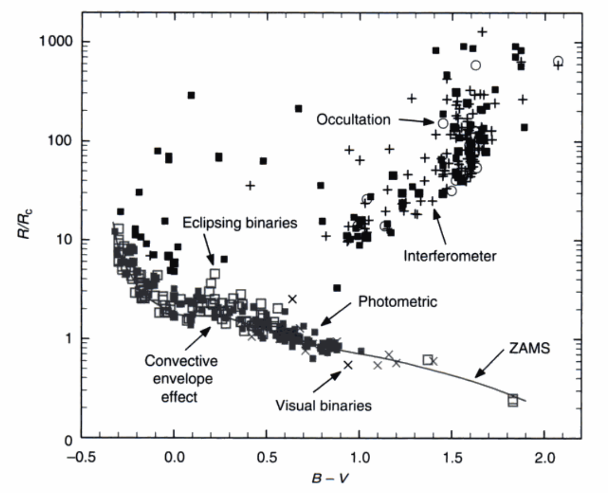

# 第十四章：半径与有效温度的确定

这俩参数是恒星的基本参数。假设有俩以某恒星为中心的同心球，一个半径为恒星半径$R$，另一个的半径为恒星到观测者的距离$d$；在这两个球面上接收到的辐射量为$\mathscr{F}_\nu, F_\nu$，则有

$$ 4\pi d^2 F_\nu =  4\pi R^2 \mathscr{F}_\nu \tag{14.1} $$

将有效温度的定义$(1.2)$代入并积分，有

$$ \int_0^\infty F_\nu d\nu = (R/d)^2 \int_0^\infty \mathscr{F}_\nu d\nu = \theta_\mathrm{R}^2 \sigma T_\mathrm{eff}^4 \tag{14.2} $$

$\theta_\mathrm{R}$自然是角半径了。测量得到$\int_0^\infty F_\nu d\nu$和角直径和距离之后就可以算出恒星半径以及有效温度了。例外是食双星，可以直接得出线直径。

不同波段是有不同的半径的，毕竟光深和几何深度的关系随着频率而变化。同时有效温度实际上在恒星不同的表面上是不一样的（有米粒组织等），而且决定恒星大气更根本的参数是温度随着光深的分布。但是这一章我们先忽略这些东西，就看这两个参数。

## 半径测量

半径测量分为直接和间接的方法。

### 直接方法

#### 干涉法

干涉法好说，测量一个方波傅立叶变换之后的零点位置可以得出这个方波的大小，而干涉仪可以测出这个零点。现在(2003年)的精度已经达到了0.05毫角秒，有几百颗星的角直径被测出来了。

#### 月掩星法

也好说，测量恒星被掩食的时候的光变然后建模拟合就行。局限在于不同波度的光变幅度不一样，所以需要用比较窄的滤光片；类似的，月球边缘的起伏也会造成不同次掩食时光变和时标的不一样。当然最大的问题是白道和月球的运动是固定的，这个方法只对少部分恒星适用。通过这个方法测出来角直径的恒星也在100颗左右。

#### 食双星

对于食双星，我们知道掩食时间与视向速度，那就知道线直径了。不过密近双星经常会偏离球形，同时物质交换会使得两颗恒星的光谱趋同，加大掩食时间与视向速度的测量难度。远距离双星的难度主要在于视向速度的测量方面。

#### 热流量法

对$(14.2)$稍作变形：

$$ \frac{R}{d} = \theta_\mathrm{R} = \sqrt{\frac{\int_0^\infty F_\nu d\nu}{\sigma T_\mathrm{eff}^4}} \tag{14.4} $$

不过同样需要知道距离、有效温度以及恒星的热辐射。

热辐射可以通过恒星的光谱来估计，或者与太阳的数据作差转换成热星等，利用第十章的热改正来得到恒星的热星等。有效温度大致是从恒星模型来，也就是之后说的一些方法，直接或间接地得到。

#### 测光半径

热流量法要求我们知道整个光谱范围的流量，而测光半径法则走向了另一个极端。从$(14.1)$我们可得：

$$ \theta_\mathrm{R} = R/d = (F_\nu/\mathscr{F}_\nu)^{1/2} \tag{14.7} $$

那如果我们能够准确知道某一个波长下的$F_\nu, \mathscr{F}_\nu$，我们就能算出角直径来了。$F_\nu$好测，而$\mathscr{F}_\nu$可以从模型来。只要在几个不同的波长上有测光，我们就可以将不同参数的模型与之匹配，找到最合适的那个。当然这些测光点是越多越好，有利于选择正确的模型。

这个方法依赖绝对定标，对测光以及模型的流量绝对定标要求不低。还有一个红外流量法，介于这两个方法之间：假设一个$T_\mathrm{eff}$，得到一个$\theta_\mathrm{R}$，又得到一个新的$T_\mathrm{eff}$，如此循环。不过这个方法又和有效温度以及模型扯上了关系，同时红外的模型准确度也是要考虑的问题。

### 间接方法

#### 表面亮度法

还是从热流量法出发，将$(14.4)$取对数并将流量转成星等，有

$$ \lg{\theta_\mathrm{R}} = - 0.2 (m_\mathrm{V} - BC) - 2\lg{T_\mathrm{eff}} + \text{constant} \tag{14.5} $$

于太阳的参数作差，把不好测量的项移到一边并定义一个新变量：

$$ \mathbb{P}_\mathrm{V} = \lg{\frac{T_\mathrm{eff}}{T_\mathrm{eff}^\odot}} - 0.1 (BC-BC^\odot) = -0.1 (m_\mathrm{V}-m_\mathrm{V}^\odot) - 0.5 \lg{\frac{\theta_\mathrm{R}}{\theta_\mathrm{R}^\odot}} \tag{14.10} $$

当我们有一批通过直接方法测出来的$\theta_\mathrm{R}$以及它们的$m_\mathrm{V}$时，就可以很容易地算出$\mathbb{P}_\mathrm{V}$；再用公式拟合$\mathbb{P}_\mathrm{V}$和某些观测量（比如色指数）的关系后，就可以通过测量色指数来得到角半径了。

#### 把这些结果 放到一张 图上

我们能从这张图上看出不少信息。

首先不同方法测出来的结果是一致的，没有哪种结果有很大偏离。对于矮星来说半径的弥散比较小，而且有一个下限零龄主序(ZAMS)在。$B-V > 0.5$的恒星演化时标比较长，所以没怎么演化，都堆在了一起；反之高温恒星的弥散就大一点了。在0.4到0.6左右矮星半径有一个快速的下降，这是因为对流传能开始占据一定比例，帮助恒星更快地收缩（但是为什么之后又慢了？）。

对巨星的分布书中没有详细的描述。

## 有效温度测量

仍然从$(14.2)$出发：

$$ T_\mathrm{eff} = \frac{\left( \int_0^\infty F_\nu d\nu / \sigma \right)^{1/4}}{(R/d)^{1/2}} \tag{14.14} $$

$$ T_\mathrm{eff} = \frac{T_\mathrm{eff}^\odot \left( \int_0^\infty F_\nu d\nu / \int_0^\infty F_\nu^\odot d\nu \right)^{1/4}}{(\theta_\mathrm{R}/\theta_\mathrm{R}^\odot)^{1/2}} \tag{14.15} $$

前者需要流量的绝对定标、后者和太阳作比；现在的话这俩都可以用。只不过恒星的热辐射不能完全被测出来，里面就涉及到恒星模型的帮助；那么用恒型模型也可以测出有效温度。

### 光球层模型法

也就是算出一个模型来（温度分布），然后加上各个波段上的吸收系数就有辐射了。当然它的好坏取决于模型有多合适。

### 有效温度关系校准

有效温度和很多的参数有关系，比如色指数和光谱型。当然误差会来自色指数的测量、星周包层带来的红化等等。既然说到了校准，我们之后就介绍一些校准有效温度的方法。毕竟多数时候有效温度只是区分恒星的一个数字，所以拿什么来校准问题都不大。

#### 帕邢连续谱

实际上指的是帕邢连续谱的斜率。连续谱受谱线以及$\log{g}$的影响不大，基本上是LTE，还对有效温度比较敏感。当然对于高温和低温恒星不一定有用，因为它们的主要辐射不在可见光了。还有一点就是连续谱形成于比较深的地方，所以从斜率转化到有效温度的时候要注意匹配。

#### 模型色指数

当合成光谱质量很高的时候，我们可以去计算模型的色指数。这包括连续谱和谱线的计算，以及模型与观测星等的零点校正，还有观测波段的透过率。

#### 巴尔末跳跃

用于高温恒星，类似于帕邢连续谱，但是是测量巴尔末线系限左右的流量差。不过也受$\log{g}$和元素丰度影响，需要进行改正。同时在线系限附近有很多的巴尔末线，连续谱不好确定。帕邢和巴尔末附近的恒星模型有的时候也给出不同的结果。

#### 氢线

氢线的强度对有效温度很敏感。但是氢线太胖了不好测量，以及高温之后它也会和$\log{g}$有关系。

#### 原子谱线的LDR

这就是我的硕士毕业论文，不多说了。
