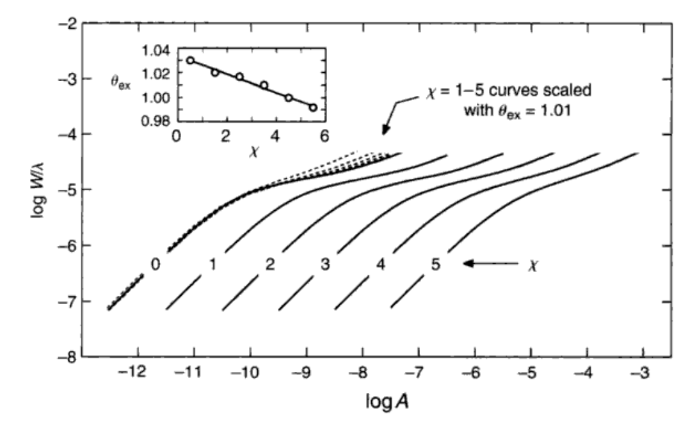
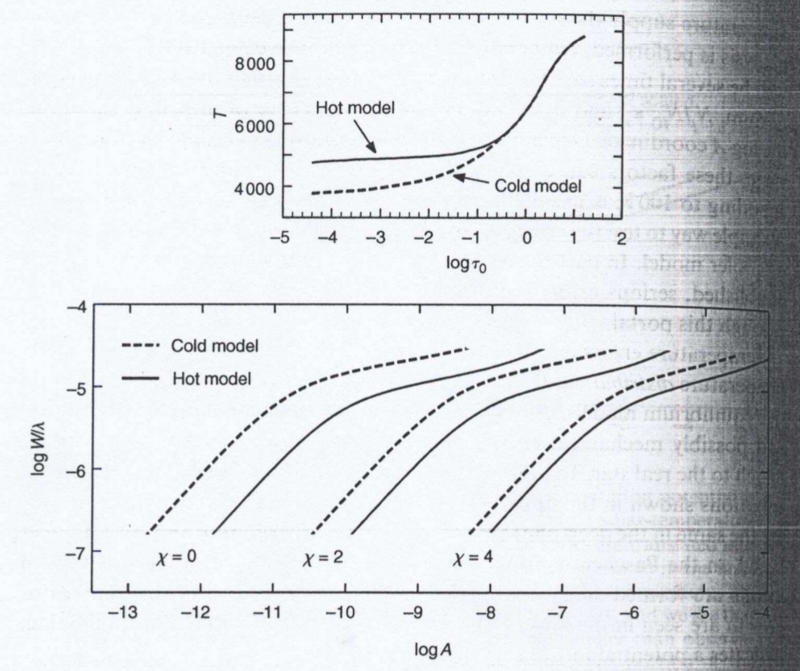
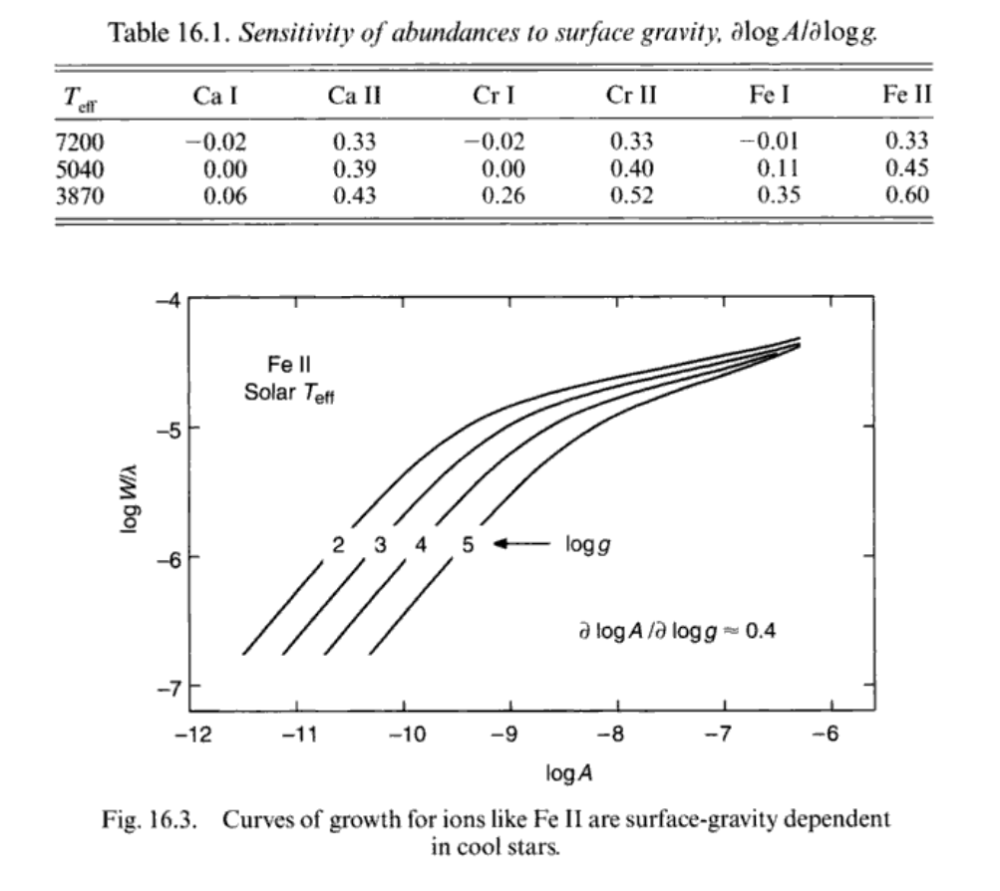
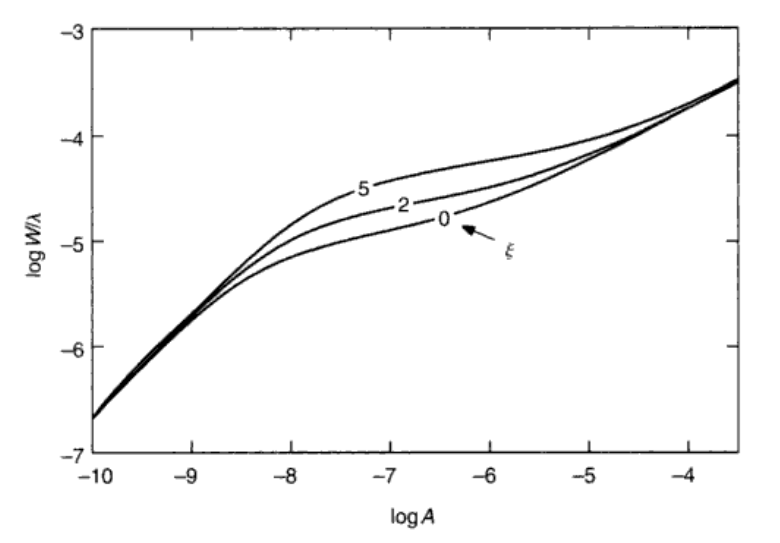
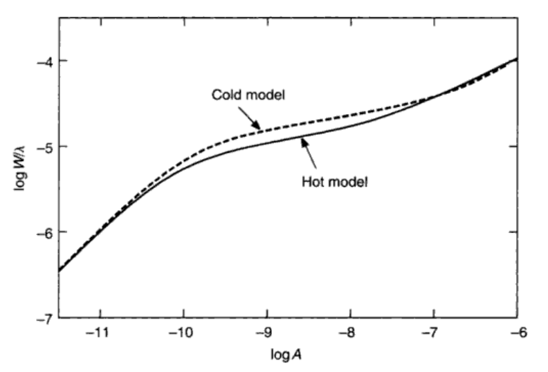
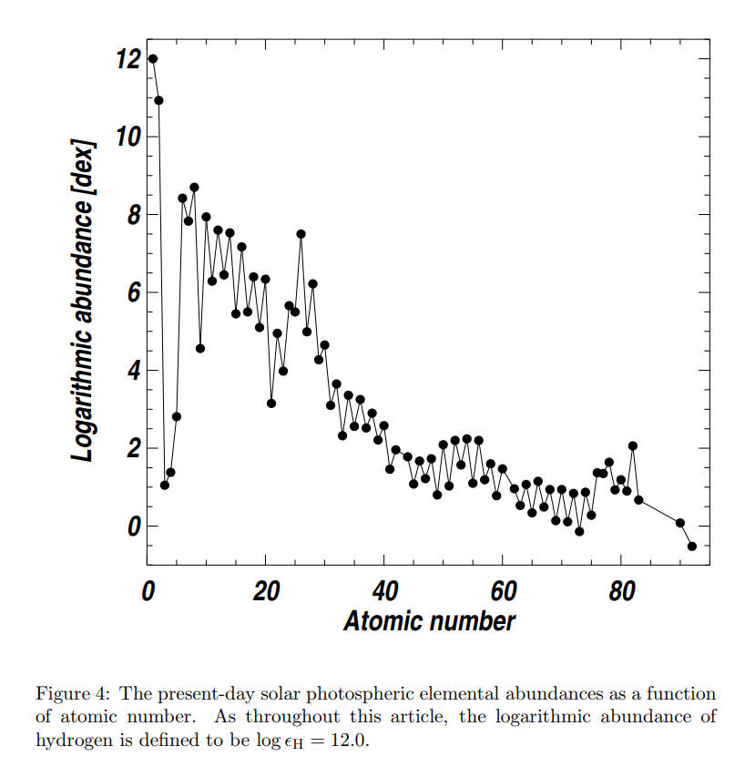
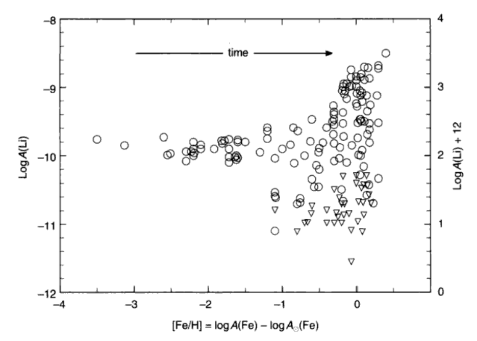
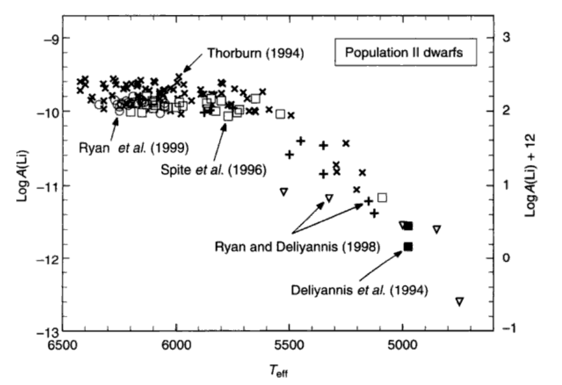
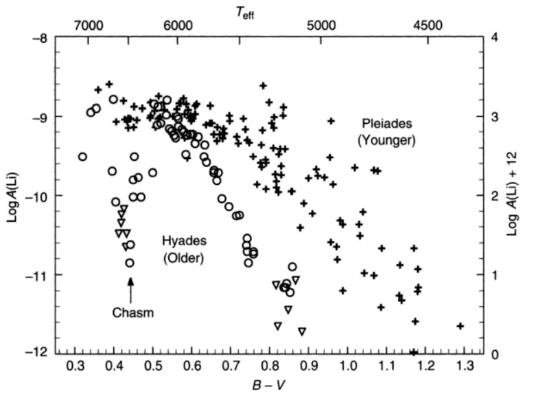

# 第十六章：化学丰度分析

恒星的化学丰度所包含的信息我认为超过了其他恒星参数所含信息的量。现在的恒星演化模型、星团模型以及星系模型都可以给出恒星或者恒星群在HR图上的分布；但是恒星的化学丰度并不容易从模型中导出。这是因为化学丰度不仅和恒星自身的状况有关，还反映了形成时的星际环境状况。最近再次变得热门的银河考古学就是希望通过低质量恒星的长寿命以及它们的元素丰度去推断银河系早期的状况以及之后的演化。而对于恒星自身来说，锂和碳的同位素反映了恒星的演化阶段。

我们用于分析化学丰度的手段仍然是光谱的谱线。所以我们的第一反应应该是，元素丰度的分析是和恒星的有效温度、$\log{g}$等参数的确定耦合在一起的。要不然就先把基本的参数确定再搞丰度，要不然就一块定了。

低分辨率光谱只能告诉我们某条谱线的吸收总量，而高分辨率光谱还能告诉我们谱线的形状信息。当然，曝光充足的情况下，分辨率总是越高越好的。

## 几段概括

确定元素丰度的方法主要有两个：生长曲线法以及合成光谱法。

生长曲线在[第13章](https://mingjiejian.github.io/2018/10/07/OASP13/)已经有提到。因为生长曲线代表了谱线等值宽度和元素丰度的一一对应关系，所以只要生长曲线和谱线等值宽度确定，就可以马上得到元素丰度。我们后来还找到了谱线深度和元素丰度的关系，实际上在谱线有致宽的情况下这也是一条生长曲线。

合成光谱法就是尽一切所能模拟观测到的光谱。我们相信总有一组参数使得观测和模拟光谱的差异达到最小，而这组参数就是我们想要的恒星参数。

当然这两种方法都是需要一个很可靠的谱线列表的。除了谱线位置要准确之外（废话要不然怎么对应起来），我们还要求有一个精确的振动强度，也就是$(13.31)$中的$Af$。这就是为什么除了一个大线表（比如[VALD](http://vald.astro.uu.se/)和[MB99](http://adsabs.harvard.edu/abs/1999ApJS..124..527M)）之外，几乎每个光谱仪都会有一个自己的线表（[APGEE](http://adsabs.harvard.edu/abs/2013AJ....146..133M)的以及不知道什么时候才能发出来的WINERED线表）。当然$Af$的准确性就是靠实验室的同志们提高了，这里按下不表。

如果我们只需要较差测量，那么内部的误差将会很小。我们只需要拿两个其他恒星参数都类似的恒星，看看它们谱线的宽度差就好了。

最后几点注意：一般来说LTE就已经够了，但是对于某些谱线，如H、He等，来说，nLTE是需要考虑的。Again我又想到了Maria。同时这个结果只适用于表征这条谱线所在的恒星大气部分的丰度，比如说内部的丰度我们不知道，或者星冕层发出来的谱线测量的丰度要转成恒星大气的丰度可能不那么简单。

## 生长曲线法

### 一些计算

我们从$(7.15)$出发，经过换元得到$(13.15)$：

$$ F_\nu = 2\pi \int_{-\infty}^{\infty} B_\nu(\tau_0) E_2(\tau_\nu) \frac{[l_\nu(\tau_0)+\kappa_\nu(\tau_0)]\tau_0 d\log{\tau_0}}{\kappa_0(\tau_0)\log{e}} $$

我们想算的是等值宽度：

$$ W = \int_0^\infty \frac{F_\nu-F_c}{F_c}d\nu $$

实际上上面的变量我们都知道怎么算了，比如$l_\nu$可以用$(11.53)$算出来，而在其中未定的只有$(11.53)$里面的$g_nAf$。对于某条确定的线，我们知道$g_n$；如果$f$也已知的话，$A$就知道了。只要重复上述过程，就可以搞出一堆生长曲线。如果谱线比较宽，则还需要考虑micorturbulence以及damping带来的致宽。

在现在的这个运算能力下，合成光谱的产生其实不难。但是生长曲线在为我们提供原理上的认识方面还是不可或缺的。

### Scaling relations

对于某一颗星来说，它的元素丰度是固定的。但是当我们考察同一种元素的不同谱线的时候，我们还是会发现它们也有不同的宽度。这是因为还有其他的因素能影响宽度。

我们应用弱线近似：

$$ \frac{F_c-F_\nu}{F_c} \approx \text{constant} \frac{l_\nu}{\kappa_\nu} \tag{16.1}$$

对整个频率域积分，得到等值宽度：

$$ w = \frac{\text{constant}}{\kappa_\nu} \int_0^\infty l_\nu d\nu $$

利用$l_\nu \rho = N\alpha$和$(11.9)$以及考虑量子效应（强行加上个$f$）得到积分的结果：

$$ w = \text{constant}\frac{\pi e^2}{mc} \frac{\lambda^2}{c} f \frac{N}{\kappa_\nu} \tag{16.2}$$

$$ \rho$被丢到了常数里面。引入元素丰度$A = N_E/N_H$以及某元素第$j$级电离的原子数$N_j$，式子$(1.17)$变为：

$$ N = A \frac{N_j}{N_E} N_H \frac{g_n}{u(T)} e^{\frac{-\chi}{kT}} \tag{16.3}$$

把上式丢进$(16.2)$，有：

$$ \log{\frac{w}{\lambda}} = \log{C} + \log{A} + \log{g_nf\lambda} - \theta_{ex} \chi - \log{\kappa_\nu} \tag{16.4} $$

(MOOG也用了这条式子)$\frac{w}{\lambda}$是为了将和多普勒有关的现象归一化（*介又是什么？*）。上式说明了右侧后面这四项的地位是一致的，所以当其他三个固定的时候，剩下那个就可以作为横坐标出现在生长曲线图上了。

*之后的这一大段没有看懂*

### 温度的影响

温度会影响$(16.4)$中的$\frac{N_j}{N_E}, \kappa_\nu, \theta_ex$，也就是说会将生长曲线向左或者右平移。不过一般100K的误差只相当于0.1dex的移动，所以还好。

但是有效温度的差异也会影响恒星模型的温度分布，从而移动生长曲线。图16.2就反应了这么一个情况。当然不同温度还会改变谱线饱和的点；温度越高，饱和点越早。这个现象在LDR的研究中也出现了。

### $\log{g}$的影响

我们只讨论线性区间。$\log{g}$对谱线的影响主要在第13章讨论过了。对于低激发能元素的中性谱线来说，基本上$\log{g}$不会对谱线宽度有什么影响，但是其他的就不一定了。我们从图16.3中可以看出，$\Delta\log{A}, \Delta\log{g}$之间是有线性关系的，所以我们在表上看到CaI基本上不怎么受影响，而其他的就不一定了。从Ca到Cr再到Fe的过程就是激发能逐渐上升的过程。

如果$\log{g}$已知，那么我们可以分别确定中性谱线和电离谱线的金属丰度。而如果$\log{g}$未知的话，我们也可以通过调整$\log{g}$来让中性和电离谱线的金属丰度一致，这也可以确定$\log{g}$。

如果非要用强线的话也行，不过会引入更多的变量。

### 饱和部分

饱和部分的斜率很小，所以由此确定的金属丰度误差会大。另外还有一些因素会影响到这部分的生长曲线。

microturbulence($\xi$)，$\xi$会将生长曲线的饱和部分拉高，并延迟饱和的点。当然这个特性也可以用来确定$\xi$的值，只要先用线性部分确定基本参数、再用不同$\xi$来拟合生长曲线的饱和部分就行了。超精细分裂以及磁场分裂造成的影响和$\xi$差不多，不过超精细的影响对不同种类的原子不一样。

温度分布对饱和部分也有影响。温度越高，饱和得就早，和$\xi$类似。具体是为什么我还不是很理解。同时nLTE成分越大，饱和也越早。

### 金属丰度的确定

理论上来说对每条谱线都算一个曲线，然后直接读数就行。不过这样会引入很多无关的变量，比如$\xi$。我们得一个一个$\xi$的值去试直到给出的丰度弥散最小，这样很累。

那怎么办呢？从$(16.4)$我们可以得出一个很简便的方法：

$\frac{w}{\lambda}$确定之后，$(16.4)$右边可以有无数个解。那么我们取两条线（1和2），硬是代入这个$\frac{w}{\lambda}$里面，就有

$$ \begin{align}
\log{\frac{w}{\lambda}} &= \log{C} + \log{A_1} + \log{g_{n1}f_1\lambda_1} - \theta_{ex} \chi_1 - \log{\kappa_{\nu 1}} \\
 &= \log{C} + \log{A_2} + \log{g_{n2}f_1\lambda_2} - \theta_{ex} \chi_2 - \log{\kappa_{\nu 2}}
\end{align}$$

$$ \Rightarrow \Delta \log{A} = \log{\frac{g_{n1}f_1\lambda_1}{g_{n2}f_2\lambda_2}} - \log{\frac{\kappa_{\nu 1}}{\kappa_{\nu 2}}} - \theta_{ex} (\chi_1 - \chi_2) \tag{16.5} $$

也就是说，我们惊奇地发现，对于同一颗恒星来说，两条谱线在生长曲线上的横坐标差是固定的，由它们的参数确定。所以我们就可以利用这个$\Delta \log{A}$将所有的测量点都平移到某一条生长曲线上，就可以快乐地拟合了。

## 较差测量

好处前面已经讲了。其实就是拿标准星的生长曲线套在目标星上。由$(16.4)$我们有：

$$ \log{\frac{A}{A_\mathrm{ref}}} = \log{\frac{w}{w_\mathrm{ref}}} - \log{\frac{\kappa_{\nu}}{\kappa_{\nu\mathrm{ref}}}} - (\theta_{ex}-\theta_{ex\mathrm{ref}}) \chi \tag{16.7}$$

和$(16.5)$相比，因为是同一条线，所以线的参数是一样的；但是标准星和目标星的温度差异使得最后两项还是留了下来。自然差异越小精度越高。

## 合成光谱法

这方法在线重叠较多、温度较低的恒星上好使，虽然它需要把所有的线都证认出来并有良好的参数。具体就是试错呗，在参数空间里面找啊找，找到了就好了。[Johnson 2002](http://adsabs.harvard.edu/abs/2002ApJS..139..219J)讨论了误差。

## 丰度指标

UBV测光可以在一定程度上反应金属丰度，因为三个波段上的谱线数量依次递减，而金属丰度越高，自然吸收越多。所以恒星在双色图$(U-B)$-$(B-V)$上的位置可以反映它的金属丰度。当然得先改掉红化。

总谱线吸收当然也和金属丰度有关；但是需要先建立它与有效温度的关系。只对亮星有用。

## 太阳丰度

太阳丰度的数据来源可以不只是光球层光谱，还可以是色球层、日冕、黑子等。

[Asplund+2009](http://adsabs.harvard.edu/abs/2009ARA%26A..47..481A)

太阳丰度在铁附近有峰值（银河考古学那篇应该有解释），同时偶数元素比奇数的多，这和$\alpha$捕获有关。

## 银河系的恒星丰度

应该在银河考古学那篇那加一些金属丰度梯度的东西。

金属丰度和年龄是有关系的。Velanti+06和最近都有用APOGEE去做恒星年龄。锂丰度也有一些有趣的现象。图16.13显示最早的恒星有类似的锂丰度（应该和大爆炸匹配），之后的丰度弥散很大，这是因为锂污染的不均匀以及锂的耗损（*什么？*）。

### 锂丰度

之前也说过锂丰度和恒星演化阶段有关。drege up当然会把内部的锂带上来，所以观测到的锂丰度是初始丰度和drege up的结合。

图16.14看到，老年低温恒星锂丰度很低，这是因为对流层底部温度和压强升高以及寿命长导致的锂被清除掉了。（*什么？*）左边的平台和初始丰度有关，但是可能也有耗损。图16.15反映出越老的恒星锂丰度越小，同时Pleides的弥散来自于自转速度的不同，或者不止一个population。锂丰度在6400-6800K还有一个坑，可能和恒星自身有关。锂6在恒星中很少，所以可以用锂6来探测系外行星。

Be也可以用来探测恒星内部结构。

### 碳丰度

CNO循环的事情。又和韩国人联系上了。碳12和碳13的比值也会随着恒星演化发生改变，从最初的90跌到15左右。

### 特殊金属含量的恒星

多数是AB型星，锶和铕很多。它们都有光谱上的周期和变化。人们认为这是自转造成的，某个区域上某个元素含量很高，同时有强的磁场。磁场和金属量高的区域有联系。还有一些自转比较慢，磁场弱。

或者是双星？

## 碎碎念

化学丰度确定是一个循环的过程，因为它本身就会影响模型。O等对温度敏感的谱线会受米粒组织的影响。
