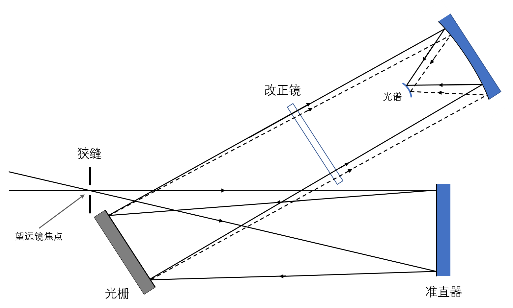
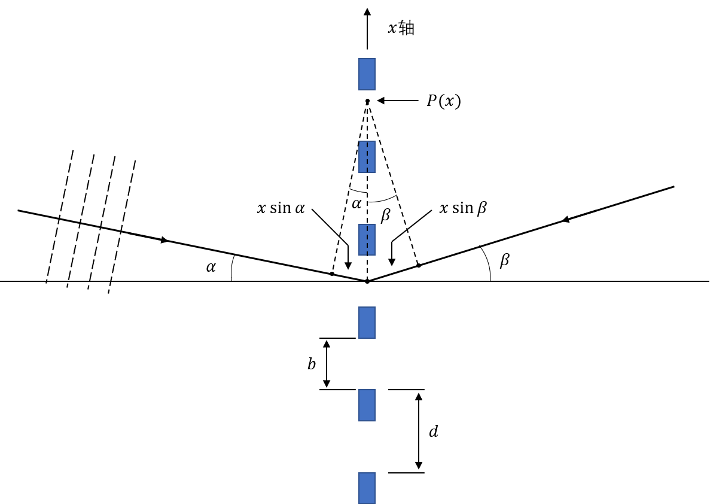
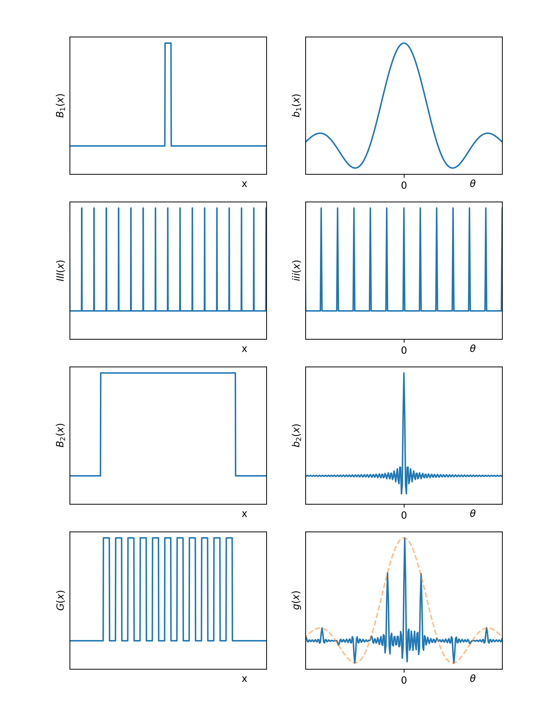
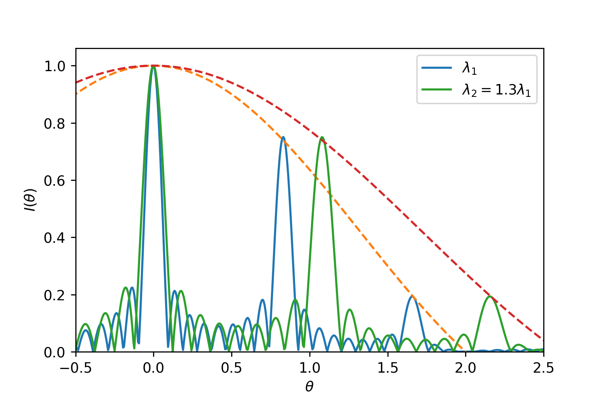
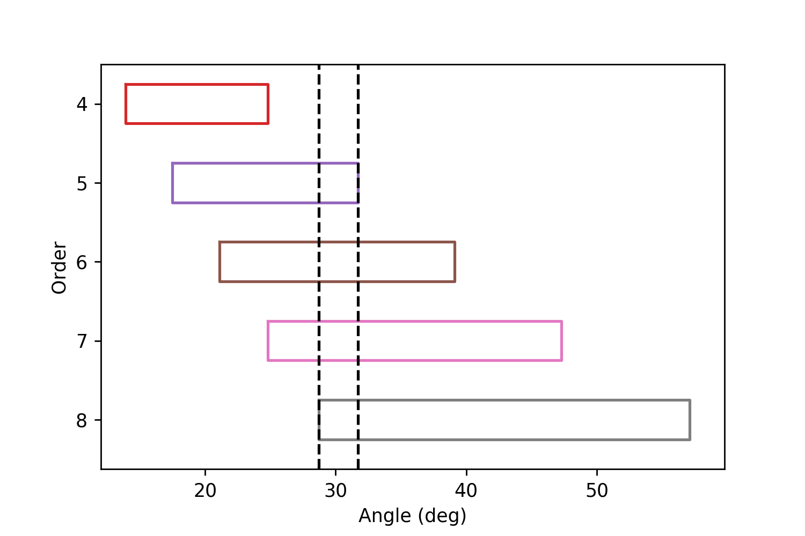

# 第三章：光谱仪

我们需要光谱仪，没有光谱仪哪来的光谱。低分辨率光谱仪可以得到天体的连续谱（[第十章](OASP10.md)），而高分辨率的光谱仪可以得到天体的谱线（[第十二章](OASP12.md)）。

## 概述


<div align="center"><em>光谱仪示意图</em></div>

从望远镜中过来的光在狭缝的中心聚焦，然后被准直器变为平行光照到光栅上面，色散后经过改正镜再被聚焦到CCD上。单色光会在焦面上形成一条线；而因为一般狭缝的宽度都比较大，最终在焦面形成的线宽基本不受光栅衍射条纹的影响。而当复色光入射到光谱仪的时候，焦面上将形成一段连续谱。连续谱中每个颜色的“纯净”程度由$\Delta \lambda$决定。$\Delta \lambda$越小，色散程度越大，天文学家们越高兴。不过色散程度也需要和天体入射的光的总量协调，因为色散程度越大每个像素的光流量越小，需要的积分时间就越长。一般来说我们需要$\Delta \lambda$小于我们关心的光谱结构；第十二章有定量计算。


## 衍射光栅及其原理


<div align="center"><em>衍射光栅示意图</em></div>

令$P(0)$所指示的点为相位0点，则在光栅上任一点和它的相位差为$x \sin{\alpha}$；$\alpha$为入射平面光法向与光栅法向的夹角，是一个定值。所以我们可以将在光栅上的入射光表达为：

$$ F(x, t) = F_0(t)e^{2\pi i\frac{x\sin{\alpha}}{\lambda}} \tag{3.1}$$

同时因为入射光的频率很大，积分时间一般又比较长，所以可以将$F_0(t)$用它的平均值$F_0$代替。

令$G(x)$为光栅，

$$ G(x) = \begin{cases} 1 & \mathrm{狭缝中}\\ 0　& \mathrm{狭缝外} \end{cases}$$

在$\beta$角上看到的光强为$F(x, t)$与$G(x)$的乘积加上离开光栅后的相位差在$x$上的积分：

$$ \begin{align} g(\beta) & = \int^{\infty}_{-\infty} F(x, t) e^{2\pi i\frac{x\sin{\beta}}{\lambda}} G(x) dx \\ & = F_0\int^{\infty}_{-\infty} G(x) e^{2\pi i\frac{x\sin{\alpha}+x\sin{\beta}}{\lambda}} dx \end{align}$$

令$\theta = \frac{\theta'}{\lambda} = \frac{\sin{\alpha} + \sin{\beta}}{\lambda}$，有

$$ g(\theta) = F_0 \int^{\infty}_{-\infty} G(x) e^{2\pi ix\theta} dx \tag{3.2}$$

将这个式子与[第二章](OASP2.md)的傅里叶变换定义式比较，我们发现它们是一样的，所以光栅就相当于一个傅里叶变换器。因为这里$F_0$是一个常数，重要的是后面的积分，所以之后我们将直接讨论$G(x)$的傅里叶变换。

### $G(x)$的傅里叶变换

$G(x)$是由宽为$b$的狭缝等距$d$摆放直至充满宽度$W$而来的：

$$ G(x) = B_1(x) * III(x) B_2(x) \tag{3.3}$$

$B_1(x)$为单个狭缝，它与$III(x)$的卷积为无限宽的光栅，$B_2(x)$为光栅的宽度。它的傅里叶变换为：

$$ \begin{align}  g(\theta) &= b_1(\theta) iii(\theta) * b_2(\theta) \\  & = \frac{b\sin{\pi\theta b}}{\pi\theta b} iii(\theta) * \frac{W\sin{\pi\theta W}}{\pi\theta W} \end{align}$$

将Shah函数用$\delta$函数表达：

$$
\begin{equation}
\begin{split}
g(\theta) & = \sum \delta(\theta-\frac{n}{d}) * \frac{W\sin{\pi\theta W}}{\pi\theta W} \frac{b\sin{\pi\theta b}}{\pi\theta b} \\
& = \sum_n \frac{W\sin{\pi(\theta-\frac{n}{d}) W}}{\pi(\theta-\frac{n}{d}) W} \frac{b\sin{\pi\theta b}}{\pi\theta b}
\end{split}
\tag{3.4}
\end{equation}
$$


<div align="center"><em>光栅以及它的傅里叶变换</em></div>

在小角度下$d\theta'$和$d\beta$近似是一样的：

$$ \sin{\alpha} + \sin{\beta} = \theta' \Rightarrow d\theta' = \cos{\beta} d\beta \approx d\beta $$

每个尖峰下降到0时的宽度由$B_2(x)$决定：

$$ \Delta \theta' = \frac{\lambda}{W} $$

每个尖峰的位置由$III(x)$决定：

$$ \theta' = \frac{n\lambda}{d} = \sin{\alpha} + \sin{\beta} \tag{3.5}$$

所以不同波长的光有不同的宽度和尖峰位置。这里的$n$称为级数，0级光谱所有波长的光都集中在$x=0$处，所以为白光。1级和其他级光谱的分辨率为：

$$ \frac{d\theta'}{d\lambda} = \frac{n}{d} \tag{3.6}$$

将$\Delta \theta' = \frac{\lambda}{W}$代入$(3.6)$，得：

$$ \Delta \lambda = \frac{\lambda}{W} \frac{d}{n} \tag{3.7}$$

这个量可以理解为单位角度上的波长改变量是多少；我们当然希望它越小越好，所以$n$小的时候要增大板宽和多刻线；$n$大的时候则不一定。


<div align="center"><em>复色光入射时的情况</em></div>

## 闪耀光栅

上图中我们可以看到透射光栅的光谱受到狭缝宽度影响，主要的能量落在了0级处，并没有分开。我们自然不希望这样，而是想让多数的光落在我们想要的级数上。要做到这一点，我们只需要将$b_2(\theta)$的最高点从0移动到对应的级数位置即可。第二章傅里叶变换的性质2表明如果想在某个域上平移函数，需要在另一个域上引入相位差，在这里也就是不同的光程。实际的操作可以在狭缝中插入三棱镜让光线偏转，但是棱镜会带来色散，而且这样的光栅也很难制作。所以常用的是将狭缝改成倾斜的面镜，从而将光反射到某个特定角度。这样的光栅叫闪耀光栅，光栅法线与槽面法线之间的夹角$\phi$叫闪耀角(在法线同侧的角度正负号相同)。


<div align="center"><em>闪耀光栅（右）示意图</em></div>

这个时候式子$(3.4)$的最后一项发生了变化，$\alpha, \beta$变成了$\alpha-\phi, \beta-\phi$。这里用减号的原因是虽然对于槽面来说，图示的$\phi$角会使得入射角和反射角都增大，但是$(3.4)$中的$\alpha, \beta$指的是箭头所指的线段长度，这两段线在反射光栅的情况下都减小了。所以对于归一化的这一项，我们有：

$$ I(\beta) = \left[\frac{\sin{\left\{ \pi b/\lambda [\sin{(\alpha-\phi)}+\sin{(\beta-\phi)}]\right\}}}{\pi b/\lambda [\sin{(\alpha-\phi)}+\sin{(\beta-\phi)}]}\right]^2 \tag{3.8} $$

因为光栅的分光，只有符合$(3.5)$的波长的光才能通过，所以我们可以将$(3.5)$代入$(3.8)$消去$\lambda$（注意$(3.5)$中的$\alpha, \beta$不变），得到：

$$ I(\beta) = \left[\frac{\sin{\left\{ n\pi b/d [\cos{\phi}-\sin{\phi}\frac{\cos{\alpha}+\cos{\beta}}{\sin{\alpha}+\sin{\beta}}]\right\}}}{n\pi b/d [\cos{\phi}-\sin{\phi}\frac{\cos{\alpha}+\cos{\beta}}{\sin{\alpha}+\sin{\beta}}]}\right]^2 \tag{3.8}$$

示例图如下：


<div align="center"><em>闪耀光栅的光强包络线，</em></div>

这里的$\phi=15^\circ$. 可以看到这个时候整个函数的最大值被推到了$\alpha+\beta = 2\phi$的地方。当然我们也可以用$\lambda$作为自变量，画出$I(\beta)$随$\lambda$的变化情况。

### 利特罗条件

一般来说光栅在制造的时候会被造成当入射角和衍射角一样的时候，1级光谱会被闪耀，这被叫做利特罗条件。但是当入射光线和衍射光线在同一个方向的时候，我们并不能接收到光谱，所以一般使用的是别的入射角；这种情况下1级光谱的闪耀波长会发生变化。假设利特罗条件下的闪耀波长为$\lambda_0$，则根据$(3.5)$有：

$$ \frac{n\lambda}{d} = \sin{\alpha} + \sin{\beta} $$

$$ \begin{align} \frac{n\lambda_0}{d} &= 2\sin{\phi} \\ &= 2\sin{\alpha+\beta} \end{align} $$

两式相除，得：

$$ \lambda = \lambda_0 \cos{0.5(\alpha-\beta)} $$

### 阴影

光栅的摆放方式有很多种。我们之前讨论的都是入射光线和光栅法线在槽面法线的两侧；当然也可以倒过来摆，将入射光线和光栅法线放在槽面法线的同一侧($\alpha < \beta$的时候)。不过这样的话会引起一部分的光在反射后照射到槽的侧面，引起光损和杂散光。光损比例由下式决定：

$$ f=\frac{2\tan{\phi}\tan{\beta-\phi}}{1+\tan{\phi}\tan{\beta-\phi}} $$

### 如果光谱仪有缺陷

首先有周期性缺陷的光谱仪一般会产生鬼线。这样的光谱仪相当于两个光谱仪的叠加：

$$ G'(x) = G(x)H(x) $$

$$ H(x) = B_3(x) * III(x) B_2(x) $$

所以“缺陷光谱仪”会在原来的谱线周围再加上一堆鬼线。如果周期性缺陷相对于原来的光谱的间隔很大，那么鬼线会在母线（原来的谱线）附近。我们可以仿照$(3.5)$并且代入$(3.6)$写出鬼线的$\Delta \lambda$：

$$ \Delta \theta_g = \frac{m\lambda_g}{D} $$

$$ \Delta \lambda_g = \frac{d}{n}\frac{m}{D}\lambda_g $$

所以鬼线是等距分布的。鬼线的光强比较复杂，但是一般母线的强度最大。

还有另外的几种因缺陷引起的线，如卫星线（有一块刻歪了）等。

## 色散和分辨率

分辨率是光谱仪很重要的一个参数。但是在讨论分辨率之前我们需要分清楚它和色散的区别。

### 角、线色散


如上图，如果两束不同波长的光射入镜头的角度为$\Delta \beta$，则称它们的角色散为$\Delta \beta$。角色散的大小是由光栅决定的，具体来说是$(3.6)$式。这个角度最终在焦平面上投影的长度叫做线色散，易得：

$$ \Delta x = f_\mathrm{cam} \Delta \beta $$

或者

$$ \frac{d\beta}{dx} = \frac{1}{f_\mathrm{cam}} $$

将角度转化成波长，有：

$$ \begin{align} \frac{d\lambda}{dx} &= \frac{d\lambda}{d\beta} \frac{d\beta}{dx} \\ &= \frac{1}{f_\mathrm{cam}} \frac{1}{d\beta/d\lambda} \\ &= \frac{1}{f_\mathrm{cam}} \frac{d\cos{\beta}}{n} \tag{3.13} \end{align} $$

这里没有小角度入射的假设，所以有一个$\cos{\beta}$在。同样，高的色散程度对应着小的$\frac{d\lambda}{dx}$。

### 分辨率

我们从狭缝的大小开始考虑。令$f_\mathrm{coll}, f_\mathrm{cam}$为准直器、成像相机的焦距，在小角度情况下，宽度为$W'$的狭缝在准直器（或者光栅）上的角度为：

$$ \Delta \alpha = \frac{W'}{f_\mathrm{coll}} $$

对$(3.5)$式求导，得出：

$$ \Delta\beta = -\frac{\cos{\alpha}}{\cos{\beta}} \Delta \alpha $$

所以

$$ \Delta \beta = -\frac{\cos{\alpha}W'}{\cos{\beta}f_\mathrm{coll}} $$

令$w$为狭缝在CCD上的像宽，则

$$ \begin{align} w &= \Delta \beta f_\mathrm{cam} \\ &= -\frac{\cos{\alpha}}{\cos{\beta}} \frac{f_\mathrm{cam}}{f_\mathrm{coll}} W' \tag{3.14} \end{align}$$

${w/W'}$正比于$f_\mathrm{cam}/f_\mathrm{coll}$。一般来说我们需要CCD的像素与狭缝在CCD上的像宽相匹配，最好是1个单位像宽对应CCD上的两个像素（奈奎斯特频率）。稍微的过采样可能会有好处，但是面临着更长时间曝光和深度减小的问题；而欠采样会使得信息丢失。

我们也可以将像宽$w$转换成单位长度上的波长改变量（分辨率）：

$$ \begin{align} \Delta \lambda &= w \frac{d\lambda}{dx} \\ &= -\frac{\cos{\alpha}}{\cos{\beta}} \frac{f_\mathrm{cam}}{f_\mathrm{coll}} W' \frac{1}{f_\mathrm{cam}} \frac{d\cos{\beta}}{n} \\ &= -\cos{\alpha} \frac{W'd}{f_\mathrm{coll}n} \tag{3.15}\end{align} $$

可以看出分辨率与成像相机的焦距没有关系。提升分辨率可以通过改变上式的参数，但是一般会导致光损(减小$W'$)或者需要更大/更好的光栅(增大$f_\mathrm{coll}$或者$n$)。

## 阶梯光谱仪

通过增大$n$来提高分辨率实际上没那么简单。使用高级数光谱的时候，虽然光谱的确被色散到了更宽的角度上（当然传统上这意味着需要更长的CCD），但是不同级数的光谱会发生重叠，使得不同（但是分立）波长的光同时照到了一个像素上。


<div align="center"><em>高级数光谱重叠情况；选择的当的话黑色虚线中间可以包含了整个波长范围的光</em></div>

那么如果我们截取某一段区域，使得这段区域几个级数的光谱加起来刚好覆盖我们想要的波长，然后在后面加上一个在另一个方向上色散的光栅，就可以把光谱分成独立的条状并且覆盖很宽的波长范围；这就是阶梯光谱仪。


<div align="center"><em>阶梯光谱仪示意图</em></div>

阶梯光谱仪的一个例子是京都产业大学造的[WINERED](http://lihweb.kyoto-su.ac.jp/WINERED/)：

```{image} img/post-OASP3/winered-index.png
:align: center
:width: 70%
```
<br>


<div align="center"><em>WINERED光谱仪结构</em></div>

图中下方从右到左为狭缝、准直镜以及阶梯光栅，中间的白色部分为CCD。这个光谱仪的波长虽然在近红外($0.90-1.35 \mu \mathrm{m}$)，但是除了CCD部分之外都在常温下工作，不需要冷却；同时在分辨率、波长覆盖和灵敏度上都有不错的数值。


<div align="center"><em>WINERED与其他光谱仪参数对比</em></div>

## 略过的内容

多目标光谱仪、迈克尔逊干涉仪、望远镜基础
