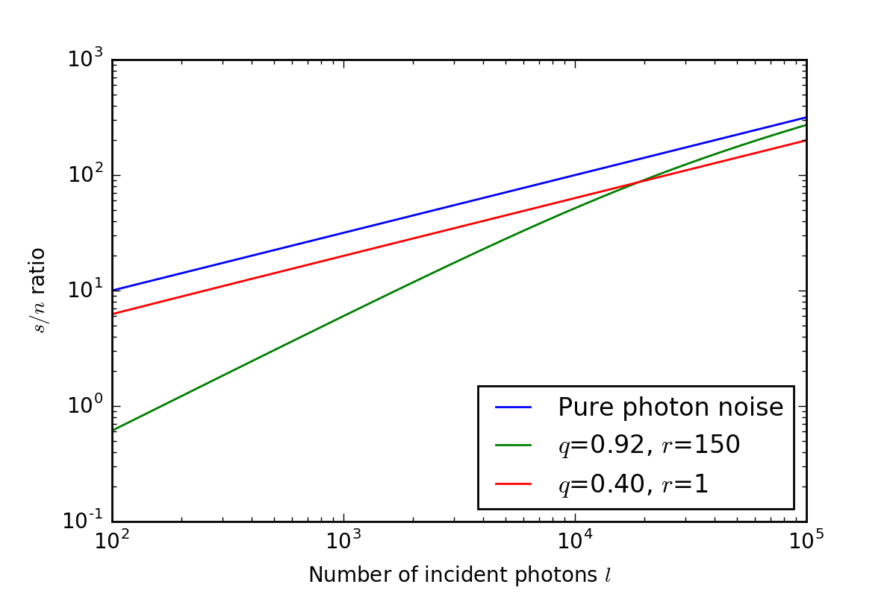

# 第四章：光电探测器

这一章讲的是有关光电探测器的东西。从观测的角度来说，知道光电探测器的一些参数是很有必要的，比如说在仪器选择和之后的数据处理上。光电探测器分为两大类，积分的（常见的硅CCD）和脉冲计数的（光电倍增管）。积分类型的适合获取高信噪比图像，脉冲计数的信噪比稍低一点。当然除了探测器本身之外，我们还需要有很多其他的电子器件，来控制开关、记录时间、进行模数转换等。

## 量子效率和光谱响应

量子效率定义为探测到的光子数和入射的光子数的比值，即

$$ q(\lambda) = \frac{\mathrm{探测到的光子数}}{\mathrm{入射的光子数}} $$

这个量当然越大越好，因为我们不想损失任何一个光子。同时比值的分子和分母都是波长$\lambda$的函数，所以量子效率作为波长的函数也可以被称为光谱响应；这个量也是越宽越好。

另一种量子效率的定义方式是从能量/电荷的角度去定义。我们可以用普朗克关系将入射光子数转化成能量：

$$ J = N \frac{hc}{\lambda} $$

同时将探测到的光子数转化为电荷量：

$$ Q = q'(\lambda)eN $$

那么量子效率就变成了$J$和$Q$的比：

$$ r = \frac{Q}{J} = \frac{e\lambda}{hc}q'(\lambda) = 8.066\times 10^{-5}\lambda q'(\lambda) $$

一般来说硅探测器有很高的量子效率和比较宽的光谱响应。

## 线性响应

除了“横向”的光谱响应以外，“纵向”的线性响应也是一个重要的参数。线性响应指的是输出的电子数量和入射的光子数量成正比的区间。在线性响应区间内，不考虑其他的误差时，探测到的谱线形状是不变的。但是如果离开了线性响应区间，就会使误差增大同时要做适当的改正。线性响应的区域和探测器用到的原理以及之后对电子的处理有关。

## 硅二极管阵（具体过程）

充电之后的硅二极管阵就像一个个小电容，光子在转化成电子之后被存储在每个单元中，通过方波信号控制读取或者移动。自扫描阵列(self scanning array)是1维的阵列，但是现在用的比较多的CCD是2维的阵列。（读出方式请回忆自己的理解）电子在不同像素中移动的时候会有损失，留下来的比例比较高(0.99950-0.999999)，但是架不住CCD太大。CCD在拍摄光谱的时候会将光谱在垂直色散方向的致宽求和；至于是在读出之前求和还是读出之后求和就看天体的亮度：是太暗所以先求和减少读出误差还是太亮所以后求和防止饱和。像素合并也可以提高读出速度。

信号在离开探测器之后后被各种处理，放大、数字化、积分等等。重要的是最好在离开探测器之后马上进行放大，以防止后续操作带来的误差也被放大了。最后一步的数字化要求进行模数转换(Analog-to-digital, A/D conversion)，所以转换出来的数值的单位叫做ADU(A/D Unit)。ADU和光子数之间的关系可以通过放大器和探测器的性质得出。

探测器不同像素之间的不一致大概在百分之几左右，可以用平场解决。为了减少误差平场的信噪比应当比亮帧的高几倍。但是对于靠近光谱响应边缘的光来说，因为探测器开始变得透明，望远镜结构和探测器本身会带来一些额外的像，这是平场所不能解决的，但是对于可见光来说问题不大。

## 本底和宇宙线

所有的照片都是有本底的，即使没有打开镜头盖。这些电子的产生主要是因为热运动，所以冷却是一个减少热噪声的好办法。除了冷却之外，有些探测器还需要真空，防止因为温度梯度太大导致的结霜或者结露。足够低的温度可以将热噪声降低到可被忽略的水平，但是冷却也会影响探测器的光谱响应，如当温度降低100度时，红端的响应会降到1/10。所以宽光谱响应的探测器需要把温度浮动保持在1度以下。

除此之外有的探测器还有一些偶尔出现的固定图样，如果每次的图样都一致的话也可以通过偏置减掉。宇宙线也会在照片中留下亮斑；只要像素合并不是很多的话比较容易被认出来。

## 噪声

噪声主要来自三个方面：星光本身的光子噪声、天光的光子噪声和仪器噪声。第一和第二种噪声是比较稳定而且容易计算的，所以它们的和提供了理论的噪声最小值。

光子噪声遵从玻色-爱因斯坦统计：

$$ \Delta N = N^{1/2}(1 + \frac{1}{e^{\frac{h\nu}{kT}}-1}) $$

当$h\nu \ll kT$的时候，上式可以简化为

$$ \Delta N = N^{1/2} $$

假设仪器噪声也符合玻色-爱因斯坦统计，我们可以得出信噪比和探测到的光子数的关系。令$N$为探测到的光子总数、$L$为探测到的来自天体的光子总数、$B$为来自所有其他源的光子总数，则根据光子守恒以及误差传递公式，有：

$$ L = N - B $$

$$ \Delta L = (\Delta N^2 + \Delta B^2)^{1/2} $$

将简化的玻色-爱因斯坦统计公式代入，有：

$$ \Delta L = (N + B)^{1/2} $$

此时信噪比为

$$ s/n = L / \Delta L = \frac{L}{(L + 2B)^{1/2}} $$

当来自其他源的光子数很小，即$B \ll L$时，

$$ s/n \approx L^{1/2} $$

信噪比正比于根号下恒星光子数。比如$10^4$个光子对应100的信噪比，即1%的误差。而当$B \gg L$的时候，式子变为

$$ s/n = \frac{L}{(2B)^{1/2}} $$

此时应尽量增大$L$（增大口径、提高量子效率等），或减少$B$。这个时候增大$L$对信噪比的提高比$B \ll L$时要快（正比）。

当然在所有情况下，获得同样信噪比需要的时间是和天体的亮度有关的。

## 探测器的选择

之前推出来的公式只是和探测到的光子数而不是天体入射的光子数有关，不利于实际计算，所以需要再作推广。

令$l$为恒星入射的光子数，则有$L = q(\lambda)l$；同时假设天光的光子噪声相对仪器噪声可忽略（光谱情况下），仪器噪声为$r$，则信噪比表达式为：

$$ s/n = \frac{q(\lambda)l}{(q(\lambda)l + r^2)^{1/2}} $$

从上式可以看出信噪比只和量子效率、入射光子数和读出噪声有关，而量子效率和读出噪声都可以测量。不同的$q, l, r$值下的信噪比曲线如下图所示：

*入射光子数和信噪比的图*

显然当入射光子数大时，应选用量子效率高的探测器；而小时，应选用读出噪声小的。

## 阱深和动态范围

一个像素点可以容纳的电量成为它的阱深。当势阱被填满了之后，这个像素将不能继续探测光子。所以当天体的光子噪声主导时，从理论上来说，势阱可容纳的最大光子数的平方根就是可以获得的最大信噪比。但是实际上达不到，因为逼近势阱的顶部的时候会出现其他问题；如果想提高信噪比就需要多次曝光并叠加。

探测器本身的读出噪声加上可容纳的最大电量可以描述探测器的动态范围，也就是可以探测到的光子数量范围。比如读出噪声是400个电子，势阱可以容纳$1.2 \times 10^7$个电子，那么动态范围为$\frac{1.2 \times 10^7}{400} = 3 \times 10^4$。

## 噪声的测量

作为主要对科学感兴趣的阵营，我们有的时候对总体的噪声水平感兴趣，而不是具体的噪声来源。一个简单而又直接的方法就是测拍摄多幅暗场，统计每个像素的ADU分布；分布的宽度就是噪声、平均值就是偏置。

有的时候我们想知道测得的噪声ADU值对应多少光子；这时需要利用信噪比表达式将$s/n, L_{\mathrm{ADU}}, u_0$（模数转换的常数，$\mathrm{photons/ADU}$）, $r_{\mathrm{ADU}}$联系起来：

$$ s/n = \frac{u_0 L_\mathrm{ADU}}{(u_0 L_\mathrm{ADU} + u_0^2 r_\mathrm{ADU}^2)^{1/2}} \\ = \frac{L_\mathrm{ADU}}{(\frac{ L_\mathrm{ADU}}{u_0} + r_\mathrm{ADU}^2)^{1/2}} $$

利用暗场的起伏可以测出$r_\mathrm{ADU}$，已知光度的灯平场以及起伏可以测出$s/n$以及$L_\mathrm{ADU}$，即可算出此时的$u_0$，$u_0 r_\mathrm{ADU}$即为噪声对应的光子数。

## 空间分辨率

空间分辨率是指可以将两个源分开的最小角距离。从频域的角度理解，因为像素阵列有大小，所以傅里叶变换之后频率大于奈奎斯特频率的信号会被盖掉，丢失了高频的信号。但是探测器单独的空间分辨率并不足以描述数据的轮廓；整体的谱线轮廓会在第12章讨论。

## 略过的内容

光电倍增管、照相底片
