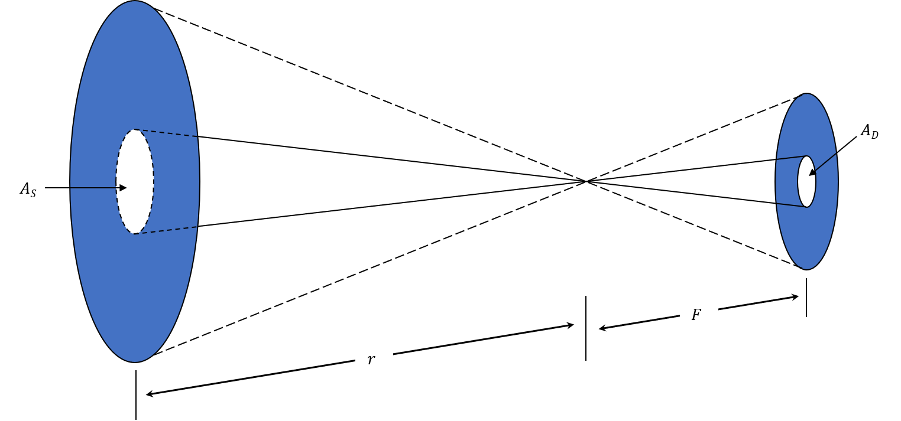

# 第五章：有关辐射的各种定义

## 辐射强度 (specific intensity)

辐射强度描述的是某一点的光的强度分布，是辐射场的性质，跟接下来用到的面元的性质无关。这个量当然需要是在单位时间、单位频率下的；同时这个表面处在不同位置也会不一样，所以要将表面缩小成面元。我们先将面元固定在一个点上，看如何描述光的强度分布。

我们只能通过单位时间、单位频率下穿过单位面积面元的能量大小来描述光的强度。但是面元是有朝向的，一个只朝一个方向的辐射场和面元的法向量平行的时候会产生最大的通量；如果将辐射场（或者面元）旋转一个角度，除了方向外辐射场没有任何其他的变化，不过通量就小了。然而辐射强度是辐射场的性质，和面元的方向无关，所以除了$\mathrm{d}A\mathrm{d}t\mathrm{d}\nu$需要和描述辐射场强度（其实就是辐射强度）的量相乘之外，我们还需要一个表示方向的立体角源和表示方向与面元法向夹角的余弦值将（可能倾斜的）面元“摆正”，去导出正确的能量。所以能量和辐射强度有这样的关系：

$$ \mathrm{d}E_\nu = I_\nu cos{\theta} \mathrm{d}\omega\mathrm{d}A\mathrm{d}t\mathrm{d}\nu $$

也得到了辐射强度的表达式：

$$ I_\nu = \frac{\mathrm{d}E_\nu}{cos{\theta}\mathrm{d}\omega\mathrm{d}A\mathrm{d}t\mathrm{d}\nu} \tag{5.1}$$

它表达的是单位时间($\mathrm{d}t$)单位频率($\mathrm{d}\nu$)下穿过某一点($\mathrm{d}A$)朝某个方向($cos{\theta}\mathrm{d}\omega$)的光的能量。
自变量可以表达为$I_\nu(\vec{r}, \vec{l}, t)(\vec{l} \cdot \vec{n}) = I_\nu(x, y, z, \theta, \phi, t)$，$\vec{r}, x, y, z$为观测点的坐标，$\vec{l}, \theta, \phi$为方向，$\vec{n}$为面法向。
辐射强度这个量将微观的光子和宏观的流量联系了起来。

当然我们也可以用波长去表达，而从上式我们可以推出

$$ I_\nu\mathrm{d}\nu = I_\lambda\mathrm{d}\lambda  \tag{5.2}$$

它们的单位分别是$\mathrm{erg / (s~cm^2~rad^2~Hz)}, \mathrm{W / (m^2~rad^2~Hz)}$和$\mathrm{erg / (s~cm^2~rad^2~Å)}, \mathrm{W / (m^2~rad^2~Å)}$。这条式子，加上熟悉的频率-波长关系$\lambda\nu = c$，我们会发现同一个物体$I_\nu$和$I_\lambda$的形状是不一样的。这是因为$\mathrm{d}\nu = -\frac{c}{\lambda^2}\mathrm{d}\lambda \Rightarrow -\frac{c}{\lambda^2}I_\nu = I_\lambda$（负号表示波长和频率变化方向相反），所以即使不同波长下的辐射强度一样，翻译到频率下会变成一条曲线。

*频域和波长域下太阳的辐射强度，可以看到形状改变了。取自[这里](http://www.oceanopticsbook.info/view/light_and_radiometry/level_2/a_common_misconception)*

我们也可以定义平均辐射强度，为辐射强度在所有方向上的平均：

$$ J_\nu = \frac{1}{4\pi} \oint I_\nu \mathrm{d}\omega  \tag{5.3}$$

## 流量

比起辐射强度，流量可能更容易理解一点。流量就是通过一个面的所有能量之和；一个方向为正的话，另一个方向就为负；或者说流量就是一个面对所有方向辐射强度的积分。从这两个表述里面我们可以得到流量的两个定义式：

$$ F_\nu = \frac{\oint \mathrm{d}E_\nu}{\mathrm{d}A\mathrm{d}t\mathrm{d}\nu} = \oint I_\nu \cos{\theta} \mathrm{d}\omega  \tag{5.4}$$

显然当辐射场各向同性的时候，流量为零（进出一样）；所以也可以说流量是衡量辐射场非各向同性程度的一个量。

假设我们讨论的点在恒星的表面上，将流量的辐射强度积分拆成两个半球，一个在恒星内部，一个在外部，我们可以得到

$$ \begin{align} F_\nu & = \int_0^{2\pi}\mathrm{d}\phi\int_0^\pi I_\nu\sin{\theta}\cos{\theta}\mathrm{d}\theta \\ & = \int_0^{2\pi}\mathrm{d}\phi (\int_0^\frac{2}{\pi} I_\nu\sin{\theta}\cos{\theta}\mathrm{d}\theta + \int_\frac{2}{\pi}^\pi I_\nu\sin{\theta}\cos{\theta}\mathrm{d}\theta) \\ & = F_\nu^\mathrm{out} + F_\nu^\mathrm{in} \end{align} $$

实际上就是向里的和向外的之和。对于恒星表面来说，一般是没有向内的辐射的；同时如果在$\phi$方向各向同性的话，上式可以简化为

$$ F_\nu^\mathrm{surface}  = 2\pi\int_0^\frac{2}{\pi} (I_\nu\sin{\theta}\cos{\theta}\mathrm{d}\theta)  \tag{5.6}$$

再简化一下，如果向外的辐射在各个$\theta$方向都相等的话，那么

$$ F_\nu^\mathrm{surface} = \pi \bar{I_\nu}  \tag{5.7}$$

对恒星来说这样的简化是可以接受的。

辐射强度是一个辐射场的内禀量，所以不应该随着距离而变化；而流量遵循平方反比律。这里的不同之处在于辐射强度的定义式中有一个$\mathrm{d}\omega$，但流量里面没有。这也说明了只有当我们明确知道观测的源的$\mathrm{d}\omega$有多大，也就是能分辨清楚源面的时候，我们才能测量辐射强度；否则我们测量的只能是流量。

图中左侧是天空中的一个均匀的延展源，右侧是它的像。假设我们现在讨论通过中间透镜的辐射强度和流量，而$A_S$所张的立体角刚好可以看作一个面元。这那么根据定义，包含在$A_S$这个圆锥中的能量就是在透镜这一点上、$A_S$方向的辐射强度。如果我们改变这个源的距离，因为这个圆锥（立体角大小）不变，虽然源距离我们远了，每个点发出的光少了，但是有更多的面积进入了$A_S$中，所以接收到的能量是不变的。当整个源的面积小于等于$A_S$的时候，我们就不能分辨源的面了，所以此时测量到的就变成了流量，遵循平方反比定律。

## K积分

到现在为止我们从辐射强度中引出了两个值，平均辐射强度和流量：

$$ \begin{align} J_\nu & = \frac{1}{4\pi} \oint I_\nu \mathrm{d}\omega \\ F_\nu & = \oint I_\nu \cos{\theta} \mathrm{d}\omega \end{align} $$

如果在积分号里面再加一个$\cos{\theta}$，也可以定义出一个有物理意义的量：

$$ K_\nu = \frac{1}{4\pi} \oint I_\nu \cos^2{\theta} \mathrm{d}\omega  \tag{5.8}$$

它跟辐射压有关。

光子的动量为$P = \frac{E}{c}$，则单位时间单位面积内穿过某个面的总动量就是辐射压：

$$ \mathrm{d}P_\nu = \frac{\mathrm{d}E_\nu}{c} \frac{\cos{\theta}}{\mathrm{d}t\mathrm{d}A} $$

用辐射强度代入，有

$$ \mathrm{d}P_\nu = \frac{I_\nu}{c} \cos^2{\theta} \mathrm{d}\nu\mathrm{d}\omega $$

对立体角和频率积分一下，就有

$$ P_R = \frac{1}{c} \int_0^\infty\oint I_\nu \cos^2{\theta} \mathrm{d}\omega\mathrm{d}\nu = \frac{4\pi}{c} \int_0^\infty K_\nu \mathrm{d}\nu  \tag{5.9}$$

如果各向同性的话，

$$ P_R = \frac{4\pi}{3c} \int_0^\infty I_\nu \mathrm{d}\nu \tag{5.10}$$

而第六章会讨论温度的一个定义方式：

$$ \pi\int_0^\infty I_\nu \mathrm{d}\nu = \sigma T^4 $$

故有

$$ P_R = \frac{4\sigma}{3c}T^4 \tag{5.11}$$

所以高温恒星的辐射压是很强的；同时太阳等低温恒星辐射压可以被忽略。

## 辐射能量密度

在继续之前我们稍微再从不同的角度理解一下辐射强度。辐射强度可以被理解为单位时间单位频率内往某个方向的能量对某个面元的平均，也就是这个“摆正了的”面元单位时间单位频率内的单位面积上有多少正前方的能量穿过。所以辐射强度某种程度上来说是辐射能量面密度。

那么有了面密度，能不能有体密度呢？当然是可以的，我们仿照辐射强度把$\mathrm{d}A$写成$\mathrm{d}V$就行了（记得带上$\cos{\theta}$）。但是注意到我们在讨论光，光肯定以光速运动，所以面元在空间中相对光扫过的体积和面积的关系为$\mathrm{d}V = c\mathrm{d}A$，也就是说

$$ u_\nu = \frac{I_\nu}{c} $$

体积的数值肯定比面积大，所以同样的光分摊到了一个更大的数字上，密度就小了。

## 吸收系数和光深

光穿过介质时候的衰减遵循以下规律：

$$ \mathrm{d}I_\nu = -\kappa_\nu\rho I_\nu \mathrm{d}x \tag{5.12}$$

$\rho$是单位体积的质量密度，$\mathrm{d}x$是长度，所以$\kappa_\nu$是单位质量上的面积($\mathrm{\frac{cm^2}{g}}$)，也就是吸收截面。

$\kappa_\nu$反映的是物质本身的性质；实际上这个值有两个方面，一个是真正的吸收，另一个是物质对光的散射。所以这个吸收系数实际上是消光系数。

在没有介质发射的情况下我们可以装作化简地把式子写得简单一点，利用

$$
\begin{equation}
\begin{aligned}
\tau_\nu & = \int_0^L \kappa_\nu \rho \mathrm{d}x \Rightarrow \\
\mathrm{d}I_\nu & = -I_\nu\mathrm{d}\tau_\nu \Rightarrow \\
I_\nu & = I_\nu^0 \exp{-\tau_\nu}
\end{aligned}
\tag{5.13}
\end{equation}
$$

这是最简单的消光规律。

## 发射系数和源函数

对发射系数的定义和吸收系数非常类似，只是没有了负号：

$$ \mathrm{d}I_\nu = j_\nu \rho \mathrm{d}x \tag{5.14}$$

$j_\nu$的单位是$\mathrm{\frac{erg}{s~rad^2~Hz~g}}$。发射系数同样包含真正的发射和散射到我们考虑的方向上的光。

如果我们把发射系数和吸收系数相除，我们会发现这个商的单位和辐射强度是一样的；所以我们可以把这个商当作一个新的“辐射强度”，并定义为源函数：

$$ S_\nu = \frac{j_\nu}{\kappa_\nu} \tag{5.15}$$

源函数的表征了光线在穿过介质的时候被介质替换掉的比例。它在之后的辐射转移中很有用。但是源函数的计算是比较复杂的，这里只考虑两个最极端的例子，纯各向同性散射以及纯吸收。

### 纯各向同性散射

如上图，介质中的粒子在接收到来自某个方向的光($I_\nu \mathrm{d}\omega$)之后会将其中一部分($\kappa_\nu$)散射掉，而且是均匀地散射到$4\pi$立体角中。所以对于某个方向上单位立体角的观测者来说只能接收到$1/4\pi$的光，即

$$ \mathrm{d}j_\nu = \frac{1}{4\pi}\kappa_\nu I_\nu \mathrm{d}\omega $$

对不同方向求积分，有

$$ j_\nu = \frac{1}{4\pi} \oint\kappa_\nu I_\nu \mathrm{d}\omega $$

一般来说$\kappa_\nu$和方向没有关系，所以

$$ S_\nu = \frac{j_\nu}{\kappa_\nu} = \frac{1}{4\pi} \oint I_\nu \mathrm{d}\omega = J_\nu $$

此时粒子“发射”的辐射强度是入射光的平均辐射强度，源函数只取决于辐射场，和粒子本身无关。

### 纯吸收

纯吸收并不意味着粒子就不发光了；只不过之前的散射是只改变光的方向，现在粒子吸收全部的光然后再发出自己的光。一般来说我们讨论粒子到达了热动平衡之后的状态，那么此时的源函数就是黑体辐射函数

$$ S_\nu = B_\nu = \frac{2h\nu^3}{c^2} \frac{1}{e^{h\nu/kT}-1} \tag{5.16}$$

此时粒子作为**黑体**发光。

## 爱因斯坦系数

我们将自发辐射归入辐射，受激辐射（负吸收）和受激吸收归到吸收里面，并分别用$A, B$表示它们的爱因斯坦系数，$l, u$表示低、高能级，则有

$$
\begin{equation}
\begin{aligned}
j_\nu\rho & = N_uA_{ul}h\nu \\
\kappa_\nu\rho I_\nu & = N_l B_{lu}I_\nu h\nu - N_uB_{ul}I_\nu h\nu
\end{aligned}
\tag{5.17}
\end{equation}
$$
