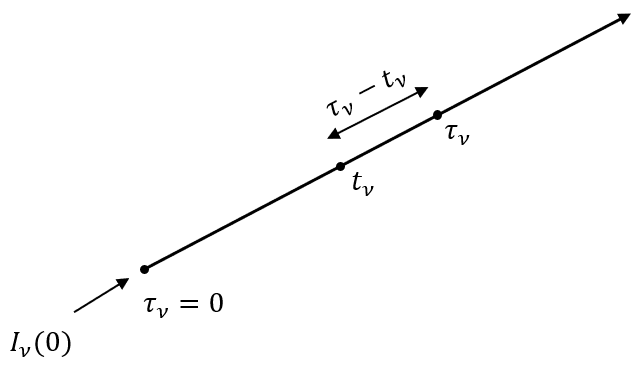

# 第七章：辐射与对流传能

恒星表面的主要传能方式是辐射。对流传能在恒星内部以及低温恒星是不可以忽略的，所以最后会稍微涉及到。同时也只有在辐射传能主导的区域内恒星的物理参数才会跟光谱有关系，之后也会有有效温度的例子。这一章我们会建立辐射传能的微分方程，然后讨论几种简单的解。但是除此之外的解都是数值的，需要进行数值积分。我们希望计算出合成光谱，而这个目标的前提就是有恒星光球层内尽可能多的物理参数；第七八九章就是干这个的。

## 辐射转移方程以及它的通解

接着[第五章](https://mingjiejian.github.io/2017/12/18/OASP5/)最后两条公式，假设辐射沿着$s$方向传播，那么光强在一个微元上的变化$dI_\nu$为损失的光加上增加的光：

$$ dI_\nu = -\kappa_\nu \rho I_\nu ds + j_\nu\rho ds $$

首先看到等号后面的两项都有一个$\rho ds$，同时考虑到如果能把第一项变成$-I_\nu$那么积分之后就是一个负e指数函数，比较方便，所以定义**光深**$d\tau_\nu = \kappa_\nu \rho ds$，得

$$ \begin{align} \frac{dI_\nu}{d\tau_\nu} &= -I_\nu + \frac{j_\nu}{\kappa_\nu} \\  &= -I_\nu + S_\nu \end{align} \tag{7.1}$$

在这里光深的微分（当然光深本身也一样）$d\tau_\nu$是一个无量纲量，所以$\kappa_\nu \rho$的单位是$\text{cm}^{-1}$，$\kappa_\nu$的单位是$\text{cm}^{2} \text{g}^{-1}$；同时要注意的是不同的作者对$\kappa_\nu$的定义不同：有的将$\kappa_\nu \rho$叫做$\kappa_\nu$。
“看着很复杂的东西为什么要去管呢？把它搞成另一个变量就好了嘛！”在这样的思想指导下我们把$\frac{j_\nu}{\kappa_\nu}$叫做**源函数**$S_\nu$。当然实际上源函数还是代表着辐射转移方程发射（光强增加）的那一部分，只是为了凑前面光损部分的简单形式它打了个折扣，衡量得是发射与吸收的比；吸收占比越大，就越靠近负e指数下降。

看着式$(7.1)$我们很轻易地用膝盖想到了方程的通解应该有这样的形式：

$$ I_\nu(\tau_\nu) = fe^{b\tau_\nu} \tag{7.2} $$

当然$f$是个函数。把它丢进$(7.1)$，得到：

$$ bI_\nu + e^{b\tau_\nu}\frac{df}{d\tau_\nu} = -I_\nu + S_\nu $$

前后一一对应，易得$b = -1$以及$f = \int_0^{\tau_\nu} S_\nu e^{t_\nu} dt_\nu + c_0$，所以

$$ \begin{align} I_\nu(\tau_\nu) &= e^{-\tau_\nu}\int_0^{\tau_\nu} S_\nu e^{t_\nu} dt_\nu + c_0e^{-\tau_\nu} \\ &= e^{-\tau_\nu}\int_0^{\tau_\nu} S_\nu e^{t_\nu} dt_\nu + I_\nu(0)e^{-\tau_\nu} \end{align} \tag{7.3} $$

$0$和$\tau_\nu$取决于从哪开始算以及算到哪。把负e指数丢到积分号里面，有：

$$ I_\nu(\tau_\nu) = \int_0^{\tau_\nu} S_\nu e^{-(\tau_\nu-t_\nu)} dt_\nu + I_\nu(0)e^{-\tau_\nu} \tag{7.4} $$

如上图，这个通解说明辐射传播方向上某一点的光强为起始点的光乘上一个负e指数衰减，加上起始点到观测点之间每一点上发出的光各自乘上负e指数衰减之和；其实挺直白的。到此似乎万事大吉，只要知道源函数表达式加上十来根头发，应该能给出解析解；不想给头发的话让计算机愣算也能给出数值解来。同时回想一下[第五章](https://mingjiejian.github.io/2017/12/18/OASP5/)粒子的两种散射情况，我们也能知道最简单的源函数就是平均光强($J_\nu$)和黑体辐射函数($B_\nu$)。

### 不同形状下的辐射转移方程

之前我们只考虑了一条直线上的辐射转移方程。对于星际介质来说这是没问题的，但是恒星是真空中的球形鸡，所以定义沿着恒星半径方向以及视线方向的光深会对解释恒星内部结构以及我们所看到的东西比较方便。用球坐标系,同时因为我们在观测，我们令$z$方向为视线方向，所以：

$$ \frac{dI_\nu}{\kappa_\nu \rho dz} = -I_\nu + \frac{j_\nu}{\kappa_\nu} $$

将$z$换成球坐标的$r, \theta$：

$$ \frac{dI}{dz} = \frac{dI}{dr}\frac{dr}{dz} + \frac{dI}{d\theta}\frac{d\theta}{dz} \tag{7.5} $$

什么你问$\phi$哪去了？当然是认为$\phi$方向光强处处一样啦，简单嘛。从图中可得：

$$ dr = \cos{\theta} dz $$

$$ rd\theta = -\sin{\theta} dz $$

所以，

$$ \frac{\partial I_\nu}{\partial r} \frac{\cos{\theta}}{\kappa_\nu\rho} - \frac{\partial I_\nu}{\partial \theta} \frac{\sin{\theta}}{\kappa_\nu\rho r} = -I_\nu + S_\nu \tag{7.6} $$

对于恒星内部或者大气很厚的恒星（超巨星）来说这就是要解的方程；但是一般的恒星光球层非常薄，所以可以认为光强跟$\theta$也没有关系（高兴），得出：

$$ \frac{d I_\nu}{d r} \frac{\cos{\theta}}{\kappa_\nu\rho} = -I_\nu + S_\nu$$

虽然不知道为什么，但是在这里我们可以定义一个和$dr$反向的量$dx = -dr$以及径向的光深$d\tau'_\nu = \kappa_\nu\rho dr$，使得这个方程的解为（推导过程和前面一样）：

$$ I_\nu(\tau_\nu) = \int_c^{\tau_\nu} S_\nu e^{-(t_\nu-\tau_\nu)\sec{\theta}}\sec{\theta} dt_\nu \tag{7.8} $$

就是在$t_\nu, \tau_\nu$后面加了个$-\sec{\theta}$而已。这里的$c$是任意的一个点，所以我们要引入恒星大气的边界条件：大气顶部($c=0$)或者底部($c=\infty$)。现在有了恒星的径向（以及反径向）和视线方向，就有一个夹角的问题：

当$\theta > 90^\circ$的时候是从外往里的方向，反之是从里往外。对于式子$(7.4)$来说不同的方向只是换一个起始点和矢量而已，但是现在对于恒星光球层内部和外部来说有不同（而且可以确定）的边界条件，所以视线方向向内和向外的光强分别为：

$$ \begin{align} I_\nu^\mathrm{out} &= \int_{\tau_\nu}^\infty S_\nu e^{-(t_\nu-\tau_\nu)\sec{\theta}}\sec{\theta} dt_\nu + I_\nu(\infty) e^{-(\infty-\tau_\nu)\sec{\theta}} \\ I_\nu^\mathrm{in} &= -\int_0^{\tau_\nu} S_\nu e^{-(t_\nu-\tau_\nu)\sec{\theta}}\sec{\theta} dt_\nu + I_\nu(0) e^{-(0-\tau_\nu)\sec{\theta}} \end{align} $$

也就是说方向向外时从光球层最底层开始算，光深为$\infty$，向内时从恒星表面开始算，光深为$0$。一般来说我们认为从恒星大气顶部往里的光强$I_\nu(0)=0$（忽略其他天体照射到恒星的光），同时从恒星大气底部向外的光强$I_\nu(\infty)=0$，因为里面辐射和物质完全热动平衡，光是透不出来的。那么视线方向上某一点的“总光强”为：

$$ \begin{align} I_\nu(\tau_\nu) &= I_\nu^\mathrm{out} + I_\nu^\mathrm{in} \\ &= \int_{\tau_\nu}^\infty S_\nu e^{-(t_\nu-\tau_\nu)\sec{\theta}}\sec{\theta} dt_\nu -\int_0^{\tau_\nu} S_\nu e^{-(t_\nu-\tau_\nu)\sec{\theta}}\sec{\theta} dt_\nu \end{align} \tag{7.9}$$

所以在观测从恒星表面出射的辐射的时候用的是$$I_\nu^\mathrm{out}(0)$$：

$$ I_\nu^\mathrm{out}(0) = \int_{0}^\infty S_\nu e^{-t_\nu\sec{\theta}}\sec{\theta} dt_\nu \tag{7.10}$$

这条式子会在计算合成光谱的时候用到。

### 光强积分

就像[第五章](https://mingjiejian.github.io/2017/12/18/OASP5/)说的那样，实际上我们不能分辨出恒星的源面，所以当然要将光强积分成流量了。利用式$(5.5)$并且认为$I_\nu$与$\phi$方向无关，我们得到：

$$ \begin{align} F_\nu &= 2\pi \int_0^\pi I_\nu \cos{\theta} \sin{\theta} d\theta \\ &= 2\pi \int_0^{\pi/2} I_\nu^\mathrm{out} \cos{\theta} \sin{\theta} d\theta + 2\pi \int_{\pi/2}^\pi I_\nu^\mathrm{in} \cos{\theta} \sin{\theta} d\theta \end{align} $$

将式$(7.9)$代入，得：

$$ F_\nu = 2\pi \int_0^{\pi/2}\int_{\tau_\nu}^\infty S_\nu e^{-(t_\nu-\tau_\nu)\sec{\theta}}\sec{\theta} dt_\nu d\theta - 2\pi \int_{\pi/2}^\pi\int_0^{\tau_\nu} S_\nu e^{-(t_\nu-\tau_\nu)\sec{\theta}}\sec{\theta} dt_\nu d\theta $$

假设源函数各向同性，有

$$ F_\nu = 2\pi \int_{\tau_\nu}^\infty S_\nu \int_0^{\pi/2} e^{-(t_\nu-\tau_\nu)\sec{\theta}}\sec{\theta} d\theta dt_\nu - 2\pi \int_0^{\tau_\nu} S_\nu \int_{\pi/2}^\pi e^{-(t_\nu-\tau_\nu)\sec{\theta}}\sec{\theta} d\theta dt_\nu \tag{7.11} $$

所以之后就看中间的那个$e$指数积分了。先直接给结论：令$w = \sec{\theta}, x = t_\nu - \tau_\nu$，则有

$$ \int_0^{\pi/2} e^{-(t_\nu-\tau_\nu)\sec{\theta}}\sec{\theta} d\theta = \int_1^\infty \frac{e^{-xw}}{w^2} dw \tag{7.12} $$

为了方便起见将后面的$e$指数积分叫做$E_n$:

$$ E_n(x) = \int_1^\infty \frac{e^{-xw}}{w^n} dw \tag{7.13} $$

所以刚刚的流量就是：

$$ F_\nu(\tau_\nu) = 2\pi \int_{\tau_\nu}^\infty S_\nu E_2(t_\nu - \tau_\nu) dt_\nu - 2\pi \int_0^{\tau_\nu} S_\nu E_2(\tau_\nu - t_\nu) dt_\nu \tag{7.14} $$

照例在恒星表面变成

$$ F_\nu(0) = 2\pi \int_{0}^\infty S_\nu(t_\nu) E_2(t_\nu) dt_\nu \tag{7.15} $$

举一反三得K积分里面的量$J_\nu, K_\nu$可以表示为

$$ \begin{align} J_\nu(\tau_\nu) &= \frac{1}{2} \int_{\tau_\nu}^\infty S_\nu E_1(t_\nu - \tau_\nu) dt_\nu + \frac{1}{2} \int_0^{\tau_\nu} S_\nu E_1(\tau_\nu - t_\nu) dt_\nu \\ K_\nu(\tau_\nu) &= \frac{1}{2} \int_{\tau_\nu}^\infty S_\nu E_3(t_\nu - \tau_\nu) dt_\nu + \frac{1}{2} \int_0^{\tau_\nu} S_\nu E_3(\tau_\nu - t_\nu) dt_\nu \end{align} \tag{7.16} $$

### e指数积分的性质

$$ E_n(0) = \int_1^\infty \frac{1}{w^n} dw = \frac{1}{n-1} $$

$$ \frac{dE_n}{dx} = -E_{n-1} \tag{7.19} $$

$$ nE_{n+1}(x) = e^{-x} - xE_n(x) \tag{7.20} $$

$$ E_n(x) \approx \frac{1}{xe^x} $$

大概就是这样。

## 辐射平衡

实际上辐射平衡指的就是能量守恒。我们认为光球层是不产生能量的，所以光球层处处都不能有源或者汇，吃进去多少就得吐出来多少。我们仍然处于平面平行层的假设之中，所以散度为0的条件可以表述为：

$$ \frac{d}{dx}F(x) = 0, F(x) = F_0 \tag{7.21} $$

$$ x$指的是光球层中的某一点。如果所有能量都是辐射的话，有

$$ F(x) = \int_0^\infty F(\tau_\nu) d\nu = F_0 \tag{7.22} $$

这就是辐射平衡条件。如果也有对流的话，则变为

$$ \Phi(x) + \int_0^\infty F(\tau_\nu) d\nu = F_0 \tag{7.23} $$

还有其他能量源的话，加上去就好了。

先不管对流，将$(7.14)$代入$(7.22)$，有：

$$ \int_0^\infty [\int_{\tau_\nu}^\infty S_\nu E_2(t_\nu - \tau_\nu) dt_\nu - 2\pi \int_0^{\tau_\nu} S_\nu E_2(\tau_\nu - t_\nu) dt_\nu] d_\nu = \frac{F_0}{2\pi} \tag{7.24} $$

这叫做Milne第二公式，其他两条Milne公式之后会讨论到。这条公式里面唯一的未知量是$S_\nu(\tau_\nu)$，也就是说在辐射平衡条件下，符合这条式子的源函数就是我们要找的源函数；把它丢回$(7.14)$就可以将流量算出来了。

另外两个Milne公式可以从辐射转移方程推出来：

$$ \cos{\theta} \frac{dI_\nu}{dx} = \kappa_\nu\rho I_\nu - \kappa_\nu\rho S_\nu \tag{7.25}$$

对立体角积分并且认为$\kappa_\nu, S_\nu$与方向无关，有

$$ \frac{dF(x)}{dx} = 4\pi\kappa_\nu\rho J_\nu - 4\pi\kappa_\nu \rho S_\nu \tag{7.26}$$

对所有频率积分，并考虑到辐射平衡条件$(7.21)$，左边等于0，有

$$ \int_0^\infty \kappa_\nu\rho J_\nu d\nu = \int_0^\infty \kappa_\nu\rho S_\nu d\nu \tag{7.28}$$

用$(7.16)$的$J_\nu$代入，

$$ \int_0^\infty \kappa_\nu [\frac{1}{2} \int_{\tau_\nu}^\infty S_\nu E_1(t_\nu - \tau_\nu) dt_\nu + \frac{1}{2} \int_0^{\tau_\nu} S_\nu E_1(\tau_\nu - t_\nu) dt_\nu - S_\nu] d\nu = 0 $$

这也是一条Milne公式（书上没写是第几条...），也是给求$S_\nu$用的。如果在恒星内部，所有频率上的光深都很大的话，$\frac{dF(x)}{dx}$就大概为0，所以从$(7.26)$我们可以认为$J_\nu = S_\nu$。

最后一条Milne公式是从$(7.25)$乘上一个$\cos{\theta}$来的。乘上之后对方位角和频率积分，最后一项就没了，剩下的是：

$$ \int_0^\infty \frac{dK_\nu}{d\tau_\nu} = \frac{F_0}{4\pi} $$

同样将$K_\nu$代入，有

$$ \int_0^\infty \frac{d}{d\tau_\nu} [\frac{1}{2} \int_{\tau_\nu}^\infty S_\nu E_3(t_\nu - \tau_\nu) dt_\nu + \frac{1}{2} \int_0^{\tau_\nu} S_\nu E_3(\tau_\nu - t_\nu) dt_\nu - S_\nu] d\nu = \frac{F_0}{4\pi} $$

实际上这三条Milne公式都是从光强加上辐射平衡条件来的，所以它们并不独立，满足某一条公式的源函数必定满足其他两条。回到遥远的第一章，我们可以看到现在代表着有效温度决定着$F_0$，所以有效温度实际上是模型的一个重要参数。

现在既然所有的公式都齐了，剩下的就是确定源函数。这里只讨论一种最简单的情况，灰大气。更复杂的情况留给论文去说。

## 灰大气模型

灰大气模型确定的源函数值得在这里讨论并不仅仅是因为它是比较早得出的解，还因为它是很多其他源函数迭代的初始函数。灰大气指的是$\kappa_\nu$与频率无关，当然它不怎么真实(by Quin)。

从$(7.7)$开始，将式子对全频率积分，并将积分后的结果写成不带$\nu$角标的量，有

$$ \cos{\theta} \frac{dI}{d\tau} = I - S $$

可以“简单地”理解为把角标拿掉；那么式$(7.22), (7.28), (7.30)$变成：

$$ \begin{align} F &= F_0 \\ J &= S \\ \frac{dK}{d\tau} &= \frac{F_0}{4\pi} \end{align} \tag{7.32}$$

在这里爱丁顿老爷子假设入射和出射的光强和方向无关，都是一样的，也就是：

$$ I(\tau) = \begin{cases} I^\mathrm{out}(\tau) & 0 \le \theta \le \pi/2 \\ I^\mathrm{in}(\tau) & \pi/2 \le \theta \le \pi \end{cases} $$

然后三个K积分就变成了

$$ \begin{align} F(\tau) &= \pi[I^\mathrm{out}-I^\mathrm{in}] \\ J(\tau) &= \frac{1}{2}[I^\mathrm{out} + I^\mathrm{in}] \\ K(\tau) &= \frac{1}{6} [I^\mathrm{out} + I^\mathrm{in}] \end{align} $$

不信？不信自己代进定义里面算去。把它们丢进$(7.32)$里面，该相等的相等，该积分的积分，得到

$$ S(\tau) = J(\tau) = 3K(\tau) $$

$$ K(\tau) = \frac{F_0}{4\pi}\tau + \frac{F_0}{6\pi} $$

$$ \Rightarrow S(\tau) = \frac{3F_0}{4\pi}(\tau+\frac{2}{3}) \tag{7.34}$$

热动平衡之下我们还有黑体辐射定律；利用$(6.4)$，我们可以得出$S(\tau) = J(\tau) = \sigma/\pi T^4(\tau), $F_0 = \sigma T_\mathrm{eff}^4$，所以

$$ T(\tau) = [\frac{3}{4}(\tau+\frac{2}{3})]^{1/4} T_\mathrm{eff} \tag{7.36}$$

这样一来每层的温度由有效温度和光深决定，也可以知道了。如果把老爷子的假设去掉，解会从$\frac{2}{3} \rightarrow q(\tau)$，稍微复杂一点。当然灰大气和实际情况差得比较远，因为大大简化了$\kappa_\nu$的情况。

## 对流传能

这一章快该结束了。中高温恒星的对流层比较深，但是低温恒星的对流层可以延伸到光球层的底部，所以需要考虑对流传能。对流元需要和环境温度有差别（要不然哪有能量传输），而且光深需要比较大（要不然被辐射传能搞没了）。一个对流元所携带的能量为：

$$ \Phi = \rho C_p v \Delta T $$

$\rho, C_p, v, \Delta T$分别为密度、比热、速度、温度差。这些对流元可上可下、可冷可热。太阳的米粒（儿）组织就是我们可以看到的对流层的顶部，同时对流层传输的能量是辐射传能的$\sim 10^{-3}$倍，可以忽略掉。但是因为对流带来的速度不均匀会对光球层产生影响（对流超射），使得谱线形状发生变化，带来不对称性，所以可以用这种不对称性来研究恒星的米粒组织（第十七章）。然后对流还会产生一些声学波，将恒星内部的元素带到恒星表面。对流传能虽然能量小，但是速度比辐射传能快，周/月的量级vs$\sim 10^5$年。

### 对流传能条件

一团气体能上升主要是因为它的密度比环境要小；但是气体在上升的过程中会膨胀，所以它的密度并不是不变的。当气体密度的导数比环境密度的导数小的时候，气体就可以上升（假设对流元是绝热的）：

$$ (\frac{d\log{\rho}}{d\log{P}})_\mathrm{cell} > (\frac{d\log{\rho}}{d\log{P}})_\mathrm{average} $$

我们比较喜欢用温度来说事，利用理想气体公式$P = (\rho/\mu)kT$：

$$ (\frac{d\log{\rho}}{d\log{P}})_\mathrm{average} = 1 + \frac{d\log{\mu}}{d\log{P}} - \frac{d\log{T}}{d\log{P}} $$

$$ \Rightarrow (\frac{d\log{T}}{d\log{P}})_\mathrm{average} > 1 - (\frac{d\log{\rho}}{d\log{P}})_\mathrm{cell} + \frac{d\log{\mu}}{d\log{P}} $$

所以想有对流，一是增大左边，也就是温度梯度；温度梯度很大的时候恒星甚至会膨胀或者收缩。二是右边很小，也就是$(\frac{d\log{\rho}}{d\log{P}})_\mathrm{cell}$比较大。这说明当恒星温度比较低，质量比较大的分子可以存在的时候对流比较容易产生；另一种增大它的方法是在对流元内部有辐射。

### 混合长

解决了对流发生的条件之后我们来看看对流传能的最后两项。从能量守恒有$\frac{1}{2}\rho v^2 = g\Delta\rho l$，其中$l$是对流元存活的长度，也就是混合长。压强平衡要求$\Delta \rho / \rho = \Delta T / T$，所以

$$ \begin{align} \Phi &= \rho C_p (\frac{gl}{T})^{1/2} \Delta T^{3/2} \\ &= \rho C_p (\frac{gl}{T})^{1/2} [(\frac{dT}{dx})_\mathrm{cell} - (\frac{dT}{dx})_\mathrm{average}]^{3/2} \end{align} $$

混合长的具体数值是任意，没有理论支撑的；它在恒星内部有一些经验取值，但是光球层上没有。

恒星的对流比较复杂，一些更准确的计算需要看相关论文。
