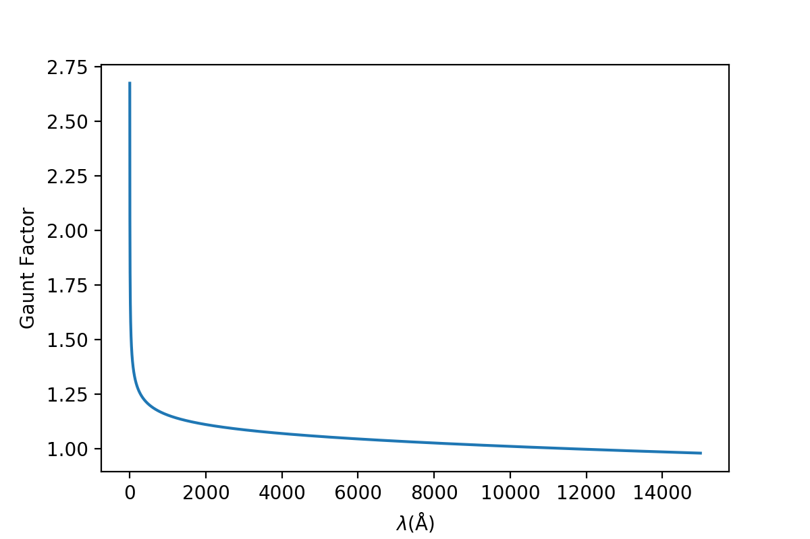
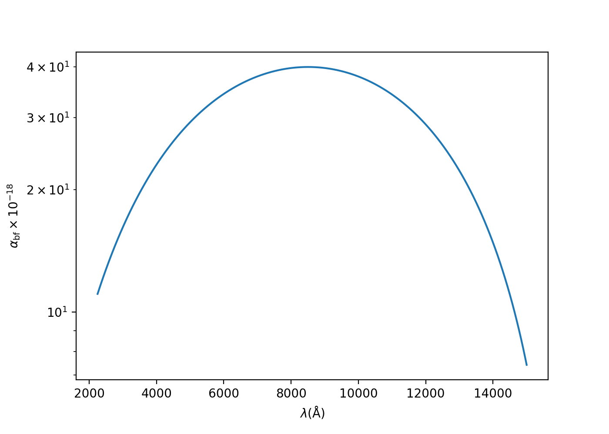
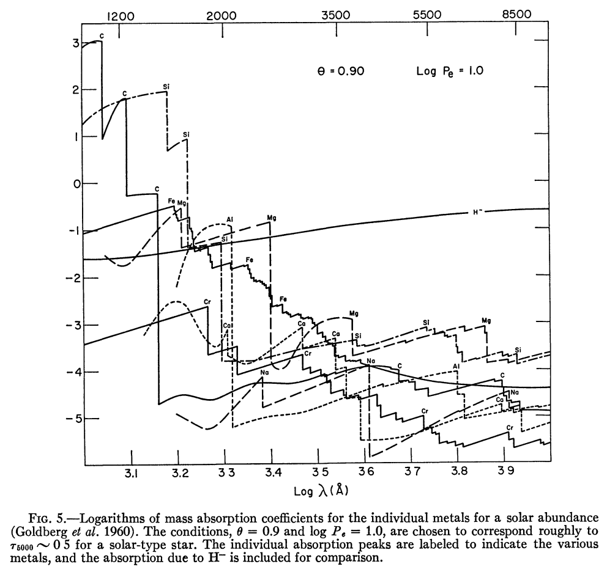

# 第八章：连续吸收系数

虽然第七章说了“只要知道源函数，之后就可以根据辐射转移方程算出每一点的辐射强度了”，但那是对于光深来说的，也就是$$ I_\nu(\tau_\nu) $$；如果我们继续将光深拆开我们发现我们还要先知道$$ \kappa_\nu $$，也就是吸收系数。由原子的束缚-束缚跃迁引起的吸收系数当然只在某个波长范围内才不为0（形成谱线），但是由另一些跃迁/物理过程引起的吸收系数却对很宽的波长范围有效，我们称之为连续谱吸收系数。连续谱吸收的重要性在于它决定了光谱整体的形状，当我们希望比较理论光谱和观测光谱的时候需要将理论的归一化光谱转换成真正的光谱。同时在计算恒星模型的时候我们也需要用到连续吸收系数，除非我们直接用已知的模型来套在其他恒星身上。所以这章讨论的就是连续谱的吸收系数。

## 连续谱吸收的来源

连续谱吸收的来源可以被归为两大类：电离过程（以及逆过程）和束缚-束缚跃迁。电离过程当然可以吸收/发出任何波长的光，只是量的多少而已。但是束缚-束缚跃迁作为谱线的主要来源一般是不作为连续谱吸收考虑的，这里的例外情况是当谱线非常密集的时候，它们总体造成的结果很像连续谱的吸收。之后我们会主要讨论这两类的吸收；但是在进入每种详细的吸收系数计算之前有必要先定义一个中间量：原子吸收系数。

原子吸收系数$$ \alpha $$指的是在某个波长上一个原子（或者是其他吸收粒子）的吸收截面大小。这个值肯定随着波长变化，而它乘上原子的数量（或者是归一化到另一种原子比如说氢原子的数量比例）就是这种原子的连续吸收系数$$ \kappa_\nu $$或者$$ \kappa_\lambda $$了。实际上原子吸收系数的推导比较复杂，所以之后一般只给出结论；来源会在文中标明，或者去看Ivan Hubeny《Theory of Stellar Atmospheres: An Introduction to Astrophysical Non-equilibrium Quantitative Spectroscopic Analysis》的第七章（后面提及的时候简称为TSA；我先吐会血）。

## 受激辐射因子

还有一个小东西要先提出来。很多过程中是有受激辐射的；本来我处于一个高能态但是环境不变的话我不会放出光子，现在你拿光来照我我肯定受不了要往低能态跑，光子就多了。考虑$$ (5.17) $$第二条式子和第一章里面的两能级占据数比例关系，有：

$$ \begin{align} \kappa_\nu\rho & = N_l B_{lu} h\nu - N_uB_{ul} h\nu \\ &= N_l B_{lu} h\nu (1 - \frac{N_uB_{ul}}{N_l B_{lu}}) \\ &= N_l B_{lu} h\nu (1-e^{-h\nu/kT}) \end{align} \tag{8.1}$$

所以考虑受激辐射的时候只是比单纯考虑吸收多乘上一个$$ (1-e^{-h\nu/kT}) $$因子；这是当然的因为吸收光的物质本身也在发出光子所以总吸收就减小了。这给我们的计算带来的不小的方便，只需要先算好所有的吸收然后在最后加起来之后乘上这个因子就对了；我们将在最后才乘上它。

## 中性氢

### 束缚-自由跃迁

有必要先把里德堡公式搬出来：

$$ \frac{1}{\lambda} = R(\frac{1}{n^2} - \frac{1}{m^2}) \tag{8.2}$$

讨论电离的时候把$$ m $$改成$$ \infty $$就行了。我们之后用$$ \chi $$表示能级$$ n $$与基态之间的能量，$$ I $$表示基态到$$ n = \infty $$之间的能量：

$$ \begin{align} \chi &= I - hRc/n^2 \\ &= hRc - hRc/n^2 \\ &= I(1 - 1/n^2) \end{align} \tag{8.3}$$

中性氢的束缚-自由辐射（电离）可以发生在任一个能级上；[Kramers (1923)](http://www.tandfonline.com/doi/abs/10.1080/14786442308565244)和[Gaunt (1930)](http://adsabs.harvard.edu/abs/1930RSPTA.229..163G)推出了束缚-自由辐射的吸收系数：

$$ \begin{align} \alpha_\mathrm{bf} &= \frac{32}{2^{3/2}}\frac{\pi^2e^6}{h^3}\frac{R}{n^5\nu^3}g_\mathrm{bf} \\ &= \frac{32}{2^{3/2}}\frac{\pi^2e^6}{h^3c^3}\frac{R\lambda^3}{n^5}g_\mathrm{bf} \\ &= \alpha_0g_\mathrm{bf} \frac{\lambda^3}{n^5} \mathrm{cm^2}每个中性氢 \end{align}$$

当$$ \lambda $$以埃为单位时$$ \alpha_0 = 1.0449\times10^{-26} $$；$$ g_\mathrm{bf} $$是从经典转换到量子的因子，接近1。[Karzas and Latter (1961)](http://adsabs.harvard.edu/abs/1961ApJS....6..167K)给出了一个表，但是一般来说用[Menzel and Pekris (1935)](http://adsabs.harvard.edu/abs/1935MNRAS..96...77M)的公式就足够了：

$$ g_\mathrm{bf} = 1 - \frac{0.3456}{(\lambda R^{1/3})}(\frac{\lambda R}{n^2}-\frac{1}{2}) $$

$$ \begin{align} g_\mathrm{ff} &= 1 + \frac{0.3456}{(\lambda R^{1/3})}(\frac{\lambda kT}{hc}-\frac{1}{2}) \\ &= 1 + \frac{0.3456}{(\lambda R^{1/3})}(\frac{\log{e}}{\theta \chi_\lambda}-\frac{1}{2}) \end{align} $$

分别对应束缚-自由和自由-自由过程。$$ \lambda $$仍然以埃为单位，$$ \theta = \frac{5040}{T} $$。

*束缚-自由过程的Gaunt因子*

*(线系限波长取自维基百科)*

如上图，不同线系在波长小于线系限处$$ \alpha_\mathrm{bf} $$不为0，且在线系限处$$ \lambda = n^2/R $$，所以此处的$$ \alpha_\mathrm{bf} $$与$$ n $$成正比。$$ n = 1 $$时的氢原子波尔半径为$$ 0.53 Å$$，对应的“面积”为$$8.8 \times 10^{-17} \mathrm{cm^2} $$，和912$$ Å $$处的原子吸收系数在同一个量级上。$$ \alpha_\mathrm{bf} $$的上升是很快的($$ \propto \lambda^3 $$)，而且从图中看到即使我们只考虑某个$$ n $$主导的波长范围，其他$$ n $$的吸收系数也不能忽略（特别是长波处），所以在求$$ \kappa_\nu $$的时候要从某个$$ n_0 $$开始，对之后所有的$$ n $$求和：

$$ \kappa(\mathrm{H_{bf}}) = \sum_{n_0}^\infty \frac{\alpha_\mathrm{bf}(\mathrm{H})N_n}{N} $$

利用[第一章](https://mingjiejian.github.io/2017/11/11/OASP1/)原子激发和电离的公式并将氢原子能级的可能态数代入：

$$ \begin{align} \frac{N_n}{N} &= \frac{g_n}{g_1} e^{-\frac{\chi}{kT}} \\ &= \frac{2n^2}{2} e^{-\frac{\chi}{kT}} \end{align}$$

$$ \begin{align} \Rightarrow \kappa(\mathrm{H_{bf}}) &= \alpha_0 \sum^{n_0}_\infty \frac{\lambda^3}{n^3}g_\mathrm{bf}e^{-\frac{\chi}{kT}} \\ &= \alpha_0 \sum^{n_0}_\infty \frac{\lambda^3}{n^3}g_\mathrm{bf}10^{-\theta\chi} \end{align} $$

Unfold (1995)证明了大于$$ n_0 + 2 $$的项之和可以用一个积分来代替：

$$ \sum_{n_0+3}^\infty \frac{1}{n^3}e^{-\frac{\chi}{kT}} = -\frac{1}{2} \int_{n_0+3}^{\infty} e^{-\chi/kT} d(1/n^2) $$

由$$ (8.3) $$得$$ d\chi = -Id(1/n^2) $$，所以

$$ \begin{align} \sum_{n_0+3}^\infty \frac{1}{n^3}e^{-\frac{\chi}{kT}} &= \frac{1}{2} \int_{n_0+3}^{\infty} e^{-\chi/kT} \frac{d(\chi)}{I} \\ &= \frac{kT}{2I} (e^{-\chi_3/kT} - e^{-I/kT}) \end{align} $$

其中$$ \chi_3 = I[1 - \frac{1}{(n_0+3)^2}] $$。不同$$ n $$的Gaunt因子又被设成了1，因为这个积分相比前面三项求和来说很小。

所以最终的吸收系数为：

$$ \kappa(\mathrm{H_{bf}}) = \alpha_0\lambda^3[\sum_{n_0}^{n_0+2}\frac{g_\mathrm{bf}}{n^3}10^{-\theta\chi} + \frac{\log{e}}{2\theta I}(10^{-\chi_2\theta} - 10^{-I\theta})] \tag{8.7} $$

### 自由-自由跃迁

自由-自由跃迁的吸收截面比束缚-自由跃迁的小不少，同时它还和自由电子的速度有关。[Kramers (1923)](http://www.tandfonline.com/doi/abs/10.1080/14786442308565244)给出了结论：

$$ d\alpha_\mathrm{ff}(\mathrm{H}) = \frac{2}{3^{3/2}}\frac{h^2e^2R}{\pi m_e^3} \frac{1}{\nu^3v} dv $$

那么要求$$ \alpha_\mathrm{ff}(\mathrm{H}) $$当然要将上式乘上Maxwell-Boltzmann分布再积分：

$$ \begin{align} \alpha_\mathrm{ff}(\mathrm{H}) &= \frac{2}{3^{3/2}}\frac{h^2e^2R}{\pi m_e^3} \frac{1}{\nu^3} \int_0^\infty (\frac{2}{\pi})^{1/2} (\frac{m}{kT})^{3/2} v e^{-(mv^2/kT)} \\ &= \frac{2}{3^{3/2}}\frac{h^2e^2R}{\pi m_e^3} \frac{1}{\nu^3} (\frac{2m}{\pi kT})^{1/2} \end{align} \tag{8.9}$$

同理，吸收系数就是吸收截面乘上Guant因子和归一化的粒子数量（在这里是质子和电子）就行了：

$$ \kappa(\mathrm{H_{ff}}) = \frac{\alpha_\mathrm{ff}(\mathrm{H}) g_\mathrm{ff} N_\mathrm{p} N_\mathrm{e}}{N_0} $$

加上Saha公式（不过我还没推出来）：

 $$ \kappa(\mathrm{H_{ff}}) = \alpha_0 \lambda^3 g_\mathrm{ff} \frac{\log{e}}{2\theta I} 10^{-\theta I} $$

在B、A型恒星中，中性氢是主要的连续谱吸收来源，所以我们会在它们的光谱中看到明显的特征比如线系限处的下降。但是低温恒星的中性氢吸收很少，主要来源转为负氢离子。

## 负氢离子

负氢离子就是氢原子加上一个电子在周围，并没有养生功效（比如[这些......](https://www.youtube.com/results?search_query=Negative+Hydrogen+Ions)）。负氢离子的结合能是0.755eV，所以波长小于16421Å的光子都能将它电离。这些“多余”的电子来自处于电离态的金属（you know比氢氦重的家伙们），所以负氢离子以及它的吸收性质依赖于金属的丰度以及它们电离的程度。像之前说的负氢离子的吸收主要在中温度的恒星中出现；高温会把负氢离子电离，而低温会减少负氢离子所需的额外电子供给。

给出结论：[Wishart (1979)](http://adsabs.harvard.edu/abs/1979MNRAS.187P..59W)给出了在2250到15000Å处误差小于0.2%的吸收截面六次多项式拟合：

可以看出来最大值在8500Å左右。

同样的利用Saha公式:

$$ \log{\frac{N(\mathrm{H})}{N(\mathrm{H^-})}} = -\log{P_\mathrm{e}} - \theta I + 2.5 \log{T} + \log{\frac{2}{1}} - 0.1762 $$

有：

 $$ \kappa(\mathrm{H_{bf}^-}) = 4.158\times10^{-10} \alpha_\mathrm{bf} P_\mathrm{e} \theta^{5/2} 10^{0.754\theta} $$

自由-自由吸收（氢原子与电子的复合）的截面以及系数的表达式由[Bell and Berrington (1987)](http://iopscience.iop.org/article/10.1088/0022-3700/20/4/019/pdf)给出。它主要影响红外辐射，用这个公式算出来的吸收系数已经考虑了受激辐射。图的话请看下面的gif。

## 其他氢

继续往低温方向走，我们会遇到氢分子$$ \mathrm{H_2} $$。虽然氢分子本身并不会对光谱造成影响，但是它的离子们会。$$ \mathrm{H_2^+} $$主要在紫外造成吸收，但是在大于3800Å处的吸收只有负氢离子的百分之几。[Bates (1952)](https://academic.oup.com/mnras/article/112/1/40/2834699)给出了计算方法。$$ \mathrm{H_2^+} $$主要造成自由-自由辐射，因为它没有稳定的束缚态。

## 氦

氦也是恒星的主要组成部分之一，但是氦不活泼，所以只能在OB型恒星里面见到。氦原子的$$ \chi_1 = 19.72$$eV，所以当第一个电子被激发的时候我们可以将剩下的原子核和电子当成一个氢原子来看待：对于$$ n \succsim 3 $$来说，我们有(Ueno 1954)：

$$ \alpha(\mathrm{He}) = 4e^{-10.92/kT}\alpha(\mathrm{H}) $$

而且这对男朋友(bf)和FFF团(ff)跃迁都有效。氦离子$$ \mathrm{He^+} $$的行为也和氢原子类似，只不过能量间隔是氢原子的大概4倍。

负氦离子也是有吸收的，只不过一般不考虑束缚-自由跃迁（因为束缚能级能量大概为19eV）。John(1994)给出了自由-自由跃迁吸收截面的表达式，而知道了吸收截面之后吸收系数可以表示为：

$$ \kappa(\mathrm{He_{ff}^-}) = \frac{\alpha(\mathrm{He_{ff}^-})A(\mathrm{He})P_\mathrm{e}}{1 + \Phi(\mathrm{He})/P_\mathrm{e}} $$

分母考虑了氦原子的电离。实际上$$ \mathrm{He^-} $$的吸收一般是很小的。

## 小结

把所有的$$ \kappa $$加起来就变成了这样：

可以看出来低温的时候负氢离子的束缚-自由跃迁占主导，随着温度上升不断下降切换成氢原子的跃迁。

坑：
- 算氢原子的bf的时候只算6项不够，要算100项左右；
- 配分函数怎么具体算还不是很明确导致$$ \mathrm{He_{ff}^-} $$没加进去（虽然都是可以忽略的）；可能需要估计各种元素丰度？

## 电子的Thomson散射

电子的经典以及量子Thomson散射都会给出同一个吸收截面：

$$ \alpha(\mathrm{e}) = \frac{8\pi}{3} (\frac{e^2}{m_\mathrm{e}c^2})^2 $$

不服请看TSA第六章。至于康普顿散射的截面，只有在光子能量大于5 keV，大概对应$$ 5\times10^7 $$度的时候才明显。虽然散射不一定是各向同性的，但是在恒星里面的光被各种散射，所以可以认为总体来说各向同性，所以：

$$ \kappa(\mathrm{e}) = \alpha(\mathrm{e}) \frac{N_\mathrm{e}}{N_\mathrm{H}} = \alpha(\mathrm{e}) \frac{P_\mathrm{e}}{P_\mathrm{H}} $$

考虑到恒星中的所有粒子为电子和其他粒子的和，有：

$$ N = N_\mathrm{e} + \sum N_\mathrm{j} = N_\mathrm{e} + N_\mathrm{H} \sum A_\mathrm{j} $$

$$  A_\mathrm{j} = N_\mathrm{j} - N_\mathrm{H} $$，所以

$$ N_\mathrm{H} = \frac{N - N_\mathrm{e}}{\sum A_\mathrm{j}}, P_\mathrm{H} = \frac{P_\mathrm{g} - P_\mathrm{e}}{\sum A_\mathrm{j}} $$

$$ \Rightarrow \kappa(\mathrm{e}) = \alpha(\mathrm{e}) \frac{P_\mathrm{e}}{P_\mathrm{g} - P_\mathrm{e}}\sum A_\mathrm{j} $$

在OB型星中，氢原子被电离，$$ P_\mathrm{e} \approx 0.5P_\mathrm{g} $$，$$ \kappa(\mathrm{e}) \approx \alpha(\mathrm{e}) \sum A_\mathrm{j} \approx 7\times10^{-25} $$cm^2/hydrogen particle。对于低温恒星，$$ P_\mathrm{e} \ll P_\mathrm{g} \Rightarrow \kappa_\mathrm{e} / P_\mathrm{e} \approx 7\times10^{-25}/P_\mathrm{g}$$；当$$ P_\mathrm{g} \approx 10^3-10^5 $$时，散射吸收系数可以被忽略。

## 其他的吸收源

其他的就剩金属元素了。它们的束缚-自由跃迁在紫外提供了额外的吸收系数。精确的计算和之前的过程类似（参考文献请看P163-164）；一些方便的计算方法包括类氢原子的方法，但是不一定对；或者仅适用于LS耦合的quantum defect method (Burgess and Seaton 1960)。[Travis and Matsushima (1968)](http://adsabs.harvard.edu/doi/10.1086/149790)给出了下面的图：

要注意这里取了对数，$$ \kappa_\nu $$的单位是$$ \mathrm{cm^2/g} $$。低温恒星还要考虑分子以及分子离子的吸收。

## 谱线

谱线和连续吸收关系不大，但是低温恒星的谱线非常密集，所以有的时候也要考虑。方法包括将谱线的吸收系数加在最后的连续吸收系数上，或者对光谱进行采样（要看！）。

## 总连续吸收系数

好了该完了。把上面的所有吸收系数加起来，该考虑受激辐射的乘上因子：

$$ \kappa_\mathrm{total} = \{[\kappa(\mathrm{H_{bf}}) + \kappa(\mathrm{H_{ff}}) + \kappa(\mathrm{H_{bf}^-}) + \kappa(\mathrm{H_{2}^+})](1-10^{-\chi_\lambda \theta}) + \kappa(\mathrm{H_{ff}^-}) + ...\} \times \frac{1}{1 + \Phi(\mathrm{H})/P_\mathrm{e}}\\ + \kappa(\mathrm{metals}) + \kappa(\mathrm{He_{ff}^-}) + \kappa(\mathrm{e}) + ... $$

大括号后面的因子是将单位从每个中性氢原子转成每个氢原子的（Saha公式）。要转成单位质量的话除一个平均质量就行：

$$ \kappa_\nu = \frac{\kappa_\mathrm{total}}{\sum A_j\mu_j} $$

$$ \sum A_j\mu_j $$的典型值为$$ 2.0\times10^{-24} $$g/H。
