# 第九章：光球层模型

乍看起来人为地制造一个恒星或者光球层的模型似乎没有必要。难道就不能从观测到的恒星光谱中导出我们想要的参数吗？就像从视差算出距离一样，只不过现在的公式或者方法比倒数麻烦很多而已。不过抱歉还真的不能，因为影响恒星光谱的因素实在太多，所以这样做一般是不现实的。所以要知道我们想知道的信息，我们只能倒过来，从一些理论和物理规律去造出一个模型，然后将模型产生的光谱和实际的光谱对比并不断修正，直到它们非常相像，我们才认为这个模型至少反映了一些实际，并用模型的参数去反映恒星的参数。

我们在第七章看到计算光强或者流量的时候我们需要源函数，同时在第八章看到计算$\kappa$的时候还需要压强（气体的和电子的）；所以光球层模型至少需要包括不同光深下面的源函数和压强（三列很多行的一个表），当然需要的话还可以在后面加上其他的参数。作为例子，这里给出一个Kurucz的模型（MOOG格式）：

`KURUCZ`

`TEFF   4750.  GRAVITY 2.50000 LTE[0.0] VTURB=2  L/H=1.25 NOVER`

`ntau=       72`

| $\rho x$ |  $T$  |  $P_\mathrm{g}$  | $N_\mathrm{e}$ | $\kappa_\mathrm{ross}$ |
| ------  |
| 2.48844185E-03 | 2877.3 | 7.869E-01 | 3.746E+07 | 5.359E-05 | 9.873E-03 | 2.000E+05 |
| 3.29274059E-03 | 2900.6 | 1.041E+00 | 4.908E+07 | 5.701E-05 | 1.014E-02 | 2.000E+05 |
| 4.29948870E-03 | 2923.9 | 1.360E+00 | 6.364E+07 | 6.082E-05 | 1.011E-02 | 2.000E+05 |

第一行是指明模型类型（MOOG也接受其他的一些模型），第二行是注释（有效温度和logg），第三行指名接下来的72行都是模型的内容。计算光谱的时候用到的物理量是光深、温度、气体压强、电子数密度或者是压强、Rossland不透明度。这里没有用到源函数的原因应该是认为热动平衡下每层的源函数都是普朗克函数，所以有温度就可以算出源函数了。所以有了模型之后就可以根据$(7.15)$来算流量了。

From the left to right column:
- Mass per square centimeter $\mathrm{RHOX} = \int_0^x \rho(x) dx \mathrm{[g~cm^{-2}]}$at the depth x
- Temperature $T~\mathrm{[K]}$
- Gas pressure$P_g~\mathrm{[dyne~cm^{−2}]}$
- electron number density $\mathrm{XNE}~\mathrm{[cm^{-3}]}$
- Rosseland mass absorption coefficient $\mathrm{ABROSS} = \kappa_\mathrm{Ross}~\mathrm{[cm2~g^{−1}]}$
- acceleration due to the absorption of radiation $\mathrm{ACCRAD}~\mathrm{[cm~s^{−2}]}$
- microturbulent velocity $\mathrm{VTURB}~\mathrm{[km~s^{−1}]}$
- energy flux that bear a convection $\mathrm{FLXCNV}~\mathrm{[erg~cm^2~s^{−1}]}$
- convective velocity $\mathrm{VCONV}~\mathrm{[km~s^{−1}]}$
- sound velocity $\mathrm{VELSND}~\mathrm{[cm~s^{−1}]}$.

这本书的主旨是“读完某一章之后就可以拿这一章的内容来做计算”，所以这里提到的模型肯定有很多假设，距离真实情况有一定距离。但是这不代表着它们没有用，它们仍然是不错的工具和真实模型的起点。这里的假设和简化包括：

1. 平面平行层假设，所有物理量只和深度有关
2. 处于流体静力学平衡，没有很大的膨胀和收缩，没有质量损失
3. 忽略米粒组织和和黑子，或者把它们也包括在光球层的平均物理量里面
4. 忽略磁场的影响
5. 处于热动平衡，有$(1.18), (1.19)$以及源函数为普朗克函数

很明显想要改进模型的话放宽这些条件就行了。十七、十八章会放宽最后一个条件。热动平衡并不是全局的，只是在某一个（相对光球层）比较小的$dx$里面成立，所以我们将光球层分成很多个子层，每一层有一个温度对应（上面的模型表格）；这就叫局部热动平衡(LTE)。

## 流体静力学平衡

流体静力学平衡就意味着压强差等于体元的所受的重力：

$$ dP = dF/dA = \rho g dx $$

这里的$dF,dx$都是里面减外面；而我们用$dx$定义的光深刚好也是这个方向的，所以：

$$ \frac{dP}{d\tau_\nu} = \frac{g}{\kappa_\nu} \tag{9.1}$$

这里的压强是总的压强。一般来说这里面气体压强占大头，除了一些特殊情况：高温恒星的辐射压$(5.11)$、磁场的压强或者湍流的压强。所以我们又欢乐地将总压强替换成气体压强$P_\mathrm{g}$了。

对$(9.1)$两边都乘一个$P_\mathrm{g}^{1/2}$，然后为了方便起见将某波长上的光深$\kappa_\nu$换成参考波长5000Å上的光深$\kappa_0$，得：

$$ P_\mathrm{g}^{1/2} dP_\mathrm{g} = P_\mathrm{g}^{1/2}\frac{g}{\kappa_0} d\tau_0 $$

要多说两句的是以后下标带$0$的量都指的是在参考波长上的量；在后面会看到$\tau_0$可以转换成其他波长上的光深，并且因为不同波长上的同一个光深值一般代表着不同的几何深度，在比较不同波长上的量的时候转换到同一个光深尺度下面是有必要的。

将上式两边积分，得：

$$ \begin{align} P_\mathrm{g}(\tau_0) &= ( \frac{3}{2} g \int_0^{\tau_0} \frac{P_\mathrm{g}^{1/2}}{\kappa_0} dt_0 )^{2/3} \\ &= ( \frac{3}{2} g \int_{-\infty}^{\log{\tau_0}} \frac{t_0^{1/2}P_\mathrm{g}^{1/2}}{\kappa_0 \log{e}} d\log{t_0} )^{2/3} \end{align} \tag{9.2}$$

换成$\log{}$是因为这样能有更高的精度。这是个超越方程所以我们先猜一个$P_\mathrm{g}(\tau_0)$，代进去算出新的$P_\mathrm{g}(\tau_0)$之后再重复直到收敛。即使我们猜了$P_\mathrm{g}(\tau_0)$，上面的式子里仍有吸收系数$\kappa_0$是未知的，所以我们先要知道$\kappa_0$。这就是第八章干的活，而从那里的结论我们知道$\kappa_0$是温度和电子压强的函数，然后我们就要去求$T(\tau_0), P_\mathrm{e}(\tau_0)$了。

## 恒星光球层的温度

### 太阳

我们有两个方法获取恒星光球层的温度：临边昏暗以及吸收系数在不同波长上的变化。

很明显临边昏暗只能用在太阳身上。$(7.10)$给出：

$$ I_\nu(0) = \int_{0}^\infty S_\nu e^{-t_\nu\sec{\theta}}\sec{\theta} dt_\nu \tag{9.3} $$

也就是说太阳表面的辐射强度是受$e^{-t_\nu\sec{\theta}}$调节的。辐射强度主要的贡献来自于$S_\nu\sec{\theta} \sim \frac{1}{e} S_\nu\sec{\theta}$的这个范围内，而随着我们的视线方向逐渐远离太阳中心，达到$\frac{1}{e} S_\nu\sec{\theta}$所需的光深越来越小，也就是我们能看到的表面越来越浅。

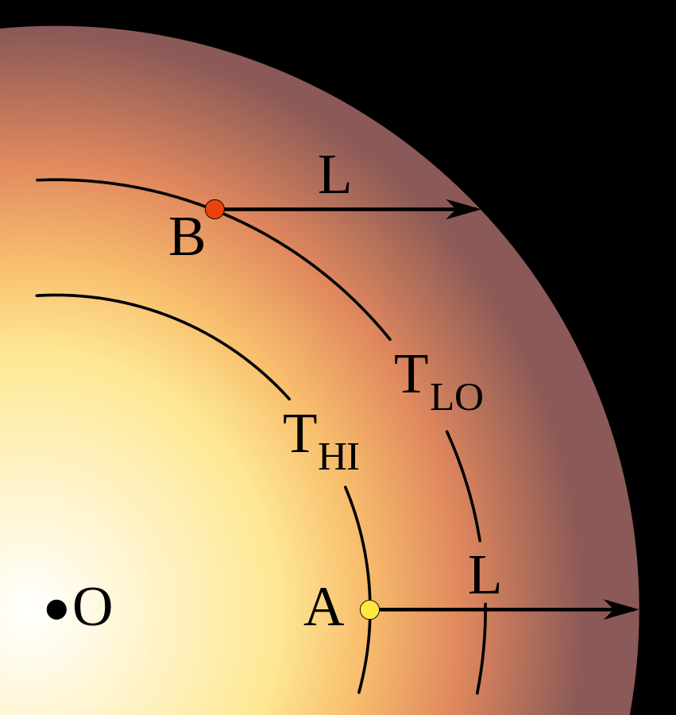
*太阳的临边昏暗*

在灰大气模型下，$(7.34)$可以写成：

$$ S_\nu = a + b\tau_\nu $$

代进$(9.3)$里面可以得到：

$$ I_\nu(0) = a + b \cos{\theta} $$

也就是说在$\theta$角观测到的辐射强度就是在光深$\tau_\nu$处的源函数的值，所以只要观测辐射强度我们就知道了源函数；这叫做Eddington-Barbier关系。当然更复杂一点的源函数也可以通过数值模拟来找到。

一个稍微定量一点的方法是将$(9.3)$写成对数坐标下的形式：

$$ I_\nu(0) = \int_{-\infty}^\infty S_\nu e^{-t_\nu\sec{\theta}}t_\nu\sec{\theta} \frac{d\log{t_\nu}}{\log{e}} \tag{9.4} $$

右边的积分叫做贡献函数，它反映了每层的辐射对表面光强的贡献。

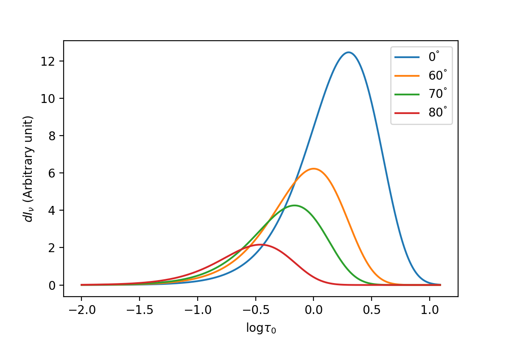
*不同角度位置上的贡献函数*

如上图，右边为大气底部，左边为大气顶端（对于光深来讲）。我们可以看到没有光从很顶端以及底部的区域发射出来，同时越靠近恒星边缘我们主要看见的光就越从光深更小的地方发射。这里的源函数取得非常随意，只是保证了普朗克函数的形式($\frac{1}{e^{0.001/\tau}-1}$)，所以$dI_\nu$的值和书上的有较大差异。同样实际操作中我们也是把顺序倒过来，通过观测到的$I_\nu$计算出源函数。

第二个办法是在不同波段上观测。除了角度之外，吸收系数$\kappa_\nu$也会决定我们能看得多深，所以对于中低温恒星来说在16000Å左右我们能看得最深，；往短波方向走我们看得越来越浅因为负氢离子的吸收变大（第八章的gif图）；波长小于2500Å之后虽然负氢离子的吸收变小了但是金属的吸收变大了。当然能结合临边昏暗以及不同波长能给我们带来最多的信息。其他还有的办法是观测强的谱线，将在第十三章详述。

所以对于太阳来说，结果大致是这样的：

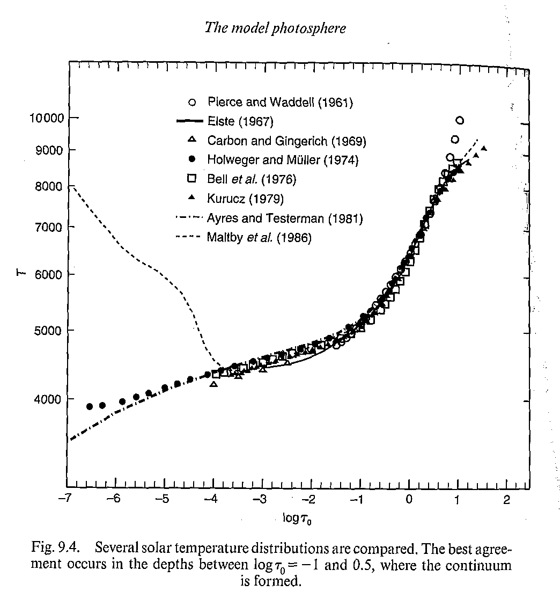

[Kurucz模型](http://wwwuser.oats.inaf.it/castelli/sun.html)
[MARCS](http://marcs.astro.uu.se/index.php)

基本上在$$-3 < \log{\tau_0} < 1$$的范围内所有模型都一致，因为有观测数据支撑；更深的地方模型们开始有分歧，因为处理对流的方式不一样。而在光深很小的地方的分歧部分原因是LTE不再成立。

另一个必须要提及的点是实际上同一层内温度肯定不会处处相同；温度起伏在百分之几到25%左右，这也是模型没有顾及的。

### 其他恒星

显然我们不能用临边昏暗去得到其他恒星的温度（边看都看不见还昏什么暗）。所以我们一是完全从理论计算，或者直接将太阳的模型变换到别的恒星上。

理论计算来源于$(7.14)$。当然还要加上$(7.22), (7.28), (7.30)$和流量守恒（恒星大气不发光）。先猜一个源函数，代进$(7.14)$算出流量，再根据流量守恒去修改源函数直到收敛。具体例子可以看P179中间提到的论文。有的时候我们还要加上谱线的影响，称之为line blanketing。

理论计算主要的误差来源与不准确的$\kappa_\nu$以及对对流的处理（混合长的选择什么的）。对流并不会对表面流量产生很大的影响，但是会改变底层的温度。我们会在第十七章引入对流。

恒星大气的理论模型十分复杂，所以多数的研究都会把模型算好并发布，直接拿来用就行了。

将太阳的模型变换到别的恒星上虽然看起来比较粗暴但是还是有一些理由的。它的做法是用一个常数去乘太阳的温度，得到恒星的温度：

$$ T(\tau_0) = S_0 T_\odot(\tau_0) $$

灰大气模型下面这么做是完全没有问题的，因为$(7.36)$：

$$ T(\tau) = [\frac{3}{4}(\tau+\frac{2}{3})]^{1/4} T_\mathrm{eff}$$

可得

$$ T(\tau) = \frac{T_\mathrm{eff}}{T_\mathrm{eff}^\odot}T_\odot(\tau)$$

这两种方法的结果是差不多的

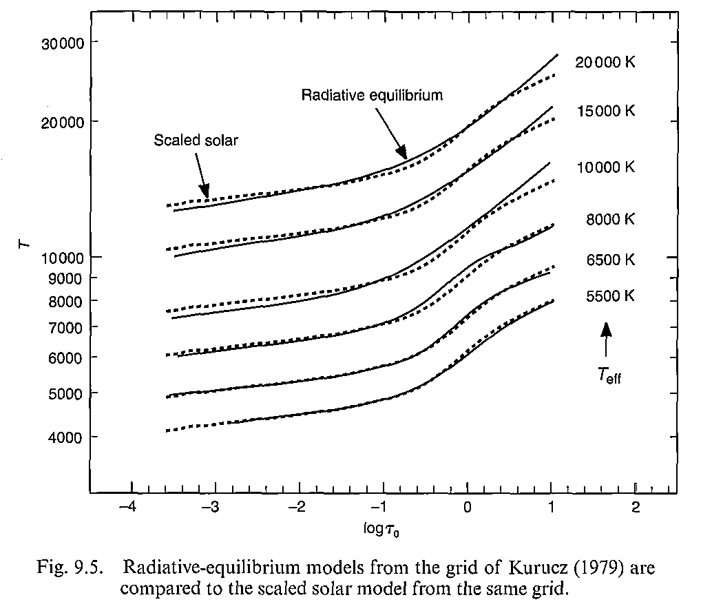

当然巨星和矮星会有不同，可能需要一个标准巨星。

实际操作中也可以直接拿格点中的恒星模型来稍作变换然后得到想要的模型，因为常数$S_0$可以随便取。

到此我们就认为我们已经知道恒星大气每层的温度了。下一个要知道的是气体压强。

## 气体压强-电子压强-温度关系

当我们在解$(9.2)$的时候我们先猜一个气体压强$P_\mathrm{g}$。之后我们就需要算$\kappa_0$，所以我们马上就要求出电子压强$p_\mathrm{e}$和气体压强的关系。令单位体积内某种元素$j$的一次电离离子的数量为$N_{1j}$，原子数量为$N_{0j}$，则根据$(1.20)$有：

$$ \frac{N_{1j}}{N_{0j}} = \frac{\Phi_j(T)}{P_\mathrm{e}} $$

忽略二次及以上的电离，$N_{1j}$就和$j$元素贡献的电子的数量$N_{ej}$相同，有

$$ \frac{\Phi_j(T)}{P_\mathrm{e}} = \frac{N_{ej}}{N_{0j}} = \frac{N_{ej}}{N_{j} - N_{ej}} $$

$$ \Rightarrow N_{\mathrm{e}j} = N_j \frac{\Phi_j(T)/P_\mathrm{e}}{1 + \Phi_j(T)/P_\mathrm{e}} \tag{9.6}$$

由理想气体公式，压强为：

$$ P_\mathrm{\mathrm{e}} = \sum_j N_{\mathrm{e}j}kT $$

$$ P_\mathrm{g} = \sum_j (N_{\mathrm{e}j} + N_{j})kT \tag{9.7}$$

所以压强之比为：

$$ \begin{align} \frac{P_\mathrm{e}}{P_\mathrm{g}} &= \frac{\sum_j N_{\mathrm{e}j}kT}{\sum_j (N_{\mathrm{e}j} + N_{j})kT} \\ &= \frac{\sum_j N_j [\frac{\Phi_j(T)/P_\mathrm{e}}{1 + \Phi_j(T)/P_\mathrm{e}}]}{\sum_j N_j [1 +  \frac{\Phi_j(T)/P_\mathrm{e}}{1 + \Phi_j(T)/P_\mathrm{e}}]} \end{align} $$

上下同除以单位体积内氢原子数量$N_\mathrm{H}$，令$A_j = N_\mathrm{j}/N_\mathrm{H}$为相对丰度，有：

$$ P_\mathrm{e} = P_\mathrm{g} \frac{\sum_j A_j [\frac{\Phi_j(T)/P_\mathrm{e}}{1 + \Phi_j(T)/P_\mathrm{e}}]}{\sum_j A_j [1 +  \frac{\Phi_j(T)/P_\mathrm{e}}{1 + \Phi_j(T)/P_\mathrm{e}}]} \tag{9.8}$$

这是一个超越方程，同样也需要迭代对于每一个光深的值去解。

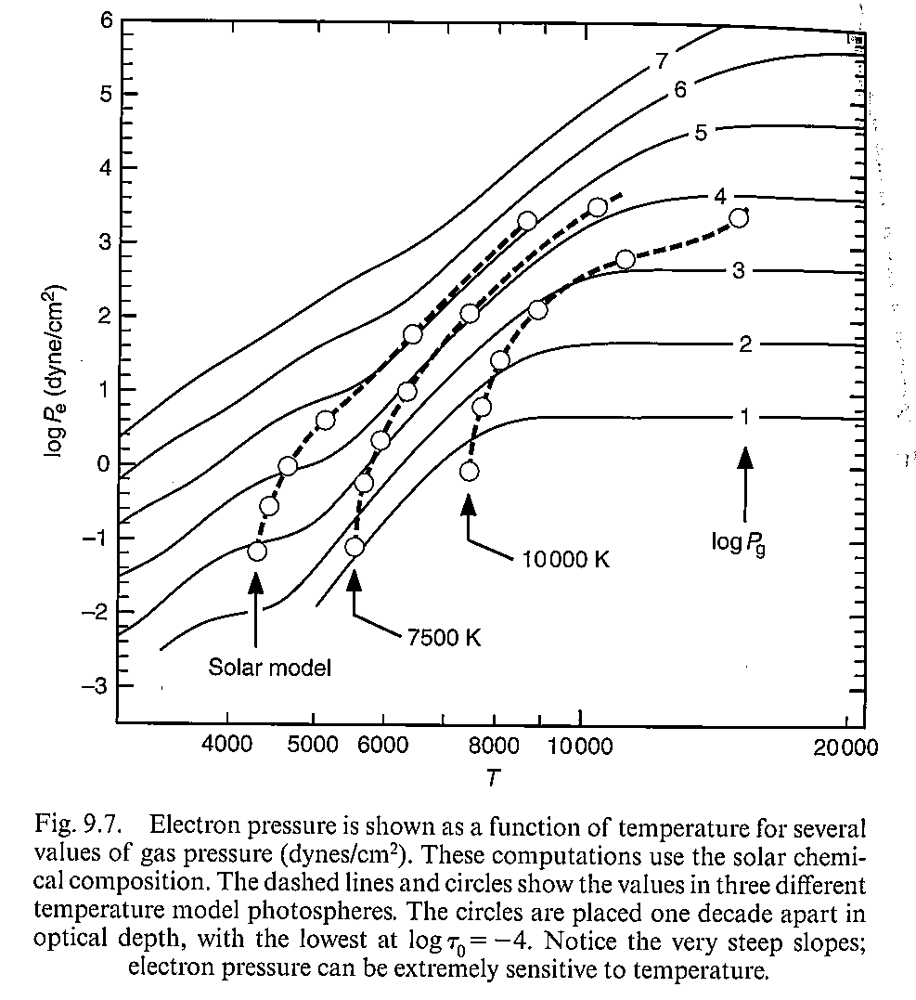

如上图，我们能看出高温时$P_\mathrm{g} \approx 2P_\mathrm{e}$，或者$$\log{P_\mathrm{g}} \approx \log{P_\mathrm{e}} + 0.3$$（因为氢基本上电离了），低温时$P_\mathrm{e} \approx P_\mathrm{g}^{1/2}$，或者$\log{P_\mathrm{e}} \approx 0.5 \log{P_\mathrm{g}}$。低温这个结论也可以从公式中推出来。先认为恒星大气中只由一种元素的原子组成，则$(9.8)$变为：

$$ P_\mathrm{e} = P_\mathrm{g} \frac{\Phi(T)/P_\mathrm{e}}{1 + 2\Phi(T)/P_\mathrm{e}}$$

$$ \Rightarrow P_\mathrm{e}^2 = \Phi(T)(P_\mathrm{g} - 2P_\mathrm{e}) $$

低温时$P_\mathrm{e} \ll P_\mathrm{g}$，所以

$$ P_\mathrm{e}^2 \approx \Phi(T)P_\mathrm{g} \tag{9.9}$$

低温恒星在迭代的时候还要注意元素丰度的问题，因为这个时候金属元素提供了主要的电子，迭代的时候可能也需要修改元素丰度。

## 模型小结

我们已经可以计算大气模型了。拿已经有了的$T(\tau_0)$和猜测的$P_\mathrm{g}(\tau_0)$计算$P_\mathrm{e}(\tau_0)$和$\kappa_0(\tau_0)$，然后通过$(9.2)$算出一个新的$P_\mathrm{g}(\tau_0)$，如此重复。如果$T(\tau_0)$是从太阳的转换来的话那收敛之后就完了；但如果$T(\tau_0)$是理论值的话我们还要求它满足流量守恒，修正$T(\tau_0)$然后再重复。

## 从模型中导出来的东西

### 几何深度

几何深度就是$dx = d\tau_0 / \kappa_0 \rho$啦，所以

$$ x(\tau_0) = \int_0^{\tau_0} \frac{1}{\kappa(t_0)\rho(t_0)} dt_0 \tag{9.10}$$

$\kappa$已经在刚刚的迭代中确定了，$\rho$可以算出来：

$$ \rho = N_\mathrm{H} \times \sum A_j \mu_j $$

同时

$$ N_\mathrm{H} = \frac{N - N_\mathrm{e}}{\sum A_j} = \frac{P_\mathrm{g} - P_\mathrm{e}}{kT\sum A_j}$$

$$ \Rightarrow x(\tau_0) = \int_0^{\log{\tau_0}} \frac{kT(t_0)\sum A_jt_0}{\kappa(t_0) \sum A_j\mu_j[P_\mathrm{g} - P_\mathrm{e}]\log{e}} d\log{t_0} \tag{9.11}$$

或者利用本文第一条公式$dP_\mathrm{g} = \rho g dx$积分，有

$$ x(P_\mathrm{g}) = \frac{1}{g} \int_0^{P_\mathrm{g}} \frac{kT(p)\sum A_j}{\sum A_j\mu_j} \frac{dp}{p-P_\mathrm{e}} \tag{9.12}$$

从这里我们可以看到恒星大气的几何深度和$g$是成反比的。

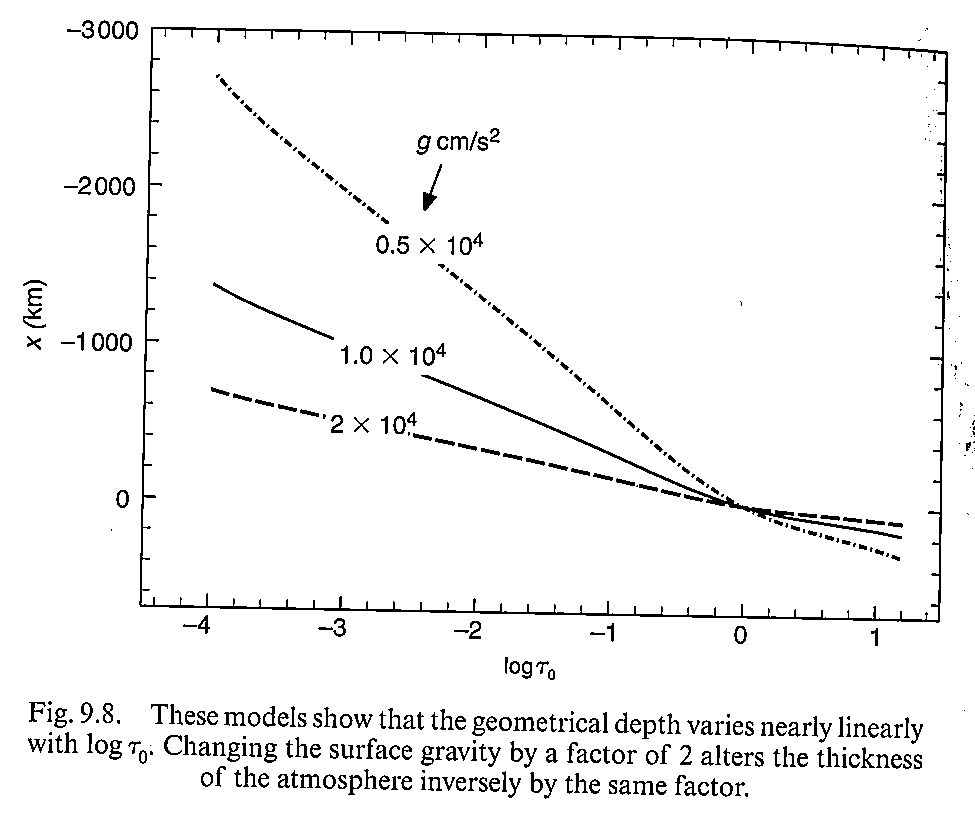

### 模型的计算

模型最重要的结果自然是光谱，或者说是不同波长上的流量。这个东西可以从$(7.15)$计算出来：

$$ F_\nu = 2\pi \int_{-\infty}^{\infty} S_\nu(\tau_0) E_2(\tau_\nu) \frac{\kappa_\nu(\tau_0)\tau_0 d\log{\tau_0}}{\kappa_0(\tau_0)\log{e}} \tag{9.13}$$

这条式子和$(7.15)$的区别在于$S_\nu$以及$d \tau_\nu$。

$S_\nu$的自变量被改成了$\tau_\nu$，这是因为热动平衡下$S_\nu(\tau_\nu) = B_\nu[T(\tau_\nu)]$，当我们在讨论同一个几何深度的薄层时无论用的自变量是$\tau_\nu$还是$\tau_0$，所表达的温度都是一样的（因为是同一层），所以方便起见我们用$\tau_0$。要注意的是$E_2$不能这样做，因为$E_2$是一个积分，整个积分是随着$\tau_\nu$的变化而变化的。

$$ d \tau_\nu$的话根据几何深度的定义，我们有

$$ dx = \frac{d\tau_\nu}{\kappa_\nu \rho} = \frac{d\tau_0}{\kappa_0 \rho} $$

代进去再换成log scale，就有了最后的那坨东西。

$(9.13)$式的微分是恒星某一层在某个波长上发出的光的流量多少，我们将他称为flux contribution function。它说明了在这个波长下，恒星的光主要是从哪一层发出来的。

从上图我们可以看出8000埃处的恒星光主要来自更高的位置，说明了$\kappa_{8000}$更大。

另一个明显的例子是巴尔末跳跃前后的flux contribution function。

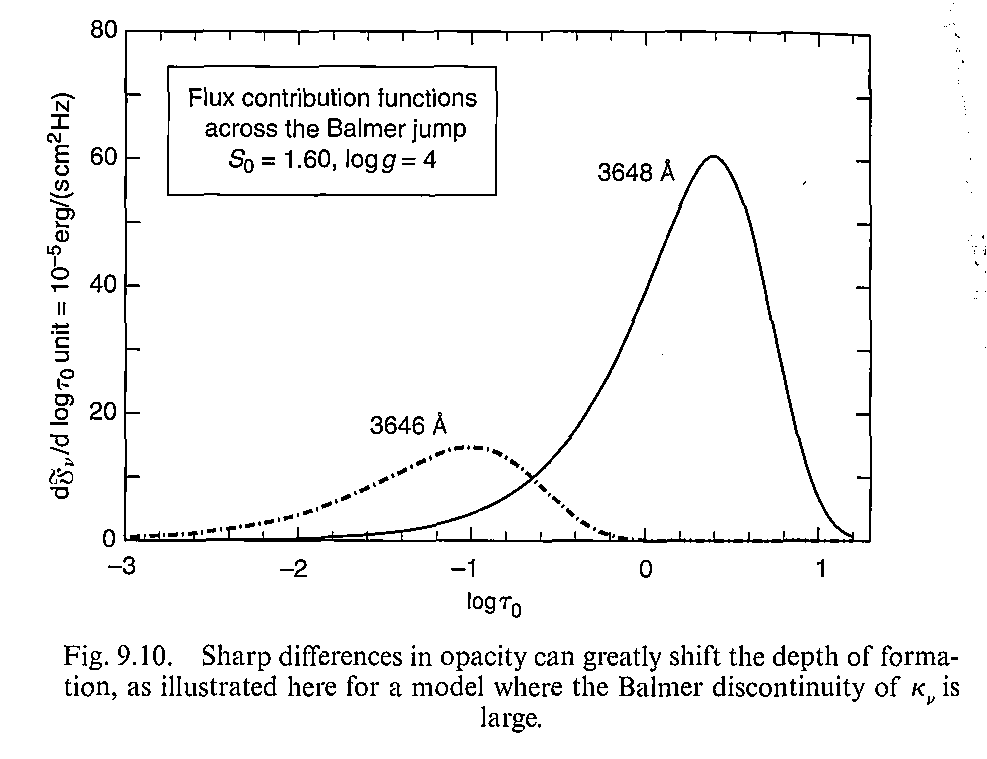

可以看到3646的辐射层远高于3648，说明多数的3646辐射都被氢原子吸收掉了。

以上讨论的主要是$E_2$对FCF的影响，同时源函数（其实也就是温度分度分布）对FCF也有影响。温度越高，辐射越多，辐射峰值也稍微往高处走（因为温度会使吸收系数发生变化）。

最后，我们还有别的方法去计算流量，比如对$(7.15)$的另一种积分（把0单拿出来然后后面分部积分）：

$$ F_\nu = \pi S_\nu(0) + 2\pi \int_0^\infty \frac{dS}{d\tau_\nu}E_3(\tau_\nu)d \tau_\nu \tag{9.15}$$

它和边界的流量以及源函数的梯度有关；在LTE情况下$S_\nu(0) = B_\nu(T_0)$，所以和边界温度有关。

### 模型的性质：压强关系

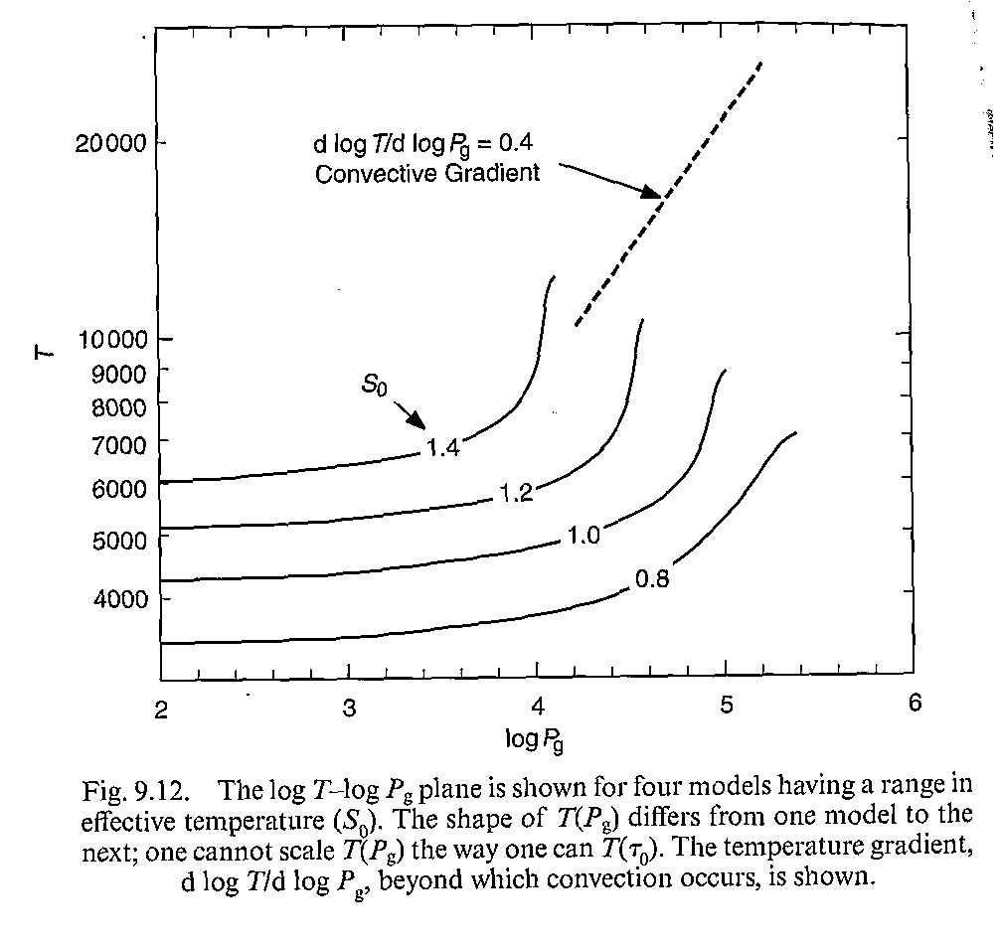

图9.12显示了气体压强和温度的关系$T(P_g)$。可以看到不同温度下的曲线并不像$T(\tau_0)$一样可以直接乘上一个常数；这是我们用光深而不用气体压强做自变量的一个原因（不方便）。

$(7.39)$表明了当上图的斜率超过$1-1/\gamma \approx 0.4$的时候，会发生对流。所以很多模型到了这里附近会不稳定，需要加入对流的因素。一件好事是对流一般发生在恒星大气的底部，因为大气比较稀薄的时候主要还是辐射传能。

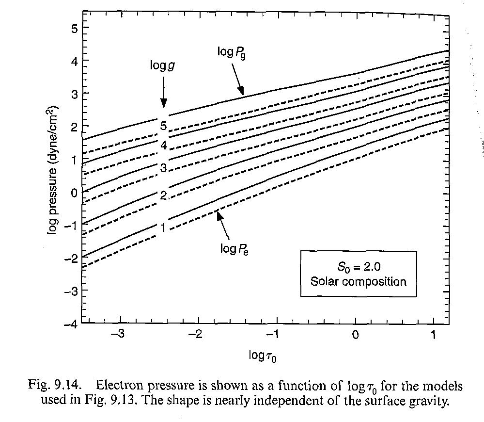

图9.13和9.14显示了两个不同温度的模型在不同光深处的气体以及电子压强。在低温模型的大气上层，电子压强远远小于气体压强；向恒星内部走，温度升高使得电离增强，所以电子压强也升高，但是仍然没有完全电离。对于高温恒星，两条线距离很小，意味着基本上完全电离了。

我们还可以看看表面重力加速度和压强的关系。由$(9.2)$，我们有

$$ P_\mathrm{g} \approx C(T) g^{2/3} \tag{9.19}$$

$C(T)$就是那一堆积分加常数。然后从$(9.9)$，对于低温模型，有

$$ P_\mathrm{e} \approx \text{constant}\, g^{1/3} \tag{9.20} $$

高温模型下因为$P_\mathrm{e} \approx 0.5 P_\mathrm{g}$，所以

$$ P_\mathrm{e} \approx \text{constant}\, g^{2/3} \tag{9.21} $$

这个结论是和计算一致的。

### 金属丰度的影响

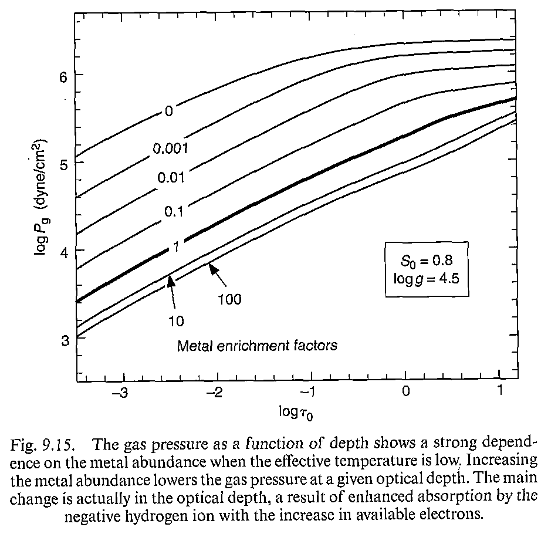
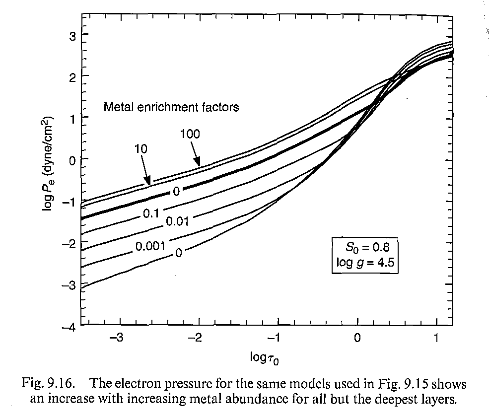

图9.15和9.16显示了低温模型不同金属丰度下气体压强的情况。高温模型的话主要是氢原子提供电子，同时压强也和金属丰度关系不大了。对于低温恒星，金属丰度越大、电子压强也越大。这是显而易见的，因为更多的金属提供了更多的电子。当然在大气底层，增大金属丰度对电子压强影响不大，因为此时（又）主要是由氢原子提供电子了，也不在乎金属提供的那点电子。稍微不那么好理解的是气体压强，为什么金属丰度增大之后气体压强反而减小了呢？这不是因为气体压强本身的问题，而是电子增多带来的不透明度增大。电子增多会带来更大的连续谱吸收，导致同一个几何深度上的光深变大，所以我们看到的恒星大气厚度变小，整条线右移、气体压强自然就“减小”了。

当然这可以用公式推出来；我们计算这么一个量：

$$ \frac{P_\mathrm{e}}{P_\mathrm{g}}\frac{1}{\sum A_j} = \frac{P_\mathrm{e}}{P_\mathrm{g}} \frac{N_\mathrm{H}}{\sum N_J} \frac{kT}{kT} = \frac{P_\mathrm{e}}{P_\mathrm{g}} \frac{P_\mathrm{H}}{\sum N_j kT} \approx \frac{P_\mathrm{e}}{\sum N_j kT} $$

恒星里面主要是氢嘛，所以$P_\mathrm{g}$和$P_\mathrm{H}$就近似相等了。继续，$N_j$和$P_\mathrm{e}$可以表述为原子离子的组合：

$$ \sum N_j = \sum (N_1+N_0)_j, P_\mathrm{e} = N_\mathrm{e}kT = \sum N_{1j}kT $$

所以

$$ \frac{P_\mathrm{e}}{P_\mathrm{g}}\frac{1}{\sum A_j} \approx \frac{\sum N_{1j}}{\sum (N_1+N_0)_j} $$

那么当金属基本上被电离的时候，$\sum N_{1j} \gg \sum N_{0j}$：

$$ \frac{P_\mathrm{e}}{P_\mathrm{g}}\frac{1}{\sum A_j} \approx 1 \tag{9.22}$$

金属处于中性的时候，$\sum N_{1j} \ll \sum (N_{1j} + N_{0j})$：

$$ \frac{P_\mathrm{e}}{P_\mathrm{g}}\frac{1}{\sum A_j} \approx \frac{\sum N_{1j}}{\sum N_{0j}} \tag{9.23}$$

在金属电离的情况下，$(9.1)$可以写成：

$$ d P_\mathrm{g} = \frac{g}{\kappa_0}d\tau_0 = \frac{g}{P_\mathrm{e}\kappa_0/P_\mathrm{e}}d\tau_0 = \frac{g}{P_\mathrm{g}\sum A_j \kappa_0/P_\mathrm{e}}d\tau_0 $$

对$P_\mathrm{g}$积分，有

$$ \frac{1}{2} P_\mathrm{g}^2 = \frac{1}{\sum A_j} \int_0^{\tau_0} \frac{g}{\kappa_0 / P_\mathrm{e}} d\tau_0 $$

把后面的积分当作常数，有

$$ P_\mathrm{g} = c_0 (\sum A_j)^{-1/2} \tag{9.24} $$

然后从$(9.22)$有

$$ P_\mathrm{e} = c_0 (\sum A_j)^{1/2} \tag{9.25} $$

当然这只是一个定性的估算，而且只在大气外部成立。

在金属中性的情况下，只考虑一种金属使得$N_1/N_0 = \Phi(T)/P_\mathrm{e}$，则有

$$ P_\mathrm{g} = c_1 (\sum A_j)^{-1/3} $$

$$ P_\mathrm{e} = c_1 (\sum A_j)^{1/3} $$

我们还可以比较一下图9.13和9.16，可以发现在恒星大气顶部，增大金属丰度和增大$\log{g}$对电子压强的影响是类似的，所以这两个物理量同向变化的时候对大气顶端的光谱特征的影响也是类似的。也就是说从光谱特征的变化我们分不出究竟是金属丰度还是$\log{g}$变大/变小了。

氦元素丰度也可以稍微使得压强发生变化。利用$(8.19)$我们可以将$(9.1)$写成

$$ dP_\mathrm{g} = \frac{g}{\kappa_0}d\tau_0 = \frac{g}{\kappa}\sum A_j \mu_j d\tau_0 $$

从这里我们能看到$\sum A_j \mu_j$和$g$的地位是相似的，所以根据$(9.19)$有

$$ P_\mathrm{g} = \text{constant} (\sum A_j \mu_j)^{2/3} $$

同时

$$ \sum A_j \mu_j = A(\mathrm{H})\mu_\mathrm{H} + A(\mathrm{He})\mu_\mathrm{He} + ... \approx 1.66\times 10^{-24} [1+4A(\mathrm{He})] $$

我们又忽略了其他元素。所以类似的，有

$$ P_\mathrm{g} = \text{constant} [1+4A(\mathrm{He})]^{2/3} $$

至于电子压强，代进$(9.9)$附近的结论就行了。

### 压强和有效温度的关系

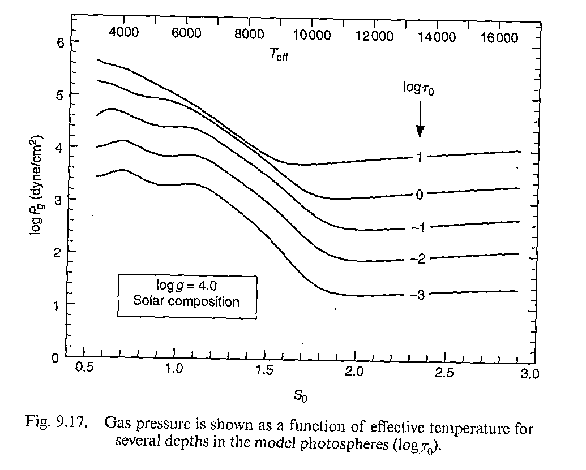
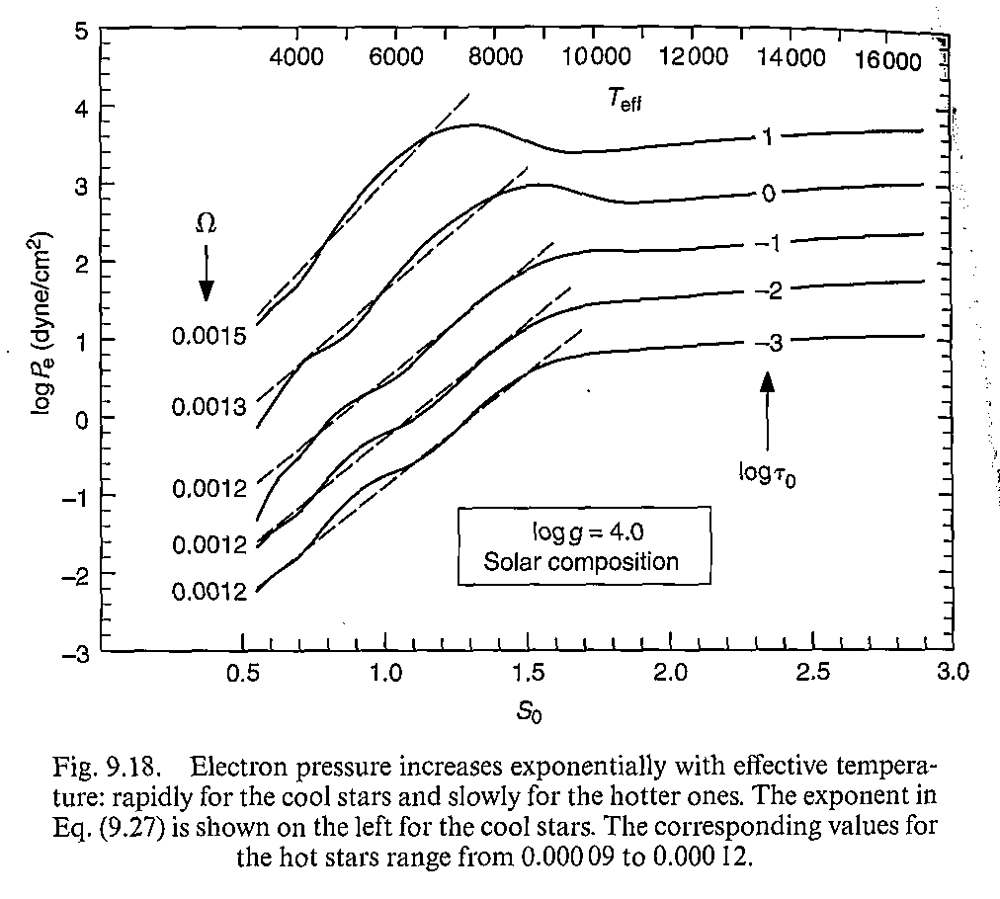

继续看图说话，9.17和9.18。我们只看大气的某一层，对于电子压强来说提高温度自然有更多电子出来，所以成正比，直到氢被电离为止。正比的那一段可以用一条直线来拟合；而气体压强就和图9.15类似了，因为电子多了所以看不深，只能看到外面压强，就小了。

### 复习

够长的一章。这里所提及的模型都是很简单的，只要确定了有效温度、$\log{g}$和金属丰度的话就可以完全确定。放松最开始提到的假设可以造出更符合实际（或者需要）的模型，这个会在之后提到。
