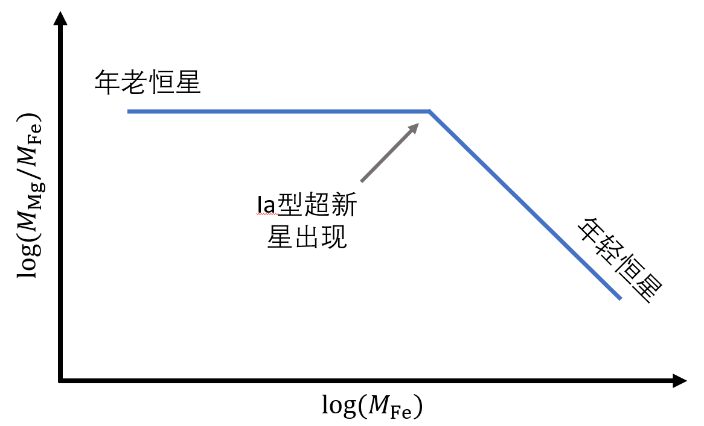
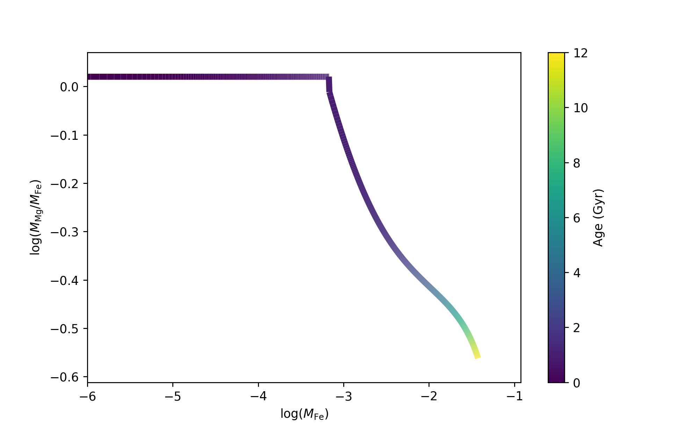

# 银河考古学讲义练习 参考答案

## 练习1

1. $^{12}C$; 2. $^{31}P$; 3. $\alpha$.

## 练习2

可以。第一代恒星的碳氮氧元素是由氦燃烧来的。Pop III星一开始的氢燃烧方式只有质子-质子链，而因为质子-质子链的燃烧效率比较低，它的核心迅速收缩升温，开始进行氦的燃烧、直至足够的碳产生，然后恒星的核反应方式转为CNO循环。详细可参见：[Evolution of massive Population III stars with rotation and magnetic fields](https://www.aanda.org/articles/aa/pdf/2012/06/aa17769-11.pdf)

## 练习3

首先我们定性地思考一下这个问题。
题目问的是只考虑Ia型超新星以及II型超新星的化学贡献，并且只问了Mg和Fe元素。
由yield的表可知，这两种超新星都会产生Mg和Fe；由超新星发生率图可知，每时每刻都有超新星爆发。
所以Mg和Fe的质量一定随着时间的推移而增长。

在$0$到$1\,\mathrm{Gyr}$中，只有II型超新星而没有Ia型超新星发生，所以此时

$$ \frac{M_\mathrm{Mg}}{M_\mathrm{Fe}} \propto \frac{y_\mathrm{II, Mg}}{y_\mathrm{II, Fe}} = 220/211 $$

在$1\,\mathrm{Gyr}$之后，Ia型超新星爆发产生了大量的Fe($y_\mathrm{Ia, Mg}/y_\mathrm{Ia, Fe} = 0.009/0.626$)，所以$M_\mathrm{Mg}/M_\mathrm{Fe}$会逐渐下降。
它们的趋势大致应该是这样的：

定量计算如下：

考虑在不同时刻元素形成的质量

$$ 
\begin{align}
M_\mathrm{X}(t) &= \int_0^t \sum_\mathrm{i=Ia, II} y_{i, \mathrm{X}} R_i(t) V dt \\
& = V \int_0^t y_{Ia, \mathrm{X}} R_{Ia}(t) + y_{II, \mathrm{X}} R_{II}(t) dt
\end{align}
$$

$t<1\,\mathrm{Gyr}$时：

$$ 
\begin{align}
M_\mathrm{X}(t) &= V \int_0^t 0.016 y_{II, \mathrm{X}} t dt \\
& = 0.008 y_{II, \mathrm{X}} t^2 V
\end{align}
$$

$t\ge 1\,\mathrm{Gyr}$时：

$$ 
\begin{align}
M_\mathrm{X}(t) &= V \int_1^t 0.004 y_{Ia, \mathrm{X}} - \frac{0.012}{11} y_{II, \mathrm{X}} t + \frac{0.188}{11} y_{II, \mathrm{X}} dt  + 0.008 y_{II, \mathrm{X}}\\
& = [ - \frac{0.006}{11} y_{II, \mathrm{X}} t^2 + (0.004 y_{Ia, \mathrm{X}} + \frac{0.188}{11} y_{II, \mathrm{X}})t - 0.004 y_{Ia, \mathrm{X}} + \frac{0.094}{11} y_{II, \mathrm{X}}] V
\end{align}
$$

将yield的数据代入并计算不同$t$处的$\log{M_\mathrm{Mg}/M_\mathrm{Fe}}$与$\log{M_\mathrm{Fe}}$，可得下图：

它和我们之前估计的大致趋势是一致的。

## 练习4

浅绿色：$\beta^+$衰变；深绿色：$\alpha$衰变

## 练习5

1. 因为$^{63}Ni$的半衰期为100年，所以某些$^{63}Ni$可以在发生$\beta^-$衰变之前接收一个中子变成$^{64}Ni$，而另外一些则发生$\beta^-$衰变变成$^{63}Cu$；
2. 因为1000年才发生一次接收中子的事件，比$^{63}Ni$的半衰期大一个量级，所以变为$^{63}Cu$的核素更多。