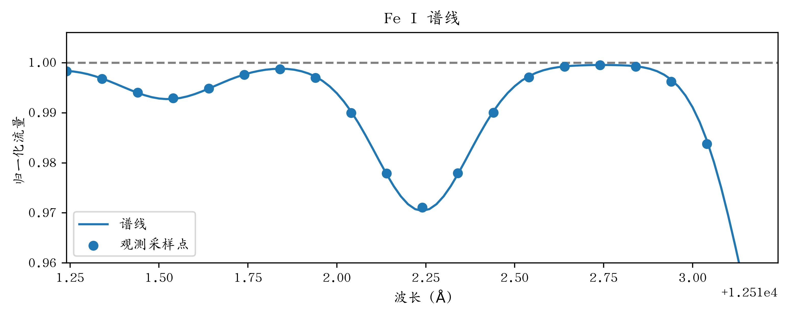
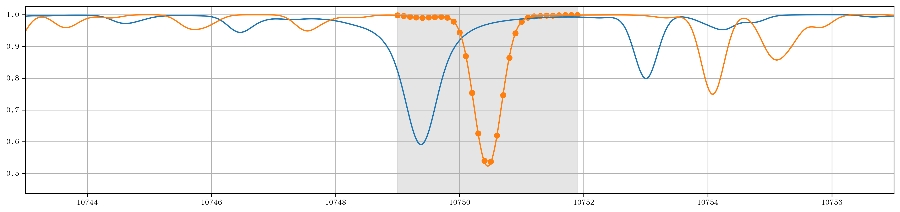
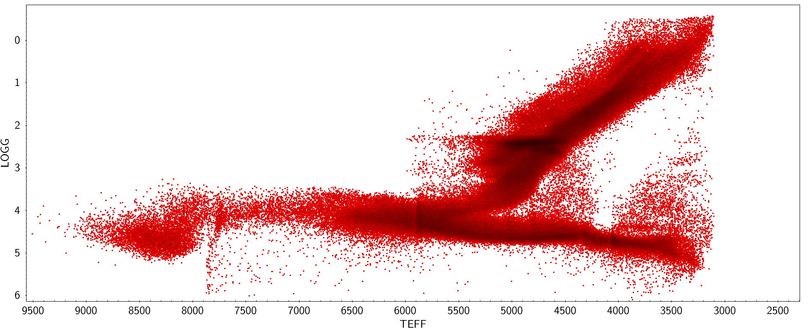
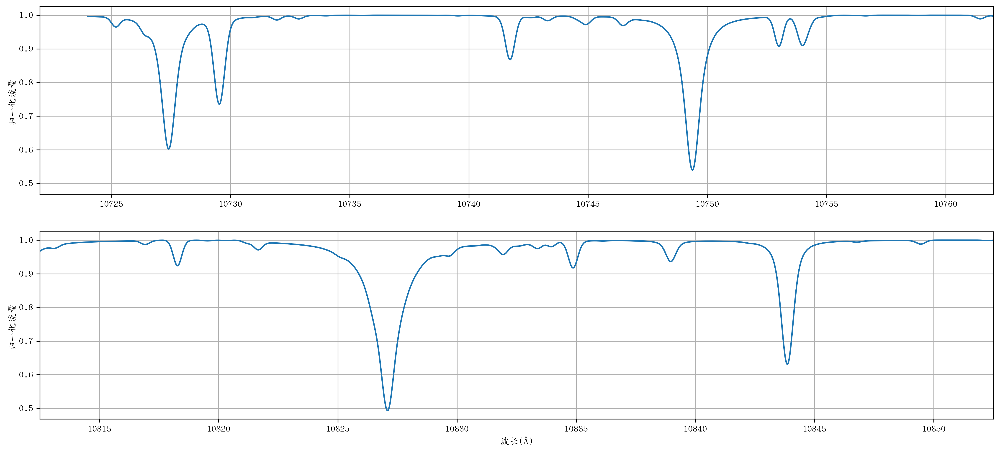
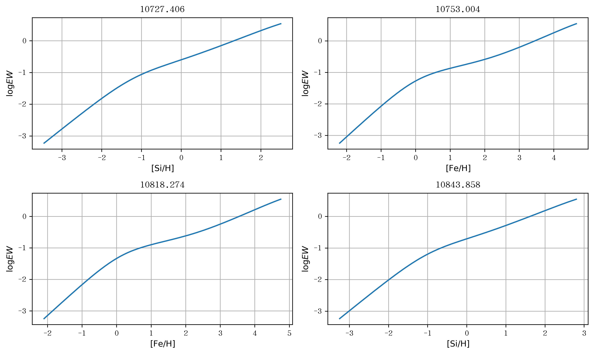

# 从恒星光谱到恒星参数

恒星参数指的是表征恒星物理状况的一些量。
几乎所有的观测都是为了获得恒星参数 --- 也就是有关恒星的信息。
这些信息可以帮助我们得知这个恒星的状态、推断它以后如何演化；当我们获取了银河系内很多恒星的参数后，我们还可以以此拼凑出银河系恒星的分布、化学丰度信息，从而还原银河系的演化过程。
所以，恒星参数的确定是恒星物理和银河考古学非常重要的基础信息。

在昨天的课里面，我们已经简单地接触到了恒星光谱以及它的分类。
今天我们从这里延伸开来，讲讲如何从恒星光谱得到恒星参数。

<br><br><br><br><br><br><br>
<br><br><br>

## 1 恒星参数

上面我们已经对恒星参数下了一个定义；但是我们还没有明确恒星参数包括什么。
在之前的课程或者书籍里面，我们都见过哪些恒星参数？

````{admonition} 例1
1. 请通过翻书或者回忆写出自己知道的所有恒星参数。

<br>

2. 下列哪些是恒星参数？哪些不是恒星参数？<br>
A.温度 B.有效温度 C.核球质量 D.宇宙学常数 E.硅元素丰度 F.视向速度 G.挠率 H.暗物质密度 I.色指数 J.终端速度

<br>
````

这么多的恒星参数肯定不可能一一讲到，这里只涉及到最基本的几个恒星参数，并将它们分成几类。

- 有效温度：发出的辐射与恒星光度L相等的黑体的温度。

$$T_\mathrm{eff} = \frac{L}{4\pi R^2\sigma}$$

- 表面重力加速度

$$ g = \frac{GM}{R^2} $$

- 元素丰度

$$\log{\varepsilon_\mathrm{X}} = \log{\frac{N_\mathrm{X}}{N_\mathrm{H}}} + 12$$

$$\mathrm{[X/H]} = \log{\varepsilon_\mathrm{X, star}} - \log{\varepsilon_\mathrm{X, sun}}$$

用方括号的好处是方括号=0 -> 元素丰度和太阳一样。

在上面列举的参数中，有一部分是可以通过观测确定的，比如：

````{admonition} 例2
下列恒星参数可以通过什么方法测得？
- 星等、位置、自行
    <br><br>
- 距离
    <br><br>
- 有效温度、表面重力加速度、元素丰度、自转速度、磁场强度、视向速度
    <br><br>
````

<br><br><br><br>

所以恒星参数可以分为两类：

1. 可观测参数：这些参数可以通过观测测定
    - 星等、距离、自行、位置、有效温度、表面重力加速度、元素丰度、自转速度、磁场强度、视向速度
2. 推导参数：这些参数不可以通过观测测定，只能通过可观测参数**间接**计算出来
    - 光度、半径、质量、年龄
    - 双星的质量可以通过双星的轨道参数得出

其中，年龄是我们在银河考古学中最关心，但又最难得到的参数。
在寒假集训讲到的银河考古学内容里面，我们通过建立银河系化学演化模型得到了恒星铁、镁元素丰度与时间的关系，也是想通过元素丰度这个媒介间接得到恒星的年龄。
由观测方法的归类可见，恒星的几乎所有物理参数和一部分运动学参数都是从恒星的光谱中得出的，所以恒星光谱很重要！

<br><br>

## 2 恒星光谱

大家印象中的光谱是什么样子的呢？

```{image} https://casswww.ucsd.edu/archive/public/tutorial/images/physics/abs_spect.gif
:width: 60%
:align: center
```

<p style="text-align:center;">图1：光谱示例</p>

```{image} https://aas.aanda.org/articles/aas/full/1998/09/ds1457/img18.gif
:width: 60%
:align: center
```

<p style="text-align:center;">图2：归一化光谱示例</p>

其实它们都是恒星光谱，只是形式不一样而已。

光谱的产生一定伴随着分光。
分光指的是将不同波长的光从同一个方向分开成射往不同方向的光的过程。
有什么东西可以分光？
棱镜和光栅。
光在通过棱镜或者光栅之后被色散，不同波长的光射到的不同的位置，然后被探测器接收到，就得到了光谱。
这个色散的程度决定了我们能看到什么东西。
色散的程度大，分辨率就高，就能看到更多谱线；反之分辨率就低，看到的谱线就少。
所以我们总是希望分辨率越高越好。
当然这就带来另一个问题：波长覆盖就小了，而我们也希望它越大越好。

<br><br><br><br><br>

在高分辨率光谱下，恒星的连续谱就很难分辨了，我们将注意力放在谱线上。
这个时候我们会拿观测到的光谱去除以连续谱，让光谱变平，就更容易测量谱线了。
变平了的光谱我们叫做“归一化光谱”。

<br><br><br><br><br><br><br>

### 2.1 谱线是什么？它是怎么来的？

谱线是这样的一个东西：

<p style="text-align:center;">图3 光谱谱线示例</p>

它是恒星发出的光经过恒星大气被大气中的原子（或者其他粒子）吸收后产生的特征。
原子吸收光子，从低能级的态上升到高能级的态。

<br><br><br><br><br><br><br>

还记得基尔霍夫的辐射定理么？

```{image} https://thecuriousastronomer.files.wordpress.com/2015/08/fg04_07.jpg
:width: 60%
:align: center
```
<p style="text-align:center;">图4 基尔霍夫辐射定理的图示</p>

一团低温气体本身不发出光线，但是将它加热，它就发出了几条谱线（发射线）。
而将低温气体放在高温光源后面，它就在同样位置产生了吸收线。
恒星大气也是类似（但不完全一样），高温光源就是恒星内部（可以看作是黑体），低温气体就是恒星外围的大气（一层薄膜）。

<br><br><br><br><br><br><br>

实验和理论表明，当一束强度为$I$光线经过一段长度为$\mathrm{d}s$的气体后，它被吸收的量为：

$$ \mathrm{d}I = - \alpha n I \mathrm{d}s $$

其中$\alpha$是与粒子类型有关的参数（吸收截面），$n$为粒子数密度（单位体积内的粒子数）。

````{admonition} 例3
假设$\alpha$与$n$都不是$s$的函数，求解上述微分方程，得到$I(s)$.
<br><br><br><br>
````

### 2.2 谱线有什么样的参数？


<p style="text-align:center;">图5 光谱示例2</p>

````{admonition} 例4
请观察蓝色光谱和橙色光谱中最明显的两条谱线。它们有什么区别？由此可得，一条谱线有什么参数？
<br><br><br><br>
````

#### 2.2.1 中心波长 (central wavelength)

谱线最深处对应的波长。
在实际测量中一般是用程序拟合整个谱线轮廓，以这个轮廓最低点处波长作为谱线的中心波长。
在这里我们只需要用像素值最小的像素的波长作为中心波长即可。
偶尔会出现两个像素的像素值都很接近而且都很小的情况，此时可以用它们波长的平均值作为中心波长。

#### 2.2.2 谱线深度 (line depth)

谱线最深处对应的归一化流量值。
在实际测量中一般也是用程序拟合整个谱线轮廓，以这个轮廓最低点处的值作为谱线的深度。
在这里我们只需要用像素值最小的像素的值即可。

#### 2.2.3 半高全宽 (full width at half maximum; FWHM)

谱线在一半深度处对应的两个像素点之间的距离，表征谱线的宽度。

#### 2.2.4 等值宽度 (Equivalent width; EW)

谱线与连续谱（在归一化光谱中是y=1的直线）所围成的面积。
它表征谱线的总吸收量。

$$ EW = \sum_i (1-f_i) * \Delta\lambda $$

上下限将谱线包围起来即可。


````{admonition} 例5
请根据下表，测量图5中阴影部分橙色谱线的中心波长、深度、半高全宽以及等值宽度。
|   wavelength |     flux |   wavelength |     flux |
|-------------:|---------:|-------------:|---------:|
|      10748   | 0.996866 |      10749.5 | 0.593067 |
|      10748.1 | 0.994498 |      10749.6 | 0.713851 |
|      10748.2 | 0.99185  |      10749.7 | 0.838262 |
|      10748.3 | 0.990373 |      10749.8 | 0.92614  |
|      10748.4 | 0.990868 |      10749.9 | 0.971314 |
|      10748.5 | 0.992472 |      10750   | 0.988936 |
|      10748.6 | 0.993518 |      10750.1 | 0.994364 |
|      10748.7 | 0.992141 |      10750.2 | 0.996015 |
|      10748.8 | 0.983237 |      10750.3 | 0.996945 |
|      10748.9 | 0.955778 |      10750.4 | 0.997574 |
|      10749   | 0.892861 |      10750.5 | 0.998025 |
|      10749.1 | 0.785981 |      10750.6 | 0.998359 |
|      10749.2 | 0.656653 |      10750.7 | 0.998614 |
|      10749.3 | 0.555153 |      10750.8 | 0.998809 |
|      10749.4 | 0.529656 |      10750.9 | 0.998962 |

<br><br><br><br><br>
````

### 2.3 谱线有什么样的行为？

- 强度随**有效温度**的变化而变化：原子激发与电离的平衡 - [玻尔兹曼](http://www.phys.ufl.edu/~meisel/Boltzmann.pdf)与[萨哈](https://www.astro.princeton.edu/~gk/A403/ioniz.pdf)方程
    - 参见[STU12](STU_12)的内容。
    - 结论：温度低的时候，没有足够的原子用于吸收光；温度高的时候，原子又被电离了。
- 宽度与**原子热运动速度等**有关
- 强度与**元素丰度**成正比

<br><br><br><br><br>

这里着重说一下最后一点。
在固定的有效温度下，如果我们将一条谱线的等值宽度与元素丰度画在一张图上，那么它将会是这样的：

```{image} img/cog_example.png
:width: 70%
:align: center
```
<p style="text-align:center;">图6 生长曲线示例</p>

生长曲线的特点：
1. 线性区间
2. 饱和区间
3. 阻尼区间

不同恒星参数、不同观测设备下的谱线的强度、形状、位置等都是不一样的。
如果想看看其他波长、其他恒星参数下的光谱的话，推荐使用python包`pymoog`以及[APOGEE的网站](https://dr16.sdss.org/infrared/spectrum/view/stars)。

<br><br>

````{admonition} 例6
大家还想看看什么参数的光谱？

````

## 3 从恒星光谱到恒星参数：有效温度和元素丰度的测量

之前我们讨论的主要是从恒星参数到恒星光谱。
但是实际观测的时候我们是不知道恒星参数的，反而是想从光谱得到恒星参数。
那么应该怎么做呢？
这里以有效温度和元素丰度为例，各给出一个通过谱线确定这个参数的例子。

### 3.1 有效温度的测量：谱线深度比(Line-depth ratio; LDR)

我们可以用谱线深度比的方法来确定有效温度。
在上一节中我们看到，谱线的深度是和温度有关系的；有的谱线随着温度上升逐渐变浅，有的与温度变化关系不大。

```{image} img/gray_91_fig1.png
:width: 70%
:align: center
```
<p style="text-align:center;">图7 谱线深度随温度变化；来自<a href="http://adsabs.harvard.edu/abs/1991PASP..103..439G">Gray & Johanson (1991)</a> 图1</p>

<br><br>

那么如果我们已知一批恒星的有效温度和谱线深度，将它们画在图上并拟合一条关系，那么这个关系就可以用在新观测的恒星上了。

```{image} img/LDR_D4.png
:width: 70%
:align: center
```
<p style="text-align:center;">图8 LDR与有效温度的关系；来自<a href="http://adsabs.harvard.edu/abs/2020arXiv200310641J">Jian et al. (2020)</a> 图5</p>

但是，谱线深度不仅和有效温度有关，还和元素丰度有关；怎么消除元素丰度的影响？
这就是我们实际上使用谱线深度比而不是谱线深度本身的原因了。
当我们选择的谱线都是同一个元素的谱线（比如都是铁元素、都是钛元素的谱线）时，元素丰度的影响就能被减少，因为元素丰度一旦变化的话，两条谱线都会同时变强或者变弱，深度比的变化会小很多。
另外在寻找谱线深度比-有效温度关系时，我们也会尽量寻找对元素丰度不那么敏感的线对。

````{admonition} 例7
上面的LDR-Teff关系用到的是在10340.89Å与10469.65Å的两条铁的谱线。
这个关系为：

$$ T_\mathrm{eff} = -6356.05 \log{\frac{d_{10340.89}}{d_{10469.65}}} + 4255.65 $$

下表给出了某恒星的在这两个波长附近的光谱。

|   wavelength |     flux |   wavelength |     flux |
|-------------:|---------:|-------------:|---------:|
|      10340.4 | 0.990487 |      10469.2 | 0.952376 |
|      10340.5 | 0.975562 |      10469.3 | 0.924575 |
|      10340.6 | 0.933868 |      10469.4 | 0.873559 |
|      10340.7 | 0.86027  |      10469.5 | 0.794045 |
|      10340.8 | 0.779791 |      10469.6 | 0.712477 |
|      10340.9 | 0.743637 |      10469.7 | 0.679068 |
|      10341   | 0.77982  |      10469.8 | 0.720547 |
|      10341.1 | 0.860368 |      10469.9 | 0.811161 |
|      10341.2 | 0.934286 |      10470   | 0.90009  |
|      10341.3 | 0.976918 |      10470.1 | 0.957102 |

请计算谱线深度、谱线深度比以及这个恒星的有效温度。

````

### 3.2 元素丰度的测量

在确定了恒星的有效温度之后，我们可以给出在这个有效温度下，这条谱线的生长曲线，如图

````{admonition} 例8
为什么有效温度确定之后才能给出生长曲线？

<br><br>
````

````{admonition} 例9
通过生长曲线确定例5中谱线对应的硅元素丰度。

<br><br>
````

## 4 课后习题

````{admonition} 从恒星光谱到恒星参数
图中给出了某颗恒星的一段光谱，图是在这颗恒星有效温度下铁和硅元素的丰度与等值宽度的关系（生长曲线）；表1给出了光谱某几部分的波长以及归一化流量的值，表2给出了2对被用作LDR的谱线。


<p style="text-align:center;">图9 某恒星在红外波段的一段光谱</p>


<p style="text-align:center;">图10 此恒星有效温度下谱线的生长曲线</p>

|   wavelength |     flux |   wavelength |     flux |
|-------------:|---------:|-------------:|---------:|
|      10726.9 | 0.871689 |      10817.8 | 0.998572 |
|      10727   | 0.823547 |      10817.9 | 0.993666 |
|      10727.1 | 0.758888 |      10818   | 0.981337 |
|      10727.2 | 0.68672  |      10818.1 | 0.959758 |
|      10727.3 | 0.627516 |      10818.2 | 0.936011 |
|      10727.4 | 0.604314 |      10818.3 | 0.925086 |
|      10727.5 | 0.627388 |      10818.4 | 0.935268 |
|      10727.6 | 0.68648  |      10818.5 | 0.958382 |
|      10727.7 | 0.758579 |      10818.6 | 0.979676 |
|      10727.8 | 0.823172 |      10818.7 | 0.992208 |
|      10752.5 | 0.99226  |      10843.4 | 0.914254 |
|      10752.6 | 0.986906 |      10843.5 | 0.868721 |
|      10752.7 | 0.972944 |      10843.6 | 0.80252  |
|      10752.8 | 0.948343 |      10843.7 | 0.724803 |
|      10752.9 | 0.921348 |      10843.8 | 0.659354 |
|      10753   | 0.909254 |      10843.9 | 0.63347  |
|      10753.1 | 0.92157  |      10844   | 0.659338 |
|      10753.2 | 0.948704 |      10844.1 | 0.724779 |
|      10753.3 | 0.973222 |      10844.2 | 0.802503 |
|      10753.4 | 0.986329 |      10844.3 | 0.868714 |

|LDR编号|谱线1波长|谱线1元素|谱线2波长|谱线2元素|
|:---:|:---:|:---:|:---:|:---:|
|16|10753.004|Fe I|10727.406|Si I|
|17|10818.274|Fe I|10843.858|Si I|

它们有如下的关系式：

$$ T_\mathrm{eff} = -4196.5 \log{\mathrm{LDR}}+3227.0 \tag{LDR-16}$$
$$ T_\mathrm{eff} = -3447.3 \log{\mathrm{LDR}}+3644.3 \tag{LDR-17}$$

|谱线波长|谱线深度|等值宽度|
|:---:|:---:|:---:|
|10727.406||0.380Å|
|10753.004|||
|10818.274||0.039Å|
|10843.858|||


1. 请在光谱中证认出这4条谱线；
2. 测量这4条线的谱线深度；
3. 根据2中的谱线深度计算这颗恒星的有效温度；
4. 这6条谱线的等值宽度如下所示，请补全缺少的等值宽度并根据生长曲线测量铁和硅元素的丰度；
5. 思考题：恒星光谱与很多参数都相关；如何通过恒星光谱确定尽量多的参数？
````