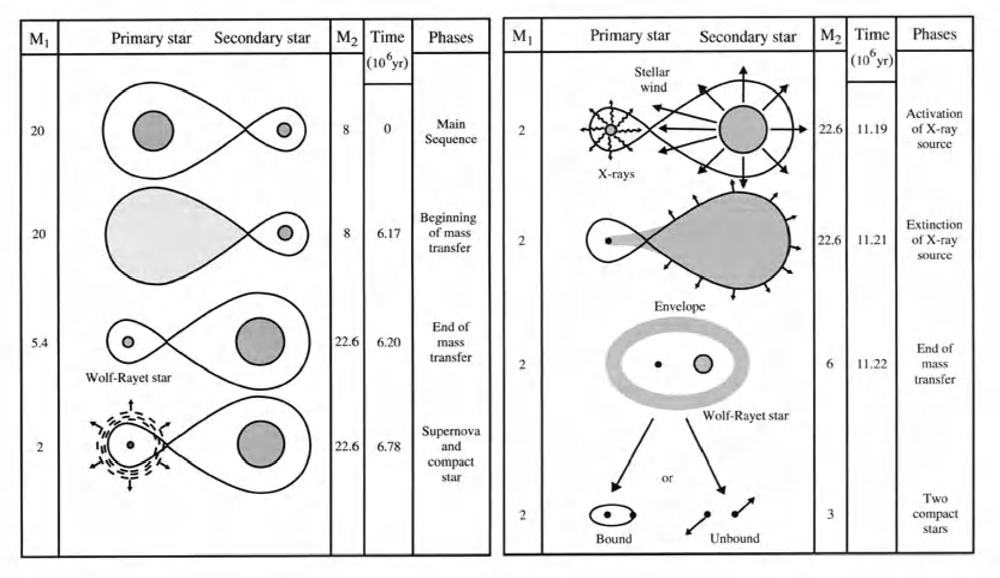
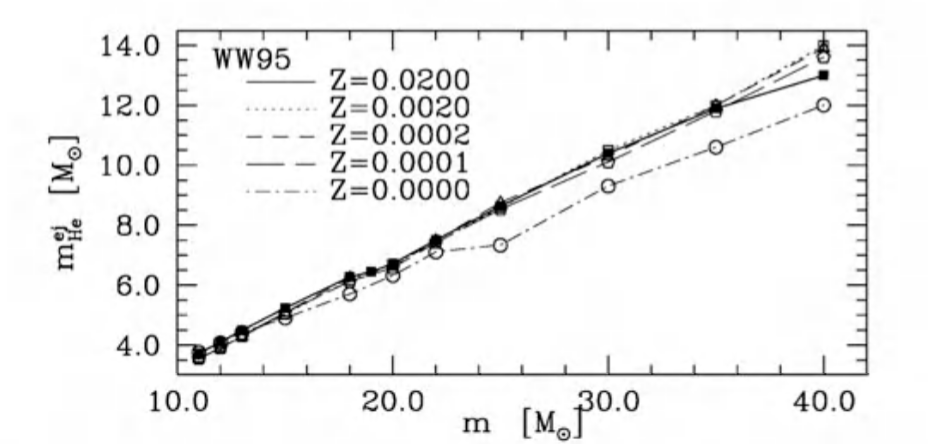
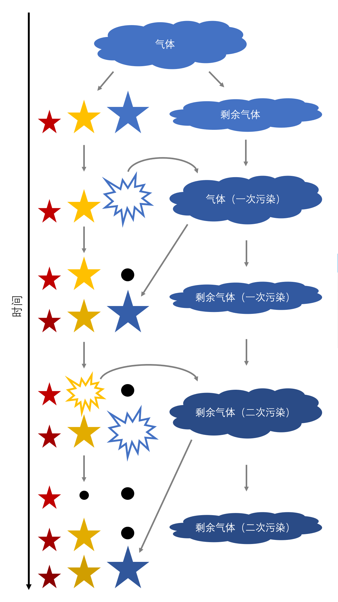
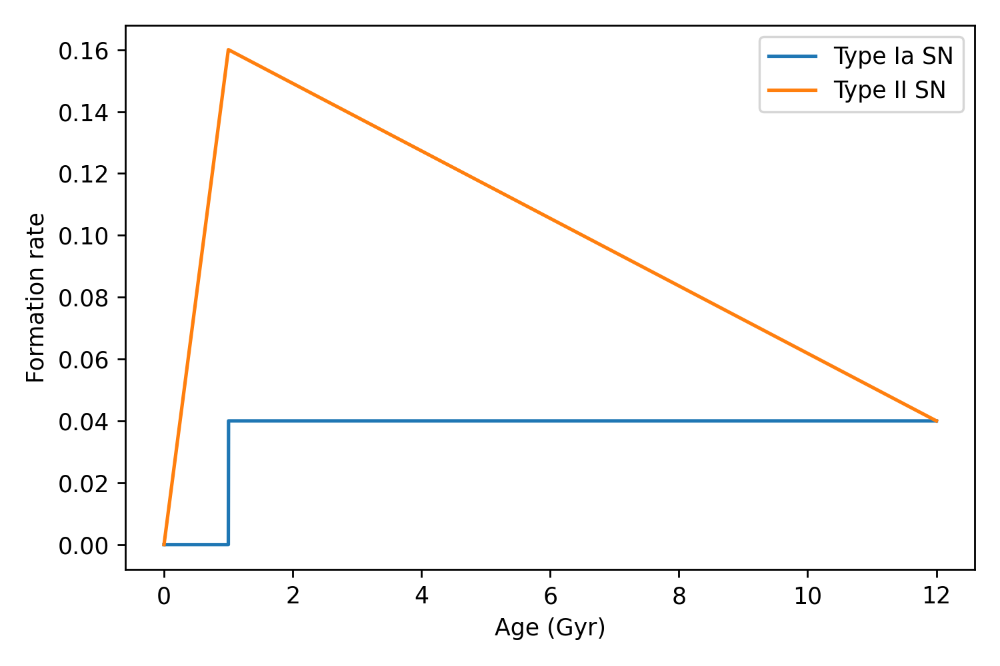
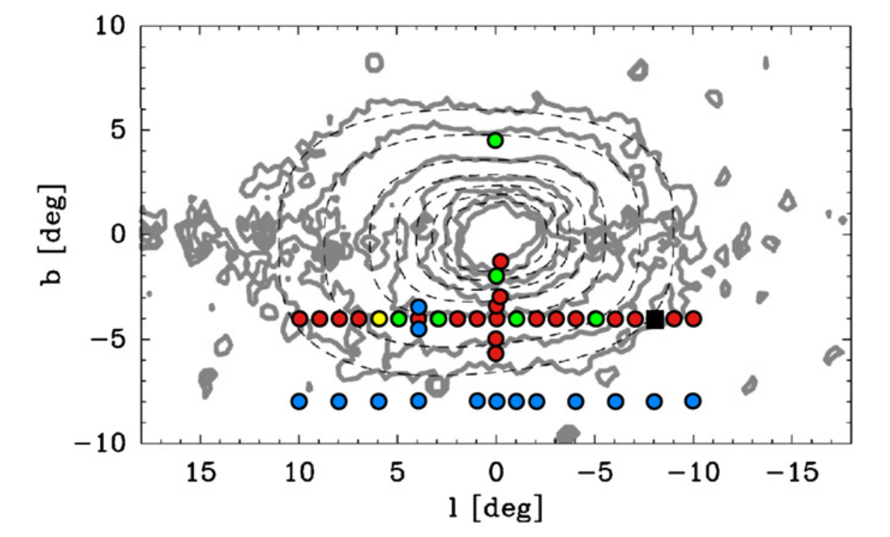
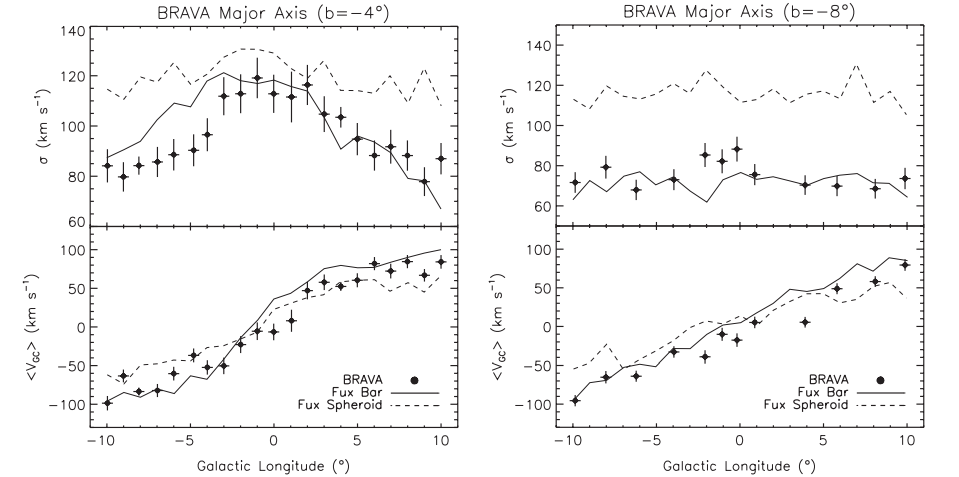
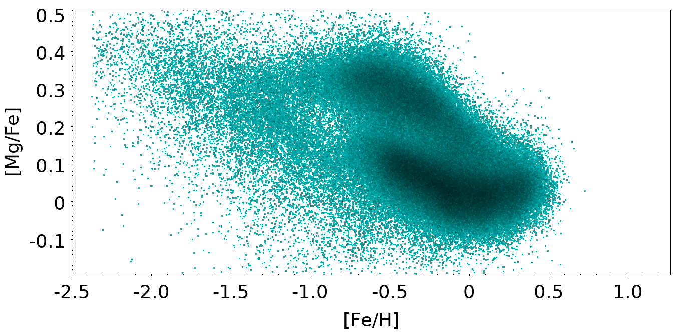
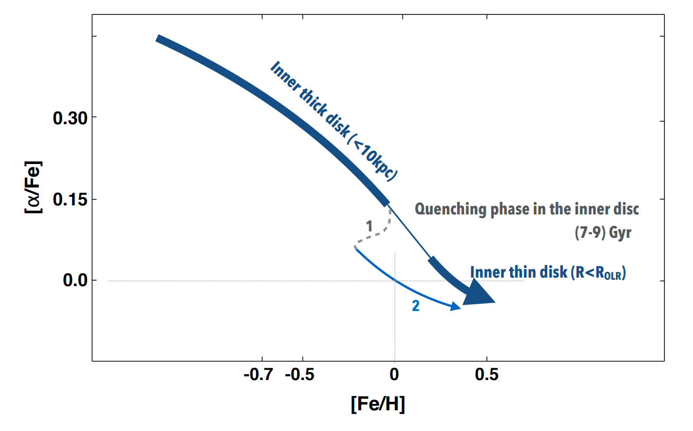

# 银河考古学

简明杰<br>
省实天文社集训 2021年1月31日 15:00-17:00

这个讲义可以通过如下网址或二维码查看：
https://mk-cookbook.readthedocs.io/en/latest/outreach/2021ssaa_ga.html


今天下午的副标题是“银河系的化学演化”。
这里的“化学”跟我们平常说的化学的概念是不同的，指的并不是化合物的形成，而是元素的合成。


这是一张元素周期表。
这里面有的元素是人工合成的，也就是自然界里面是没有的。
反过来说，其他剩下的的元素是从自然界里来的，或者说宇宙演化而来的。

那么，宇宙是怎么演化出这些元素的？
答案一：宇宙大爆炸。
的确，宇宙大爆炸不久之后发生了原初核合成。


## 1 原初核合成

宇宙在大爆炸之后密度、温度逐渐下降；那么根据不同的温度我们可以把宇宙的早期演化分成如下的阶段：

|时期|时间|温度|事件|
|:--:|:--:|:--:|:--:|
|普朗克时期|$<10^{-43}\,\mathrm{s}$|$>10^{32}\,\mathrm{K}$||
|大统一时期|$10^{-43}\sim10^{-36}\,\mathrm{s}$|$>10^{29}\,\mathrm{K}$|引力独立|
|暴胀/电弱时期|$10^{-36}\sim10^{-32}\,\mathrm{s}$|$10^{28}\sim10^{22}\,\mathrm{K}$|强相互作用力独立|
|电弱时期|$10^{-32}\sim10^{-12}\,\mathrm{s}$|$10^{15}\,\mathrm{K}$|电磁力与弱相互作用力独立|
|夸克时期|$10^{-12}\sim10^{-5}\,\mathrm{s}$|$10^{15}\sim10^{12}\,\mathrm{K}$|夸克形成|
|强子时期|$10^{-5}\sim1\,\mathrm{s}$|$10^{12}\sim10^{10}\,\mathrm{K}$|强子（如中子/质子）形成并处于动态平衡|
|中微子退耦|$1\,\mathrm{s}$|$10^{10}\,\mathrm{K}$|质子、中子得以稳定存在|
|轻子时期|$1\sim10\,\mathrm{s}$|$10^{10}\sim10^{9}\,\mathrm{K}$|轻子和反轻子处于动态平衡|
|原初核合成时期|$10\sim1000\,\mathrm{s}$|$10^{9}\sim10^{7}\,\mathrm{K}$|原初核合成开始|
*[Chronology of the universe - Wikipedia](https://en.wikipedia.org/wiki/Chronology_of_the_universe)*

简单来说就是早期温度太高，所有物质都处于基本粒子的状态；直到后来温度渐渐下降，原初核合成的原料（质子、中子）稳定存在后，由于它们结合在一起形成更重的粒子会放出能量让自身变得更稳定，原初核合成就开始了。
轻子时期在原初核合成时期之前的原因是轻子时期的能量高于氘的结合能，所以形成的氘仍然会被高能光子打散。

## 1.1 核素与核反应的表示方式

[核素](https://zh.wikipedia.org/wiki/%E6%A0%B8%E7%B4%A0)通常用元素符号表示（氕、氘和氚这三个同位素有自己的符号，$\mathrm{P,D,T}$），左上标表示质量数即是质子和中子的总数（即该种核素的原子量），左下标表示质子数（即原子序数，也可不标出），右下标表示中子数（一般情况下不标出）。

下面举几个例子：

|元素|称呼|完整核素符号|省略核素符号<br>（常用）|
|:---:|:---:|:---:|:---:|
|氢原子|氢1|$\mathrm{^1_1H_0}$|$\mathrm{\mathrm{^1H}}$|
|常见的碳原子|碳12|$\mathrm{^{12}_6C_6}$|$\mathrm{\mathrm{^{12}C}}$|
|有7个中子的碳原子|碳13|$\mathrm{^{13}_6C_7}$|$\mathrm{\mathrm{^{13}C}}$|
|常见的钙原子|钙40|$\mathrm{^{40}_{20}C_{20}}$|$\mathrm{^{40}Ca}$|

之后还会涉及到一些基本粒子的符号，列举如下：

|符号|名称|备注|
|:---:|:---:|:---:|
|$e^-$|电子||
|$e^+$|正电子|带一个单位正电荷的电子|
|$p$|质子||
|$n$|中子||
|$\nu_e$|电中微子|中微子的一种|
|$\gamma$|光子||
|$\alpha$|$\alpha$粒子|氦核，即$\mathrm{\mathrm{^4He}}$|

用核素符号加单向箭头表示单向的核反应，如两个氢原子核（质子/氕核）结合成一个氘核并放出正电子和中微子：

$$\mathrm{^1H} + \mathrm{^1H} \rightarrow \mathrm{^2D}  + e^+ + \nu_e$$

双箭头表示处于动态平衡的核反应，如两个氦4可以结合成一个铍8，但是在适当的温度下两个氦4和一个铍8同时存在：

$$ \mathrm{^4He} + \mathrm{^4He} \leftrightarrow \mathrm{^8Be} $$

````{admonition} 练习1
请写出?处的粒子：
1. $$ \mathrm{^{16}O} + \mathrm{^{16}O} \leftrightarrow p +\, ? $$
2. $$ \mathrm{^{4}He} + 2\alpha \leftrightarrow \gamma +\, ? $$
3. $$ \mathrm{^{23}Na} + p \leftrightarrow \mathrm{^{20}Ne} +\, ? $$
````

现在我们有且仅有质子和中子，得从这两个原料出发合成出复杂一点的原子：

$$ p + n \rightarrow \mathrm{D} + \gamma $$
$$\mathrm{D} + n \rightarrow \gamma + \mathrm{^3H}$$
$$\mathrm{D} + \mathrm{D} \rightarrow p + \mathrm{^3H}$$
$$\mathrm{D} + p \rightarrow \gamma + \mathrm{^3He}$$
$$\mathrm{D} + \mathrm{D} \rightarrow n + \mathrm{^3He}$$
$$\mathrm{^3He} + n \rightarrow p + \mathrm{^3H}$$
$$\mathrm{^3H} \rightarrow \mathrm{^3He} + e^- + \tilde{\nu}_e$$
$$\mathrm{^3H} + \mathrm{D} \rightarrow n + \mathrm{^4He}$$
$$\mathrm{^3He} + n \rightarrow \gamma + \mathrm{^4He}$$
$$\mathrm{^3He} + \mathrm{D} \rightarrow p + \mathrm{^4He}$$
$$\mathrm{^3He} + \mathrm{^3He} \rightarrow 2p + \mathrm{^4He}$$

$\mathrm{^7Li}$和$\mathrm{^7Be}$可以通过$\mathrm{^4He}(\mathrm{^3H}, \gamma)\mathrm{^7Li}$[^*]、$\mathrm{^4He}(\mathrm{^3He}, \gamma)\mathrm{^7Be}$合成。

[^*]: 这个是核反应式子的简略表达式，与$\mathrm{^4He} + \mathrm{^3H} \rightarrow \gamma + \mathrm{^7Li}$一致

最后，根据标准宇宙学模型，原初核合成合成了大约75%的H，25%的He、0.01%的氘和$10^{-10}$的锂（质量比例）。
比铍重的元素需要很长时间才能被合成，仅靠原初核合成时期的长度是不够的。

那其他的元素呢？此时距离人类的出现还缺一大堆元素，哪来的我们？
幸好，之后的宇宙也为我们准备了答案。

## 2 答案二：恒星核合成

在接下来的一段时间里面宇宙在化学演化上没有什么发展，因为温度太低了所以没有新的核反应发生，直到另一个高温物体的出现：恒星。

弥漫在宇宙中的原初物质在引力的作用下逐渐聚集形成了高温的等离子体，也就是恒星。
提起恒星我们的第一反应是：它的能量是由核聚变来的。
而恒星的核聚变就是由H到He的过程；这不就让化学演化继续了么？

有同学可能会问了：恒星演化也只是减少了H、增加了He的量啊，其他的元素呢？

不，并不只是氦。
恒星在不同阶段的核合成可以将元素周期表剩下的所有元素都填满。
所以我们结合恒星的演化来具体看看恒星核合成是是什么样子的。

### 2.1 单星的恒星演化

恒星演化的过程和恒星的初始质量有很大的关系，可以由下图总结：


在演化过程中恒星将内部的氢转化成更重的元素，最后在年老的阶段以及死亡时的爆发将一部分原初的物质以及和反应产物抛回星际介质中。
从这个角度看恒星挺像一个加工厂的：给它一些原料，它可以产出一些更高级的产品。

那么具体它能给我们什么产品呢？

#### 2.1.1 恒星的核反应

不同质量恒星的内部温度是不同的，质量越大温度越高，在其内部发生的核反应是不同的。
这是因为温度高了之后粒子的动能变大，可以克服更大的库伦势垒（原子核中因为质子带正电和别的原子核相斥导致的势垒）。
比如氢原子核只带一个正电荷，它的库伦势垒比碳原子核低，所以让两个氢原子核相撞然后发生核反应所需的能量小于让一个碳原子核与一个氢原子核相撞然后发生核反应的能量；这也就是为什么下面说的小质量恒星内部发生的核反应主要是质子-质子链，而大质量恒星内部发生的主要是碳氮氧循环。

在恒星内部的核反应可以总结如下：


*From [wikipedia: alpha-process](https://en.wikipedia.org/wiki/Alpha_process)*

##### 2.1.1.1 质子-质子链

图中左上角的反应是发生在低温恒星中氢燃烧的主要反应：质子-质子链。

它分为三个分支，发生的温度一次由低到高：

1. 分支一
	1. $\mathrm{^1H} + \mathrm{^1H} \rightarrow \mathrm{^2D}  + e^+ + \nu_e$
	2. $\mathrm{^2D} + \mathrm{^1H} \rightarrow \mathrm{^3He}  + \gamma$
	3. $\mathrm{^3He} + \mathrm{^3He} \rightarrow \mathrm{^4He} + \mathrm{^1H} + \mathrm{^1H}$
2. 分支二
	1. $\mathrm{^1H} + \mathrm{^1H} \rightarrow \mathrm{^2D}  + e^+ + \nu_e$
	2. $\mathrm{^2D} + \mathrm{^1H} \rightarrow \mathrm{^3He}  + \gamma$
	4. $\mathrm{^3He} + \mathrm{^4He} \rightarrow \mathrm{^7Be} + \gamma$
	5. $\mathrm{^7Be} + e^- \rightarrow \mathrm{^7Li} + \nu_e + \gamma$
	6. $\mathrm{^7Li} + \mathrm{^1H} \rightarrow \mathrm{^4He} + \mathrm{^4He}$
3. 分支三
	1. $\mathrm{^1H} + \mathrm{^1H} \rightarrow \mathrm{^2D}  + e^+ + \nu_e$
	2. $\mathrm{^2D} + \mathrm{^1H} \rightarrow \mathrm{^3He}  + \gamma$
	4. $\mathrm{^3He} + \mathrm{^4He} \rightarrow \mathrm{^7Be} + \gamma$
	7. $\mathrm{^7Be} + \mathrm{^1H} \rightarrow \mathrm{^8B} + \gamma$
	8. $\mathrm{^8B} \rightarrow e^+ + \nu_e + \mathrm{^8Be} \rightarrow \mathrm{^4He} + \mathrm{^4He} + e^+ + \nu_e$

它的总效果为：

$$ 4\mathrm{^1H} \rightarrow \mathrm{^4He} $$

````{admonition} 练习2
将分支一二三的核反应式子配平并求和，验证它们的总效果为$4\mathrm{^1H} \rightarrow \mathrm{^4He}$。
````

##### 2.1.1.2 碳氮氧循环

而图中右上角的反应是发生在高温恒星中氢燃烧的主要反应：碳氮氧循环。
它的总效果和质子-质子链完全一致。

具体反应包括：

1. $\mathrm{^{12}C} + \mathrm{^{1}H} \rightarrow \mathrm{^{13}N} + \gamma$
2. $\mathrm{^{13}N} \rightarrow \mathrm{^{13}C} + e^+ + \nu_e$
3. $\mathrm{^{13}C} + \mathrm{^{1}H} \rightarrow \mathrm{^{14}N} + \gamma$
4. $\mathrm{^{14}N} + \mathrm{^{1}H} \rightarrow \mathrm{^{15}O} + \gamma$
5. $\mathrm{^{15}O} \rightarrow \mathrm{^{15}N} + e^+ + \nu_e$
6. $\mathrm{^{15}N} + \mathrm{^{1}H} \rightarrow \mathrm{^{12}C} + \mathrm{^{4}He}$
7. $\mathrm{^{15}N} + \mathrm{^{1}H} \rightarrow \mathrm{^{16}O} + \gamma$
8. $\mathrm{^{16}O} + \mathrm{^{1}H} \rightarrow \mathrm{^{17}F} + \gamma$
9. $\mathrm{^{17}F} \rightarrow \mathrm{^{17}O} + e^+ + \nu_e$
10. $\mathrm{^{17}O} + \mathrm{^{1}H} \rightarrow \mathrm{^{14}F} + \mathrm{^{4}He}$

在这些反应里面，反应4的速度是最慢的，所以CNO中N会累积，其他两个元素含量会下降。

##### 2.1.1.3 氦到铁的燃烧

恒星质量越大、温度就越高，可以燃烧的元素越多。
核心中的氢元素基本转化成氦元素之后，氢的燃烧停止、恒星发生收缩。
当恒星收缩到可以点燃核心的氦的时候，就发生氦以及其他元素的燃烧（下面列表分类按照需要的温度从低到高排列）：

- 氦的燃烧
	1. $\mathrm{^4He} + \mathrm{^4He} \leftrightarrow \mathrm{^8Be}$
	2. $\mathrm{^8Be} + \mathrm{^4He} \rightarrow \mathrm{^{12}C} + \gamma$
- 碳-氦的燃烧
	1. $\mathrm{^{12}C} + \mathrm{^{4}He} \rightarrow \mathrm{^{16}O} + \gamma$
	2. $\mathrm{^{16}O} + \mathrm{^{4}He} \rightarrow \mathrm{^{20}Ne} + \gamma$
- 碳-碳的燃烧
	1. $\mathrm{^{12}C} + \mathrm{^{12}C} \rightarrow \mathrm{^{24}Mg} \rightarrow \mathrm{^{20}Ne} + \alpha$
	2. $\mathrm{^{12}C} + \mathrm{^{12}C} \rightarrow \mathrm{^{24}Mg} \rightarrow \mathrm{^{23}Na} + p$
- 氖的分解
	1. $\mathrm{^{20}Ne} + \gamma \rightarrow \mathrm{^{16}O} + \alpha$
	2. $\mathrm{^{20}Ne} + \alpha \rightarrow \mathrm{^{24}Mg} + \gamma$
	3. $\mathrm{^{24}Mg} + \alpha \rightarrow \mathrm{^{28}Si} + \gamma$
- 氧-氧的燃烧
	1. $\mathrm{^{16}O} + \mathrm{^{16}O} \rightarrow \mathrm{^{32}S} \rightarrow \mathrm{^{28}Si} + \alpha$
	2. $\mathrm{^{16}O} + \mathrm{^{16}O} \rightarrow \mathrm{^{32}S} \rightarrow \mathrm{^{31}P} + p$
	3. $\mathrm{^{31}P} + p \rightarrow \mathrm{^{28}Si} + \alpha$
- 温度足够的话，$\mathrm{^{24}Mg}$和$\mathrm{^{28}Si}$会通过核反应变为$\mathrm{^{36}Ar}$, $\mathrm{^{40}Ca}$, $\mathrm{^{44}Sc}$, $\mathrm{^{48}Ti}$, $\mathrm{^{52}Cr}$, 以及主要的$\mathrm{^{56}Ni}$。之后$\mathrm{^{56}Ni}$会通过放出两个正电子依次变成$\mathrm{^{56}Co}$和$\mathrm{^{56}Fe}$。

##### 2.1.1.4 铁之后的元素

参见[快过程和慢过程](2021ssaa_sr_process)。

##### 2.1.1.5 爆炸性核反应

爆炸性核反应其实就是恒星死亡时发生的核反应。
当恒星内部核反应停止的时候，恒星因为缺乏辐射压与引力平衡而开始塌缩，直至核心简并（变成白矮星或者中子星）。
核心简并之后，外层物质遇到简并核会发生反弹，反弹产生的激波温度很高，所以在激波上可以发生最后的核反应。
同时激波会将物质向外抛射到星际空间中，让恒星合成的物质与星际介质进行混合；最后留下中子星或者黑洞。
对于大质量单星来说这个过程就是II型超新星，现在有模型去模拟它的发生以及核反应过程。

这里由于篇幅限制就不详细介绍爆炸性核反应的结果了；对于镁元素的讨论将会在星系的化学演化这一节进行。

### 2.2 双星的恒星演化

双星的恒星演化在开始的时候和单星是一样的。
不同的地方在于演化后期一部分距离比较近的双星会发生物质交流和引力波辐射，导致某成员星（白矮星）的质量超过钱德拉塞卡极限或者双白矮星并合并完全被摧毁，形成Ia型超新星。


双白矮星并合形成的Ia型超新星


白矮星+伴星形成的Ia型超新星

讲到这里，主要的核合成途径以及所有的元素我们都覆盖到了。

````{admonition} 练习3
问题：Pop III恒星可以有CNO循环吗？
````

### 2.3 合成之后的提取：Stellar yield

这么多元素这么多核反应好麻烦！
不用着急，现在相对完善的恒星演化模型已经可以帮我们解决掉这些麻烦。
我们甚至可以不管这些核反应，直接看产物就好了。
这个产物，就是stellar yield。

stellar yield指的是某质量$m$的恒星新合成并最终抛出的元素的质量（而不是质量比）。

当然不同质量、不同演化阶段的恒星的元素产量（也就是yield）肯定是不同的，所以我们会有很多个表。
具体的数字在[这里](https://github.com/NuGrid/NuPyCEE/tree/master/yield_tables)有。
这里举两个例子：


这是不同初始质量和不同的金属丰度Z（恒星形成时除H和He外其他元素的质量占比）的恒星的氦元素yield。
可以看出来恒星初始质量越大，氦元素的yield越大；同时不同的金属丰度对yield影响不大。


某一个Ia型超新星模型(W7)的yield和不同质量的II型超新星的yield的平均。
可以看出不同演化路径的恒星最后的yield是不同的。

### 2.4 星系的化学演化

有了yield之后，讨论星系的化学演化就简单多了，就是一个将恒星与星际介质分离（同时恒星保存诞生时星际介质的化学丰度信息），然后恒星死亡污染星际介质的图景。



不过这里有个问题：我们需要考虑恒星的寿命；不同恒星的寿命是不同的。
所以我们有很复杂的星系化学演化式子：

$$ \frac{dM_\mathrm{gas,X元素}}{dt} = 元素增加的质量 - 元素减少的质量 $$

$$ 
\begin{align}元素增加的质量 = &现存小质量恒星星风的贡献 \\
&+ 此时刻\mathrm{Ia}型超新星的贡献 + 同质量下此时刻非\mathrm{Ia}型超新星的贡献 \\
&+ 此时刻\mathrm{II}型超新星的贡献 + 同质量下此时刻非\mathrm{II}型超新星的贡献\\
&+ 此时刻的物质流入
\end{align}
$$

$$ 元素减少的质量 = 此时刻恒星形成的质量 + 此时刻的物质流出$$

看着很复杂，但是不用怕，我们实际使用的时候会简化的。

#### 2.4.1 例子：Mg的演化

````{admonition} 练习4
已知Ia型超新星以及II型超新星的发生率$R$如下图以及下表所示：



||$R_I\,(\mathrm{pc^{-3}Gyr^{-1}})$|$R_{II}\,(\mathrm{pc^{-3}Gyr^{-1}})$|
|:--:|:--:|:--:|
|$t<1\,\mathrm{Gyr}$|$R_I=0$|$R_{II}=0.016t$|
|$t\ge1\,\mathrm{Gyr}$|$R_I=0.004$|$R_{II}=-\frac{0.012}{11}t + \frac{0.188}{11}$|

它们的yield如2.3节最后一张图所示。
现在有一个以太阳为中心、边长为$10\,\mathrm{pc}$的立方体，只考虑Ia型超新星以及II型超新星对这个立方体的化学贡献；
同时假设1)立方体内这两种超新星的发生率如上表所示，2)超新星爆发后抛出的物质在可以忽略的时间内于立方体中均匀分布，3)$t=0$时除H、He和Li之外其他元素的质量均为0，4)立方体中$M_\mathrm{H}$为常数。问这个立方体的化学演化中$\log{(M_\mathrm{Mg}/M_\mathrm{Fe})}$与$\log{(M_\mathrm{Fe}/M_\mathrm{H})}$有怎样的关系？
````

## 3 对银河系的观测

理论总是要和观测进行比较的。
这里我们拿银河系来举例。

### 3.1 为什么是银河系？

- 它容易看：可以看每颗恒星的元素丰度
- 动力学特征的保质期比化学丰度特征要短

### 3.2 我们能看什么？

对于恒星的观测主要是测光和光谱。

测光不仅仅能给出亮度，还能给出位置。
在多次测光之后还能给出恒星的自行。

我们现在主要的测光数据是Gaia卫星。
光谱数据来自各大光谱巡天，其中一个比较有名的是SDSS的APOGEE巡天。

#### 3.2.1 恒星的光谱参数

光谱可以给出视向速度，以及恒星的光谱参数。

有了位置我们就知道恒星现在在哪；有了速度我们就知道恒星以前和以后在哪，也就是银河系的历史。

有了恒星的光谱，我们可以获得的是有效温度、表面重力加速度、金属丰度以及元素丰度。
实际上恒星光谱就像是恒星的DNA一样，记录了很多的信息。

X元素丰度指的是：

$$ \log_{10}{\epsilon_\mathrm{X}} = \log_{10}{\frac{N_\mathrm{X}}{N_\mathrm{H}}} + 12 $$

其中$N_\mathrm{X}$是恒星大气单位体积中X元素原子的数量。

X元素丰度比指的是：

$$ \mathrm{[X_1/X_2]} = \left[\log_{10}{\frac{N_\mathrm{X_1}}{N_\mathrm{X_2}}} \right]_\mathrm{star} - \left[\log_{10}{\frac{N_\mathrm{X_1}}{N_\mathrm{X_2}}} \right]_\mathrm{sun}$$

### 3.3 我们看到了什么？

#### 3.3.1 棒状结构

以前我们认为核球的形状是一个旋转椭球体，但是现在的观测表明更可能是棒状结构。这个观测证据有两个：


*[Howard+09](https://ui.adsabs.harvard.edu/#abs/2009ApJ...702L.153H/abstract), Fig. 1*

首先COBE的红外观测（图中的灰色等高线）表明核球的光度不是对称分布的，所以可能是一个侧着放的棒。


*[Howard+09](https://ui.adsabs.harvard.edu/#abs/2009ApJ...702L.153H/abstract), Fig. 5*

第二看到虽然速度随银经方向都是逐渐增加的（棒和椭球都是），高银纬处（蓝色点、$b=-8^\circ$处）的速度弥散很小，暗示了这是个棒。

#### 3.3.2 翘曲

银河系边缘的翘曲很早就被探测到了，但是当时用的是HI区的位置和距离，它们的距离并不是很准确，而且没有关于恒星翘曲的证据。
2019年中国国家天文台和波兰华沙天文台的团组几乎同时用不同的数据获得了银河系内较为全面的造父变星星表，并利用造父变星的周光关系求出了它们的距离。
将它们的位置画在3维的图上，我们就可以很明显地看出银河系周围恒星的翘曲。


[An intuitive 3D map of the Galactic warp's precession traced by classical Cepheids - NASA/ADS (harvard.edu)](https://ui.adsabs.harvard.edu/abs/2019NatAs...3..320C/abstract)

#### 3.3.3 厚盘、薄盘

既然提到了光谱巡天，那么我们当然要看看光谱巡天的结果和我们之前的简单模型有没有吻合的地方。



这是APOGEE巡天[Mg/Fe] - [Fe/H]的图，很明显上面一部分的特征和我们的模型是吻合的。
但是这张图又引出了新的问题：另外一块是什么？
从课上展示的数据我们知道它是薄盘。
那它是怎么形成的呢？

这里有一个猜测：


Figure 4 of [Revisiting long-standing puzzles of the Milky Way: the Sun and its vicinity as typical outer disk chemical evolution (aanda.org)](https://www.aanda.org/articles/aa/pdf/2019/05/aa34155-18.pdf)

现在认为比较可靠的形成历史是双下落模型：银河系的原初气体形成了银晕、核球和厚盘，所以厚盘的Mg元素丰度下降比较慢。
形成厚盘之后银河系有一小段时间不怎么形成恒星，但是之后银河系附近的矮星系和银河系并合，它带来了未被或仅被少量Ia型超新星污染的气体（Fe的丰度比形成厚盘的气体更低，Mg的丰度大约与之持平），形成了薄盘。
这大致解释了薄盘和厚盘的形成，但是具体的细节（什么时候发生的并合？它是矮星系吗？质量有多大？）还不是很清楚。

#### 3.3.4 银河系的化学形成历史

当然我们也可以再详细一点，用我们已知的所有yields去建立银河系的化学演化模型，再用模型的结果去拟合观测的趋势，看哪个拟合的最好。

那最好的拟合是什么样子的呢？


是这样的。

因为上图看得不太清楚，这个模型下的超新星形成率是：


这里的超新星的发生率和我们练习4中的模型也有不少相似之处。

另一个比较贴合实际情况的模拟是瑞典隆德天文台Florent Renaud所做的银河系模拟（*the VINTERGATAN simulation*，VINTERGATAN时银河系的瑞典语名称）。

模拟的视频请见ppt，因为空间不足就没有放上来。

银河系的形成实际上是比较复杂的。
仅仅依靠恒星的位置和速度虽然可以获取不少的信息（比如发现星流 - 矮星系与银河系并合后的残骸），但是在恒星化学丰度信息的帮助下，我们可以更好地还原银河系地形成历史。

## 4 未来 - 星系考古学？

我们当然希望将这些观测和方法推广到其他星系里去。
当然，银河考古学只能对邻近的星系适用，比如M31。
并且由于星系离我们比较远，在光谱上我们很多时候会被限制在比较亮的星上面。


[Red Supergiants in M31 and M33 I. The Complete Sample - NASA/ADS (harvard.edu)](https://ui.adsabs.harvard.edu/abs/2020arXiv201112051R/abstract)

在这篇文章中我们利用了红外的测光数据给出了M31和M33的红超巨星星表；它们是星系中较亮的恒星，下一代的30米级望远镜可以很轻松地获取它们地光谱从而得到元素的丰度。

## 5 总结
银河考古学的内容：对星系形成历史的分析可以通过恒星的化学丰度来研究。

为什么叫银河考古学：用恒星地化学丰度去推测银河系地形成历史就像考古发掘一样。
- 有偶然性
- 需要大量的例子
- 知道的越多，越能还原当时的情景
- 银河考古学变得可能是因为”成熟“的恒星物理和大规模的巡天观测的出现，体现了“老”学科分支的新发展方向。