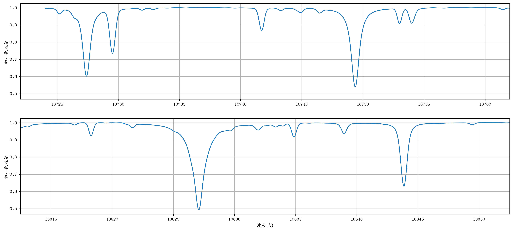

# 从恒星光谱到恒星参数 题目参考答案

````{admonition} 例1
1. 请通过翻书或者回忆写出自己知道的所有恒星参数。

答：半径、星等（亮度）、距离、光度、位置、有效温度、表面重力加速度、元素丰度、质量、年龄、自转速度、质量流失率、磁感应强度、视向速度等。

2. 下列哪些是恒星参数？哪些不是恒星参数？<br>
A.温度 B.有效温度 C.核球质量 D.宇宙学常数 E.硅元素丰度 F.视向速度 G.挠率 H.暗物质密度 I.色指数 J.终端速度

答：B, E, F, I是恒星参数，其他不是恒星参数。
````

````{admonition} 例2
下列恒星参数可以通过什么方法测得？
- 星等、位置、自行
    - 测光（拍照）
- 距离
    - 视差测量
    - 周光关系（造父变星等）
- 有效温度、表面重力加速度、元素丰度、自转速度、磁场强度、视向速度
    - 光谱观测
    - 多色测光（仅有效温度）
````

````{admonition} 例3
假设$\alpha$与$n$都不是$s$的函数，求解上述微分方程，得到$I(s)$.


````

````{admonition} 例4
请观察蓝色光谱和橙色光谱中最明显的两条谱线。它们有什么区别？由此可得，一条谱线有什么参数？
<br><br><br><br>
````

````{admonition} 例5
请根据下表，测量图5中阴影部分橙色谱线的中心波长、深度、半高全宽以及等值宽度。
|   wavelength |     flux |   wavelength |     flux |
|-------------:|---------:|-------------:|---------:|
|      10748   | 0.996866 |      10749.5 | 0.593067 |
|      10748.1 | 0.994498 |      10749.6 | 0.713851 |
|      10748.2 | 0.99185  |      10749.7 | 0.838262 |
|      10748.3 | 0.990373 |      10749.8 | 0.92614  |
|      10748.4 | 0.990868 |      10749.9 | 0.971314 |
|      10748.5 | 0.992472 |      10750   | 0.988936 |
|      10748.6 | 0.993518 |      10750.1 | 0.994364 |
|      10748.7 | 0.992141 |      10750.2 | 0.996015 |
|      10748.8 | 0.983237 |      10750.3 | 0.996945 |
|      10748.9 | 0.955778 |      10750.4 | 0.997574 |
|      10749   | 0.892861 |      10750.5 | 0.998025 |
|      10749.1 | 0.785981 |      10750.6 | 0.998359 |
|      10749.2 | 0.656653 |      10750.7 | 0.998614 |
|      10749.3 | 0.555153 |      10750.8 | 0.998809 |
|      10749.4 | 0.529656 |      10750.9 | 0.998962 |

答案：
- 中心波长：10750.5Å或10750.45Å
- 深度：0.462371
- 半高全宽：0.5到0.7Å之间都可
- 等值宽度：0.269Å
````

````{admonition} 例7
上面的LDR-Teff关系用到的是在10340.89A与10469.65A的两条铁的谱线。
这个关系为：

$$ T_\mathrm{eff} = -6356.05 \log{\frac{d_{10340.89}}{d_{10469.65}}} + 4255.65 $$

下表给出了某恒星的在这两个波长附近的光谱。

|   wavelength |     flux |   wavelength |     flux |
|-------------:|---------:|-------------:|---------:|
|      10340.4 | 0.990487 |      10469.2 | 0.952376 |
|      10340.5 | 0.975562 |      10469.3 | 0.924575 |
|      10340.6 | 0.933868 |      10469.4 | 0.873559 |
|      10340.7 | 0.86027  |      10469.5 | 0.794045 |
|      10340.8 | 0.779791 |      10469.6 | 0.712477 |
|      10340.9 | 0.743637 |      10469.7 | 0.679068 |
|      10341   | 0.77982  |      10469.8 | 0.720547 |
|      10341.1 | 0.860368 |      10469.9 | 0.811161 |
|      10341.2 | 0.934286 |      10470   | 0.90009  |
|      10341.3 | 0.976918 |      10470.1 | 0.957102 |

请计算谱线深度、谱线深度比以及这个恒星的有效温度。

答案：
- 谱线深度：0.256与0.321
- 谱线深度比：0.872
- 有效温度：$T_\mathrm{eff} = -6356.05 \log{0.872} + 4255.65 = 4880\,\mathrm{K}$

````

````{admonition} 例8
为什么有效温度确定之后才能给出生长曲线？

答案：因为谱线对温度变化是最敏感的；如果恒星出现了温度变化使得谱线变弱（强），那么生长曲线会整体向左（右）移动。
````

````{admonition} 例9
通过生长曲线确定例5中谱线对应的硅元素丰度。

答案：我们在例中已经得出了这条谱线的等值宽度为0.269Å，对应到纵轴为$\log{0.269}=-0.57$，所以硅元素丰度$\mathrm{[Si/H]}\sim 0$.
````

````{admonition} 课后习题：从恒星光谱到恒星参数
图中给出了某颗恒星的一段光谱，图是在这颗恒星有效温度下铁和硅元素的丰度与等值宽度的关系（生长曲线）；表1给出了光谱某几部分的波长以及归一化流量的值，表2给出了2对被用作LDR的谱线。




|   wavelength |     flux |   wavelength |     flux |
|-------------:|---------:|-------------:|---------:|
|      10726.9 | 0.871689 |      10817.8 | 0.998572 |
|      10727   | 0.823547 |      10817.9 | 0.993666 |
|      10727.1 | 0.758888 |      10818   | 0.981337 |
|      10727.2 | 0.68672  |      10818.1 | 0.959758 |
|      10727.3 | 0.627516 |      10818.2 | 0.936011 |
|      10727.4 | 0.604314 |      10818.3 | 0.925086 |
|      10727.5 | 0.627388 |      10818.4 | 0.935268 |
|      10727.6 | 0.68648  |      10818.5 | 0.958382 |
|      10727.7 | 0.758579 |      10818.6 | 0.979676 |
|      10727.8 | 0.823172 |      10818.7 | 0.992208 |
|      10752.5 | 0.99226  |      10843.4 | 0.914254 |
|      10752.6 | 0.986906 |      10843.5 | 0.868721 |
|      10752.7 | 0.972944 |      10843.6 | 0.80252  |
|      10752.8 | 0.948343 |      10843.7 | 0.724803 |
|      10752.9 | 0.921348 |      10843.8 | 0.659354 |
|      10753   | 0.909254 |      10843.9 | 0.63347  |
|      10753.1 | 0.92157  |      10844   | 0.659338 |
|      10753.2 | 0.948704 |      10844.1 | 0.724779 |
|      10753.3 | 0.973222 |      10844.2 | 0.802503 |
|      10753.4 | 0.986329 |      10844.3 | 0.868714 |

|LDR编号|谱线1波长|谱线1元素|谱线2波长|谱线2元素|
|:---:|:---:|:---:|:---:|:---:|
|16|10753.004|Fe I|10727.406|Si I|
|17|10818.274|Fe I|10843.858|Si I|

它们有如下的关系式：

$$-4196.5 \log{\mathrm{LDR}}+3227.0 \tag{LDR-16}$$
$$-3447.3 \log{\mathrm{LDR}}+3644.3 \tag{LDR-17}$$

|谱线波长|谱线深度|等值宽度|
|:---:|:---:|:---:|
|10727.406|0.396|0.380|
|10753.004|0.091|0.034|
|10818.274|0.075|0.039|
|10843.858|0.367|0.295|


1. 请在光谱中证认出这4条线
2. 测量这4条线的谱线深度
3. 根据2中的谱线深度计算这颗恒星的有效温度
4. 这6条谱线的等值宽度如下所示，请补全缺少的等值宽度并根据生长曲线测量铁和硅元素的丰度
5. 思考题：恒星光谱与很多参数都相关；如何通过恒星光谱确定尽量多的参数？

答案：

2. 见上表
3) 将谱线深度比代入表达式中可得有效温度为5977K和6031K，取平均值可得最终的有效温度为6004K.
4) 见上表；[Fe/H] = -0.2, [Si/H] = 0.5
5) 随着近年计算机计算速度的提高，我们现在可以用“正向建模”的方法来确定恒星参数。正向建模指的是从理论出发，考虑尽可能多的因素（大气吸收、光谱仪分辨率、CCD误差、读出误差等）构造出一个与观测数据尽可能贴合的模拟数据，然后改变我们所关心的参数从而得出一组模拟数据，再通过模拟数据和观测数据的对比得到恒星参数。这个方法可以很方便地增减恒星参数，从而使得不同恒星参数之间的互相影响同时纳入考虑范围，而不用很麻烦地去解开这种非线性的耦合。

````

