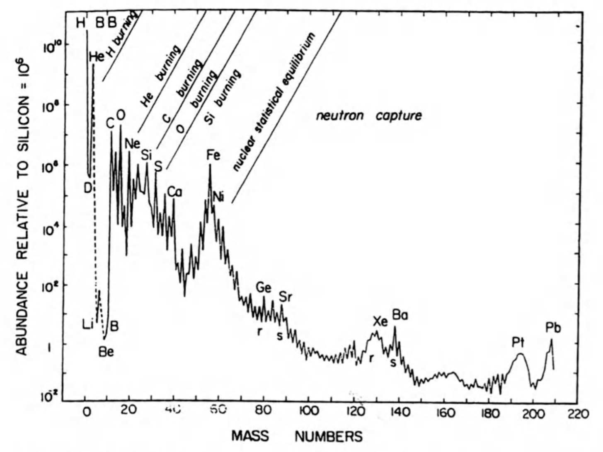
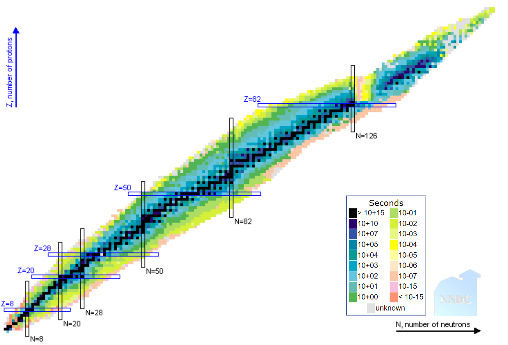
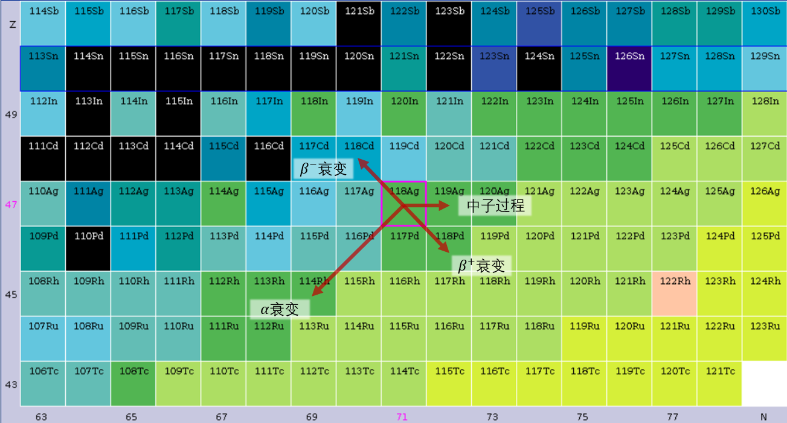
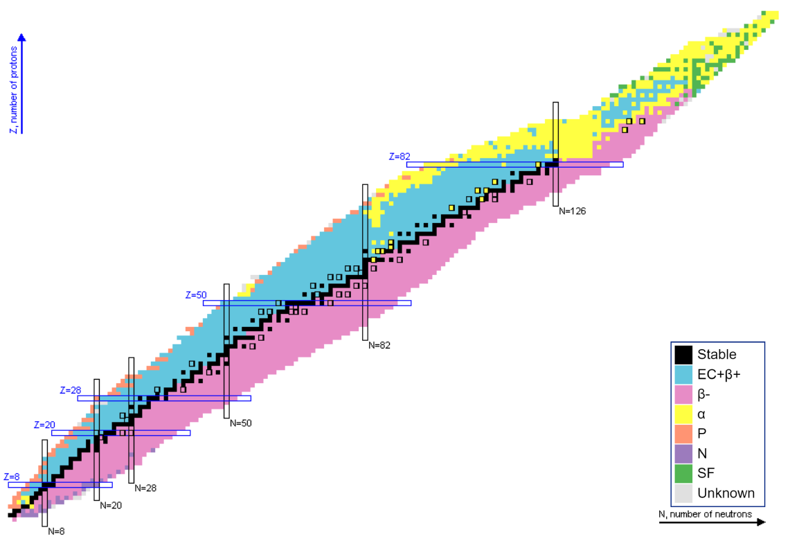
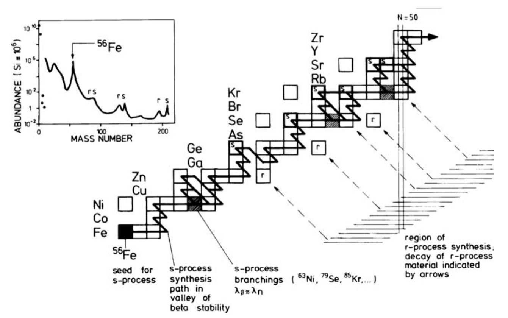

# 快过程和慢过程

我们先来看这么一张图：


*来源：[Nucleosynthesis and Chemical Evolution of Galaxies](https://ui.adsabs.harvard.edu/abs/2009nceg.book.....P/abstract)，图1.4*

它是结合太阳和其他邻近恒星/天体得出的元素丰度图（数量比）。
注意横轴是元素的质量数而不是质子数（原子序数）。

在这张图中我们能注意到以下几个特征：
1. 氢、氦的含量是所有元素中最多的（即使是在太阳中也是），这反映了原初核合成的结果；
2. 锂、铍、硼的含量很少；这是因为它们基本上在恒星核合成中被消耗了；
3. 从碳到钙的含量有下降的趋势，以及明显的奇偶效应（偶数质量数的元素丰度比奇数多）；它们是恒星核合成的结果，而奇偶效应是因为恒星核合成中的$\alpha$粒子（$^4He$核）充足引起的（从碳开始加$\alpha$粒子的话会变成氧、氖、镁，以此类推）；
4. 在铁元素附近的元素丰度有一个峰值；我们把这附近的元素叫做铁峰元素；这是因为恒星内部的核反应只能合成到$^{56}Ni$，然后衰变成$^{56}Fe$；
5. 质量数大于铁峰元素的元素丰度不为0且逐渐减少，在质量数为80、130、200附近各有两个很靠近的峰，且也有奇偶效应。

前四个特征我们已经在讲义的正文里面解释过了，这里我们关注最后一个特征。
这个特征的形成是由发生在各种天体中的“快过程”和“慢过程”而形成的。

在恒星核合成的和反应中，虽然原子核之间会互相碰撞，但是有库伦势垒的存在导致原子核之间的核反应必须在比较高温下发生。
而原子核与中子之间的核反应则因为中子不带电，所以在中子密度足够的情况下比较容易地发生。

当中子密度不是很大的时候，核反应按照接收中子-β衰变的顺序进行，我们把这个过程称为慢过程/s过程。
反之，当中子密度很大的时候，核反应按照接收中子-接收中子-接收中子-β衰变的顺序进行，我们把这个过程称为快过程/r过程。

这两个过程形成的元素基本上覆盖了元素周期表的下半部分。

## 原子核中的衰变

### $\alpha$衰变


原子喷出一个$\alpha$粒子（或者说氦原子核）；质量数-4，原子序数-2、中子数-2。基本上只会在比较重的原子里面发生，由核力和电磁力主导。在恒星核合成中比较少见，因为需要重的原子。

### $\beta$衰变


原子里面的某一个中子喷出一个电子，自己变成质子；原子质量数不变，原子序数+1、中子数-1，原子变得更稳定($\beta^-$衰变)。可以有反过程，原子里面的某一个质子喷出一个反电子，自己变成中子($\beta^+$衰变)，质量数不变，原子序数-1、中子数+1。

### $\gamma$衰变

原子中的电子从高能级激发态跃迁到更低能级的态，放出光子。
因为不涉及核反应所以不出现在恒星核合成中。

### 电子捕获

原子核将原子的其中一个电子捕获到原子核内部：

$$ p + e^- \rightarrow n + \nu_e $$

原子质量数不变，原子序数-1、中子数+1。

## 核素图


元素周期表上只列出了同种类的原子；它通过横向和纵向两个方向表征元素化学性质的变化；但是它并不能标示出全部的原子（质子数、中子数不同的原子），所以我们需要如下的核素图：



核素图以中子数为横轴，质子数为纵轴，元素周期表上的稳定元素在图中的黑色点上；图中横向表示同一种元素的同位素。由此我们可以将所有可能形成的原子都标示在这张图上。

### $\beta$稳定等高线

核素图中的核素大多数都不是稳定的；越靠近核素分布的中央它们的结合能越高，所以图中中央的黑色阶梯状分布核素就是稳定核素。其他所有的核素都会以各种方式向稳定核素衰变，这些各种方式主要就是$\beta$衰变，所以这条线也叫做$\beta$稳定等高线。顺便一提等高线的左上方为丰质子核素，右下方为丰中子核素。

### 原子核滴线(Nuclear drip line)

并不是任意的质子-中子数组合都能形成核素的；上面说的核素虽然不稳定，但还能存在一会；而核素图上白色的地方则根本不能形成核素；这个白色区域和有色区域的交界线就叫做原子核滴线。丰质子一侧的滴线称为质子滴线，丰中子一侧的滴线称为中子滴线。

### 幻数

核素图上的黑色和蓝色框框代表的是幻数：在框里面的核素会处于稳定态，不容易接收中子/质子或者发生衰变。

### 核素图上的衰变

从上面列出来的几种衰变我们可以知道它们各自对中子数和质子数的影响，那么就可以在核素图上画出它们所代表的箭头：



当然，不是所有衰变都能发生在某一个核素上的。
如果我们将每一个核素最大可能的衰变类型标在核素图上，就是这样的：



在$\beta$等高线下方的不稳定元素通过$\beta^-$衰变向左上方移动，在上方的不稳定元素通过电子捕获或者$\beta^+$衰变向右下方移动；大质量核素通过$\alpha$衰变向左下方移动。

### S过程

在中子密度较小的环境中，原子核接收了一个中子之后停了下来，如果稳定就等下一个中子，如果不稳定就$\beta$衰变到稳定，然后等下一个中子。这样的过程使得生成的核素更容易达到最终的稳定态（核素图中的黑色元素）。

那哪里才有这些稀疏中子流让S过程发生呢？答案在渐进巨星支(AGB)里。AGB星可以提供中子源：

$$ \begin{align}
\mathrm{^{13}_6C + ^4_2He} & \rightarrow \mathrm{^{16}_{8}O + n}\\ 
\mathrm{^{22}_{10}Ne + ^4_2He} & \mathrm{\rightarrow ^{25}_{12}Mg + n}\\
\mathrm{^{16}O + ^{16}O} & \rightarrow \mathrm{^{31}S + n}\\
\end{align}
$$

然后核素就可以快乐地像下图一样奔跑了：


因为S过程太慢，到达铋-83之后会短暂生成钋-84，但是钋之后会回到铅-82，然后生成铋，如此循环。


````{admonition} 练习5
这里的浅绿色箭头和深绿色箭头各是什么衰变？
````



*从$^{56}Fe$开始的s过程轨迹*

````{admonition} 练习6
$^{63}Ni$的基本参数为：
- 半衰期：101.2年
- 衰变类型：$\beta^-$衰变（概率：100%）

1. 为什么s过程的演化轨迹在$^{63}Ni$会分叉？
2. 设s过程的时标为1000年（即每1000年核素会接收一个中子），那么是演化成$^{64}Ni$的核素多，还是演化成$^{63}Cu$的核素多？
````

## R过程

原子核在大量中子轰击下变成新元素的过程就是R（快）过程了。

[来源](https://www.asc.ohio-state.edu/physics/ntg/6805/slides/rprocess.pdf)

如上图的r-process线，原子核在短时间内接收了大量中子，会在核素图上向右移动，偶尔发生一次$\beta^-$衰变稍微向左上走。在中子数达到50, 82, 186时因为中子壳层闭合，核素和中子的碰撞截面变小，所以主要发生$\beta$衰变而不是接收中子。而因为中子很多，所以R过程最终形成的核素的原子序数会比较大（也就是比较重了）。

说白了R过程就是原子核被中子轰得还来不及$\beta$衰变下一个就来了所以越吃越胖的故事。当然不能无限吃胖，太重了会有$\alpha$衰变将中子和质子数降下来的。


<video controls width=80%>
    <source src="../_images/r_process.mp4">
</video>

[来源](http://www.ph.sophia.ac.jp/~shinya/research/research.html)

这个动画说明了因为快过程形成的元素主要是中子数为幻数的丰中子核素，它们会在之后通过$\beta$衰变回到$\beta$等高线上，所以它们的质子数变小了一点。
这解释了为什么第一张图中的快过程的峰都在慢过程的左边，不正好在幻数上。

最后，通过核素图可以发现，质子数为偶数的核子有更多的稳定核素，所以有更多的形式可以稳定存在。
这就解释了为什么铁峰元素之后的元素丰度有奇偶效应。

## 这俩过程有什么用？

这两个过程为银河系考古学提供了更多的选择；我们不仅仅可以选择铁元素丰度来表征不同population的恒星，也可以选择更重的元素。如果某个地方R过程元素特别高，我们可以猜测那里之前可能有过很多的超新星爆发，也就是很久以前有大量的恒星形成。

## Refs

- [s过程](https://en.wikipedia.org/wiki/S-process)
- [r过程](https://en.wikipedia.org/wiki/R-process)
