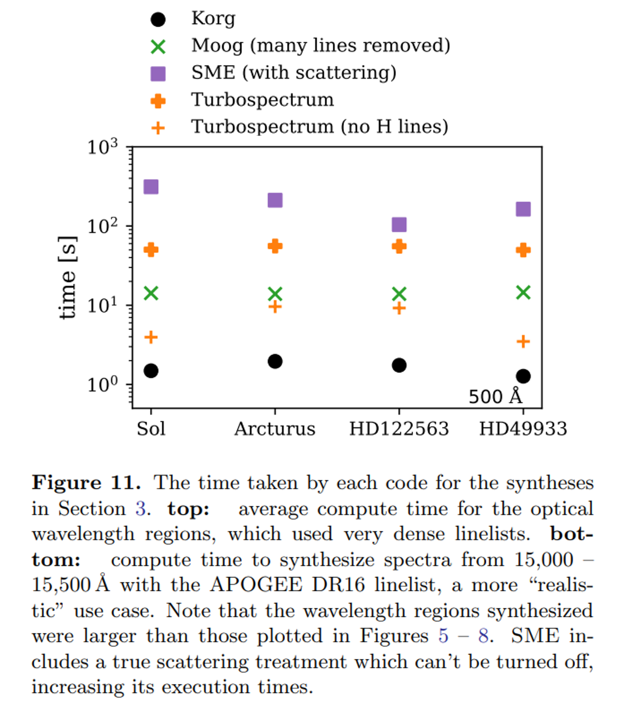

# 0. 这是什么？

这是恒星大气辐射转移程序Spectroscopic Made Easy (SME) - Python版本（所以叫PySME）的教程，中文版。

SME是Jeff Valenti和Nikolai Piskunov在1996年发布的用于生成恒星合成光谱以及拟合恒星参数的程序。
我们拿望远镜拍恒星的光谱，为的就是拿它和合成光谱（也就是模型光谱）进行对比、得到我们想要的参数，比如恒星的温度、密度、表面上有多少化学元素等等。
这就是SME的用途。

与其他用途相同的程序类似，SME需要我们提供恒星大气模型以及谱线线表，才能给我们算出合成光谱。
后来开发者们觉得这样太麻烦了，就给SME的核心代码（C以及Fortran）加上了一个IDL的wrapper，成为了IDLSME。
再后来，IDL用的人少了，python用的人多了，曾经在瑞典乌普萨拉大学就读的Ansgar Wehrhahn就把外面这层皮从IDL转成了python，PySME出现了。
现在虽然SME有IDLSME以及PySME这两个“分支”，但是它们的核心代码是一样的。

我从2024年的5月开始接手了PySME的开发工作。
到现在它已经累积了不少大大小小的更新，我也可以说我是PySME的开发者之一了。

## Why PySME?

既然我选择了接受PySME的开发，那我肯定要说服我自己（以及其他<del>所有</del>/<del>大多数</del>/一些人：为什么我们要用PySME？

市面上不是没有类似的程序；MOOG和Turbospectrum就是两个例子。
其他的一些程序我已经在[这个知乎答案](https://www.zhihu.com/question/628034522/answer/3335312294)里面总结了，这里就不再赘述。
在我看来，这个问题的回答有三点。

### 1. 易用

曾经的恒星大气辐射转移程序是很难用的。
拿MOOG来举例子，做恒星光谱的不少人相信都曾经被MOOG的使用折磨了一阵子。
MOOG本身只进行辐射转移的计算，恒星大气模型以及谱线线表是要用户自己去提供了。
这两个如何计算，市面上有没有现成的结果，大气模型有一批格点但是没有自己想要的恒星参数的点怎么办？
这就是MOOG上手会遇到的第一个问题。

第二个问题是格式。
恒星大气模型以及谱线线表可不是拿来之后MOOG就认识的，需要转换成MOOG的格式。
这里就也涉及到很多比较细节但是都需要搞清楚的coding。

所以有一个能解决上述问题的wrapper（最好是python的）其实是非常重要的。
当然后来这种wrapper也多了起来，比如我硕博期间写的pymoog。

当我开始接触PySME的时候，我就发现PySME的开发逻辑和使用方法跟我开发pymoog的思路非常相近：让用户付出最小的努力，得到想要的结果。

比如我想生成一段合成光谱，需要的仅仅是五六行代码：

```py
sme = SME_Structure()
sme.teff, sme.logg, sme.monh = 5772, 4.44, 0
sme.linelist = ValdFile('linelist/vald_6000_6020.list')
sme.wave= np.arange(6000, 6020, 0.02)
sme = synthesize_spectrum(sme)
wave, flux = sme.wave[0], sme.synth[0]
```

这就方便很多了。
当然里面还有很多细节可以自定义，在后面的章节会提到。

### 2. 线表支持更好

PySME天然支持VALD的线表。
VALD是一个目前几乎最全的天文谱线线表的数据库。
我们只需要上VALD的网站，告诉它我们需要哪个波段的谱线，下载下来之后什么更改都不用做、读入到PySME里面，就可以了。
真正的开箱即用。

隔壁的MOOG有自己的格式需要转换，Turbospectrum的线表甚至是每个元素分开的，所以用户需要自己维护H, He, Li,....等等的一堆线表。

而且VALD还在更新，以后会有更准确的谱线参数。
所以这方面，用PySME是更方便的。

### 3. NLTE支持更好

局部热动平衡(LTE)是计算恒星大气谱线很方便的一个假设。
但是随着我们观测精度的增加，我们发现LTE假设对于某些谱线来说不适用。
对于这些谱线，我们需要非局部热动平衡(NLTE)。

在PySME里面，进行NLTE计算只需要在上面的`synthesize_spectrum`之前加上一行：
```
sme.nlte.set_nlte('H')
```
就行了；同样很简单。

当然不是所有元素都支持NLTE计算，但是现在PySME已经支持15种元素的计算了，能满足日常需求。
NLTE计算所需的额外文件会由SME的开发者维护（当然我们也提供给用户下载），并且如果有新的元素结果完成，会优先支持SME。
也有一些网站提供NLTE改正，但是那只是对丰度的改正，而且不是所有的谱线都有。
PySME能算出NLTE的谱线轮廓，能更直观看出来这条线究竟NLTE在了哪里。

## Why not PySME?

PySME的缺点是，慢。

Wheeler+2023的文章里比较了几个代码用时的区别：



很不幸SME是最慢的，那PySME也不例外。
当然图片描述里面也说了，PySME考虑了散射。
其实SME还考虑了一些其他的内容，比如每条谱线的中心深度以及宽度范围。
这些参数在有的时候其实是很有用的。
我自己也有一个代码，将一个合成的任务拆成几个然后并行，可以把运行时间降到和其他的代码差不多的水平（未来可能会放进PySME里面）。

所以，和所有的科学结果一样，PySME有它的使用范围。
对于小批量的高分辨光谱分析，它是很适合的。
大量的中低分辨率光谱分析可能不是PySME最擅长的领域，不过它可以提供比如恒星参数确定之后的丰度分析，或者为机器学习提供训练样本。

希望到这里可以激起大家对PySME的一些兴趣。
具体的安装以及使用我们放到之后去讲。